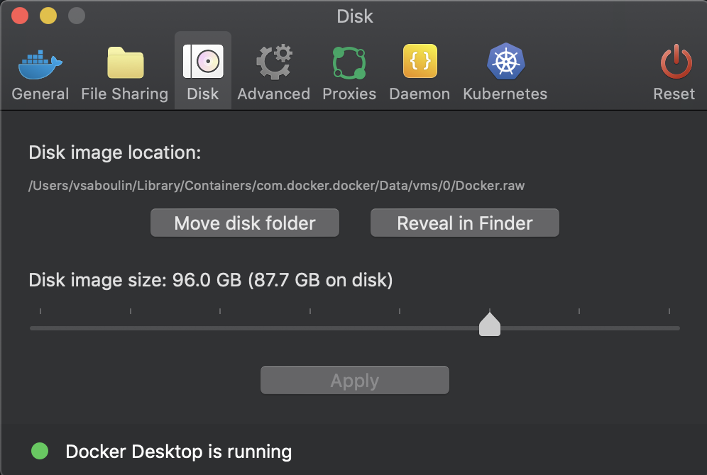

# JMS Oracle AQ (Oracle 21c) Source connector

## Objective

Quickly test [JMS Source - Oracle AQ](https://docs.confluent.io/kafka-connect-jms-source/current/overview.html#features) connector.

N.B: if you're a Confluent employee, please check this [link](https://confluent.slack.com/archives/C0116NM415F/p1636391410032900) and also [here](https://confluent.slack.com/archives/C0116NM415F/p1636389483030900).

Download Oracle Database 21c (21.3) for Linux x86-64 `LINUX.X64_213000_db_home.zip`from this [page](https://www.oracle.com/database/technologies/oracle21c-linux-downloads.html) and place it in `./LINUX.X64_213000_db_home.zip`


Note: The first time you'll run the script, it will build (using this [project](https://github.com/oracle/docker-images/blob/master/OracleDatabase/SingleInstance/README.md)) the docker image `oracle/database:21.3.0-ee`. It takes about 10 minutes.

**Please make sure to increase Docker disk image size (96Gb is known to be working)**:




## How to run

```
$ playground run -f jms-oracle21-source<use tab key to activate [fzf completion](https://kafka-docker-playground.io/#/cli?id=%e2%9a%a1-setup-completion) (otherwise use full path, i.e *not relative path*>
```

## Details of what the script is doing


Grant all permissions to C##MYUSER:

```bash
docker exec -i oracle bash -c "ORACLE_SID=ORCLCDB;export ORACLE_SID;sqlplus /nolog" << EOF
CONNECT sys/Admin123 AS SYSDBA

GRANT EXECUTE ON SYS.DBMS_AQ to C##MYUSER;
GRANT RESOURCE TO C##MYUSER;
GRANT CONNECT TO C##MYUSER;
GRANT EXECUTE ANY PROCEDURE TO C##MYUSER;
GRANT aq_administrator_role TO C##MYUSER;
GRANT aq_user_role TO C##MYUSER;
GRANT EXECUTE ON dbms_aqadm TO C##MYUSER;
GRANT EXECUTE ON dbms_aq TO C##MYUSER;
GRANT EXECUTE ON dbms_aqin TO C##MYUSER;

  exit;
EOF
```

Create JMS QUEUE called PLAYGROUND:

```bash
docker exec -i oracle sqlplus C\#\#MYUSER/mypassword@//localhost:1521/ORCLCDB << EOF

EXEC dbms_aqadm.create_queue_table('PLAYGROUNDTABLE', 'SYS.AQ\$_JMS_TEXT_MESSAGE')
EXEC dbms_aqadm.create_queue('PLAYGROUND','PLAYGROUNDTABLE')
EXEC dbms_aqadm.start_queue('PLAYGROUND')


set serverout on
DECLARE
enqueue_options DBMS_AQ.ENQUEUE_OPTIONS_T;
message_properties DBMS_AQ.MESSAGE_PROPERTIES_T;
message_handle RAW (16);
msg SYS.AQ\$_JMS_TEXT_MESSAGE;
BEGIN
msg := SYS.AQ\$_JMS_TEXT_MESSAGE.construct;
msg.set_text('HELLO PLSQL WORLD !');
DBMS_AQ.ENQUEUE (
queue_name => 'PLAYGROUND',
enqueue_options => enqueue_options,
message_properties => message_properties,
payload => msg,
msgid => message_handle);
COMMIT;
END;
/

  exit;
EOF
```

Creating JMS Oracle AQ source connector:

```bash
playground connector create-or-update --connector jms-oracle-source << EOF
{
               "connector.class": "io.confluent.connect.jms.JmsSourceConnector",
               "tasks.max": "1",
               "kafka.topic": "jms-oracle-topic",

               "db_url": "jdbc:oracle:thin:@oracle:1521/ORCLCDB",
               "java.naming.factory.initial": "oracle.jms.AQjmsInitialContextFactory",
               "java.naming.provider.url": "jdbc:oracle:thin:@oracle:1521/ORCLCDB",
               "java.naming.security.credentials": "mypassword",
               "java.naming.security.principal": "C##MYUSER",
               "jms.destination.name": "PLAYGROUND",
               "jms.destination.type": "queue",
               "jms.message.format": "bytes",
               "jndi.connection.factory": "javax.jms.XAQueueConnectionFactory",

               "key.converter": "org.apache.kafka.connect.storage.StringConverter",
               "value.converter": "io.confluent.connect.avro.AvroConverter",
               "value.converter.schema.registry.url": "http://schema-registry:8081",
               "confluent.license": "",
               "confluent.topic.bootstrap.servers": "broker:9092",
               "confluent.topic.replication.factor": "1"
          }
EOF
```

Verifying topic jms-oracle-topic:

```bash
playground topic consume --topic jms-oracle-topic --min-expected-messages 1 --timeout 60
```

Results:

```json
{
    "bytes": null,
    "correlationID": null,
    "deliveryMode": 2,
    "destination": {
        "io.confluent.connect.jms.Destination": {
            "destinationType": "queue",
            "name": "PLAYGROUND"
        }
    },
    "expiration": 0,
    "map": null,
    "messageID": "ID:E088787E36F30226E053020018AC3EF1",
    "messageType": "text",
    "priority": 1,
    "properties": {
        "JMSXAppID": {
            "boolean": null,
            "byte": null,
            "bytes": null,
            "double": null,
            "float": null,
            "integer": null,
            "long": null,
            "propertyType": "null-value",
            "short": null,
            "string": null
        },
        "JMSXDeliveryCount": {
            "boolean": null,
            "byte": null,
            "bytes": null,
            "double": null,
            "float": null,
            "integer": {
                "int": 1
            },
            "long": null,
            "propertyType": "integer",
            "short": null,
            "string": null
        },
        "JMSXGroupID": {
            "boolean": null,
            "byte": null,
            "bytes": null,
            "double": null,
            "float": null,
            "integer": null,
            "long": null,
            "propertyType": "null-value",
            "short": null,
            "string": null
        },
        "JMSXGroupSeq": {
            "boolean": null,
            "byte": null,
            "bytes": null,
            "double": null,
            "float": null,
            "integer": null,
            "long": null,
            "propertyType": "null-value",
            "short": null,
            "string": null
        },
        "JMSXRcvTimestamp": {
            "boolean": null,
            "byte": null,
            "bytes": null,
            "double": null,
            "float": null,
            "integer": null,
            "long": {
                "long": 1654247333944
            },
            "propertyType": "long",
            "short": null,
            "string": null
        },
        "JMSXState": {
            "boolean": null,
            "byte": null,
            "bytes": null,
            "double": null,
            "float": null,
            "integer": {
                "int": 0
            },
            "long": null,
            "propertyType": "integer",
            "short": null,
            "string": null
        },
        "JMSXUserID": {
            "boolean": null,
            "byte": null,
            "bytes": null,
            "double": null,
            "float": null,
            "integer": null,
            "long": null,
            "propertyType": "null-value",
            "short": null,
            "string": null
        },
        "JMS_OracleConnectionID": {
            "boolean": null,
            "byte": null,
            "bytes": null,
            "double": null,
            "float": null,
            "integer": null,
            "long": null,
            "propertyType": "null-value",
            "short": null,
            "string": null
        },
        "JMS_OracleDelay": {
            "boolean": null,
            "byte": null,
            "bytes": null,
            "double": null,
            "float": null,
            "integer": null,
            "long": {
                "long": 0
            },
            "propertyType": "long",
            "short": null,
            "string": null
        },
        "JMS_OracleDeliveryMode": {
            "boolean": null,
            "byte": null,
            "bytes": null,
            "double": null,
            "float": null,
            "integer": null,
            "long": null,
            "propertyType": "null-value",
            "short": null,
            "string": null
        },
        "JMS_OracleExcpQ": {
            "boolean": null,
            "byte": null,
            "bytes": null,
            "double": null,
            "float": null,
            "integer": null,
            "long": null,
            "propertyType": "null-value",
            "short": null,
            "string": null
        },
        "JMS_OracleHeaderOnly": {
            "boolean": null,
            "byte": null,
            "bytes": null,
            "double": null,
            "float": null,
            "integer": null,
            "long": null,
            "propertyType": "null-value",
            "short": null,
            "string": null
        },
        "JMS_OracleOriginalMessageID": {
            "boolean": null,
            "byte": null,
            "bytes": null,
            "double": null,
            "float": null,
            "integer": null,
            "long": null,
            "propertyType": "null-value",
            "short": null,
            "string": null
        },
        "JMS_OracleTimestamp": {
            "boolean": null,
            "byte": null,
            "bytes": null,
            "double": null,
            "float": null,
            "integer": null,
            "long": null,
            "propertyType": "null-value",
            "short": null,
            "string": null
        }
    },
    "redelivered": false,
    "replyTo": null,
    "text": {
        "string": "HELLO PLSQL WORLD !"
    },
    "timestamp": 1654247330000,
    "type": null
}
```


N.B: Control Center is reachable at [http://127.0.0.1:9021](http://127.0.0.1:9021])
