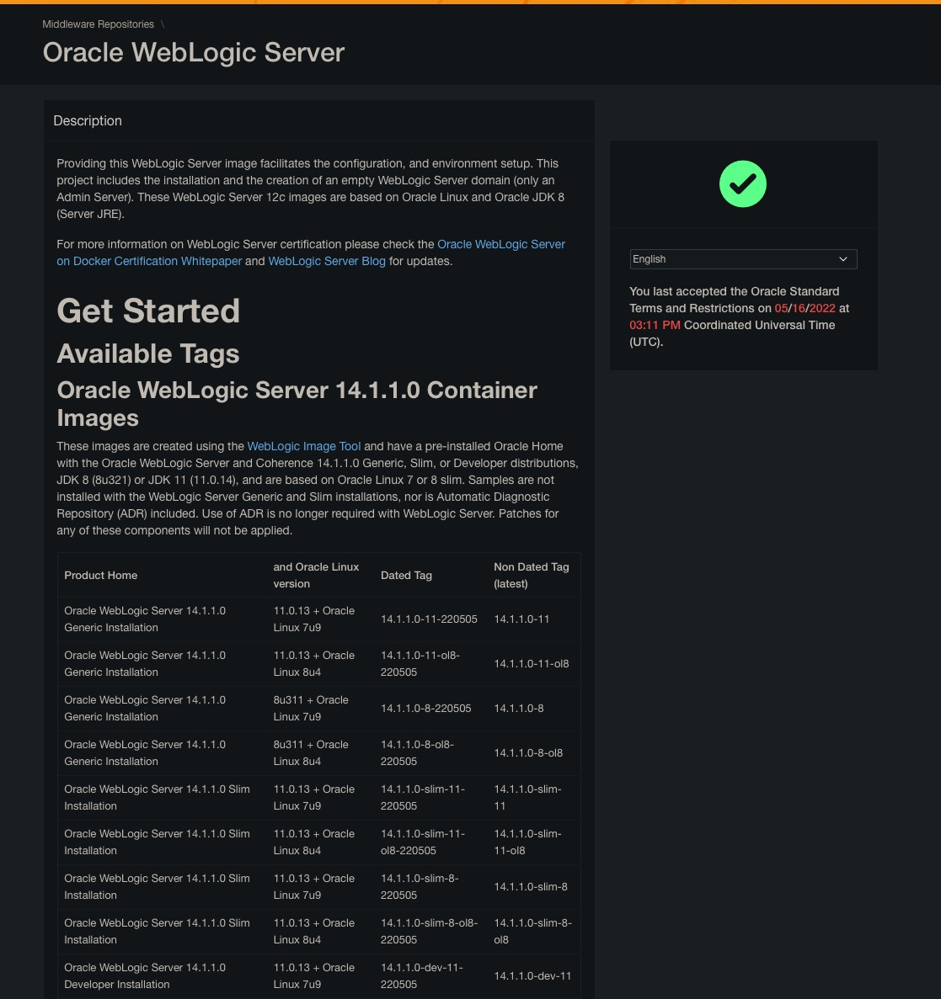
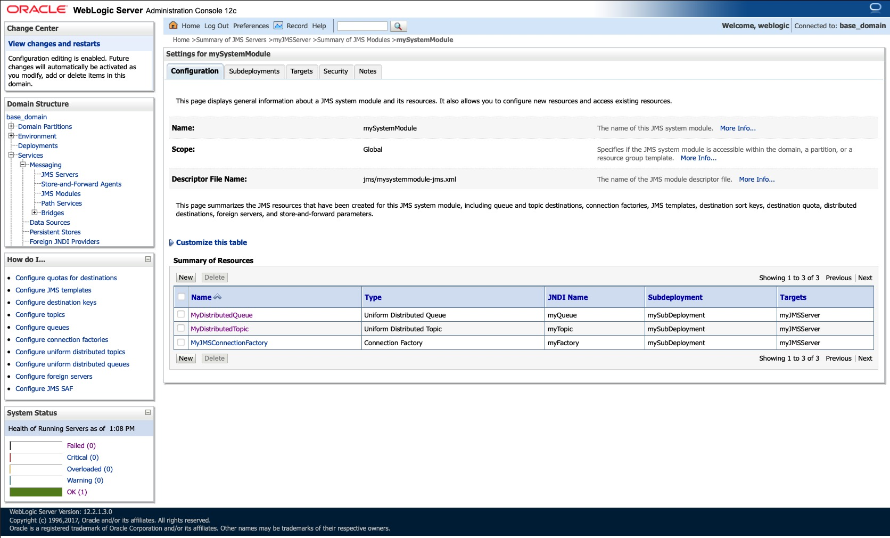
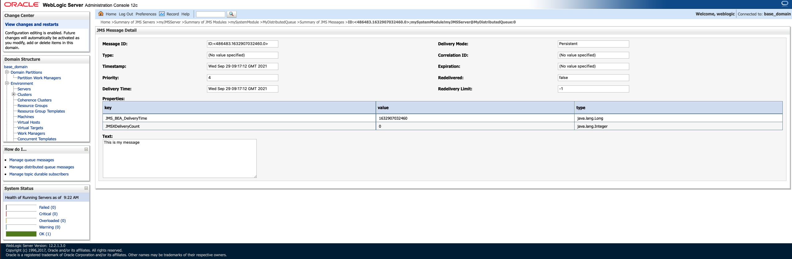

# Oracle Weblogic Sink with JMS connector

## Objective

Quickly test [Oracle Weblogic JMS](https://docs.confluent.io/current/connect/kafka-connect-jms/sink/index.html) with JMS connector.

Using Oracle WebLogic Server (Developer Tier, version `12.2.1.3`) Docker [image](https://container-registry.oracle.com). You need to register and acknowledge license terms and conditions to get the image.



## How to run

Simply run:

```
$ playground run -f jms-weblogic-sink<use tab key to activate fzf completion (see https://kafka-docker-playground.io/#/cli?id=%e2%9a%a1-setup-completion), otherwise use full path, or correct relative path>
```

N.B: Weblogic console is reachable at [http://127.0.0.1:7001/console](http://127.0.0.1:7001/console]) (`weblogic`/`welcome1`)

You can use it to see all JMS resources:



## Details of what the script is doing

### Queue example

Creating JMS weblogic sink connector

```bash
$ curl -X PUT \
     -H "Content-Type: application/json" \
     --data '{
               "connector.class": "io.confluent.connect.jms.JmsSinkConnector",
               "topics": "sink-messages",
               "java.naming.factory.initial": "weblogic.jndi.WLInitialContextFactory",
               "java.naming.provider.url": "t3://weblogic-jms:7001",
               "java.naming.security.principal": "weblogic",
               "java.naming.security.credentials": "welcome1",
               "connection.factory.name": "myFactory",
               "jms.destination.name": "myJMSServer/mySystemModule!myJMSServer@MyDistributedQueue",
               "jms.destination.type": "queue",
               "key.converter": "org.apache.kafka.connect.storage.StringConverter",
               "value.converter": "org.apache.kafka.connect.storage.StringConverter",
               "confluent.license": "",
               "confluent.topic.bootstrap.servers": "broker:9092",
               "confluent.topic.replication.factor": "1"
          }' \
     http://localhost:8083/connectors/weblogic-topic-sink/config | jq .
```

Sending messages to topic sink-messages

```bash
$ docker exec -i broker kafka-console-producer --broker-list broker:9092 --topic sink-messages << EOF
This is my message
EOF
````

Check the message has been received in destination queue:

Results:

```
JMS Ready To Receive Messages...
Message Received: This is my message
```

Or you can check using [http://127.0.0.1:7001/console](http://127.0.0.1:7001/console]) (`weblogic`/`welcome1`):



N.B: Control Center is reachable at [http://127.0.0.1:9021](http://127.0.0.1:9021])

