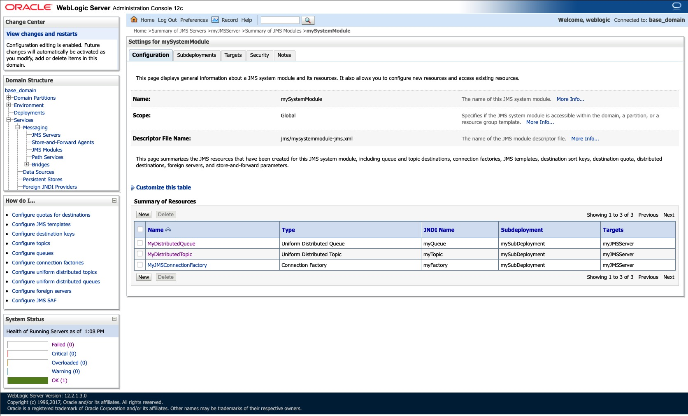

# Oracle Weblogic Source with JMS connector

## Objective

Quickly test [Oracle Weblogic](https://docs.confluent.io/current/connect/kafka-connect-jms/sink/index.html) with JMS connector.

Using Oracle WebLogic Server (Developer Tier, version `12.2.1.3`) Docker [image](https://container-registry.oracle.com). You need to register and acknoledge license terms and conditions to get the image.


Follow [this](https://docs.oracle.com/en/operating-systems/oracle-linux/podman/podman-UsingContainerRegistries.html#generating-an-authentication-key-for-use-with-oracle-container-registry) to get `ORACLE_CONTAINER_REGISTRY_PASSWORD`

* In a web browser, sign in to the Oracle Container Registry using an Oracle account at https://container-registry.oracle.com.
* Select the profile name, and in the profile menu that appears select Auth Token.
* Select Generate Secret Key and note down the secret key. This is only displayed once, during the initial generation.


## How to run

Simply run:

```
$ just use <playground run> command and search for jms-weblogic-source.sh in this folder
```

N.B: Weblogic console is reachable at [http://127.0.0.1:7001/console](http://127.0.0.1:7001/console]) (`weblogic`/`welcome1`)

You can use it to see all JMS resources:


