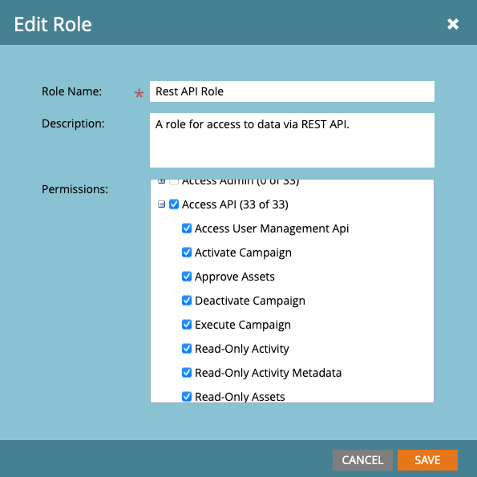
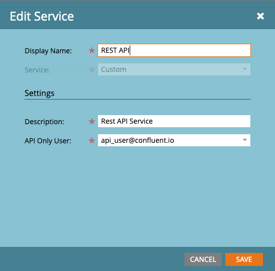
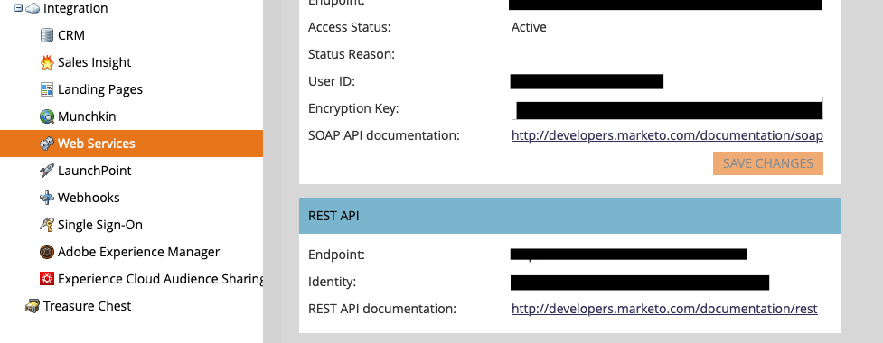

# Marketo Source connector


## Objective

Quickly test [Marketo Source](https://docs.confluent.io/current/connect/kafka-connect-marketo/index.html#marketo-source-connector-for-cp) connector.


## Marketo setup

Go to your [Marketo portal](https://engage-ab.marketo.com) (there is no trial or free version available).

### Create REST API Role

Click on `Admin`->`Security->Users & Roles` and create a new role which has all `Access API` selected (the connector itself only requires readonly privileges):



### Create REST API User

Click on `Admin`->`Security->Users & Roles` and create a new user and associates it with the REST API role that you created in previous step.

### Create custom service

A Custom service is required to uniquely identify your client application. To create a custom application, go to the `Admin`->`LaunchPoint` screen and create a new service
Provide the Display Name, choose "Custom" Service type, provide Description, and the user email address created in previous step.




Once created, by clicking on `View Details`, you can get values for `MARKETO_CLIENT_ID` and `MARKETO_CLIENT_SECRET`

### Getting endpoint URL

The REST API Endpoint URL (`MARKETO_ENDPOINT_URL`) can be found within `Admin`->`Web Services` menu.



## How to run

Simply run:

```
$ ./marketo-source.sh <MARKETO_ENDPOINT_URL> <MARKETO_CLIENT_ID> <MARKETO_CLIENT_SECRET>
```

Note: you can also export these values as environment variable

## Details of what the script is doing

Create one lead to Marketo

```bash
$ docker exec connect \
   curl -X POST \
    "${MARKETO_ENDPOINT_URL}/rest/v1/leads.json?access_token=$ACCESS_TOKEN" \
    -H 'Accept: application/json' \
    -H 'Content-Type: application/json' \
    -H 'cache-control: no-cache' \
    -d '{ "action":"createOrUpdate", "lookupField":"email", "input":[ { "lastName":"john", "firstName":"doe", "middleName":null, "email":"john.doe@email.com" } ]}'
```

Creating Marketo Source connector

```bash
# since last minute
$ SINCE=$(date -v-1M  +%Y-%m-%dT%H:%M:%SZ)
$ curl -X PUT \
     -H "Content-Type: application/json" \
     --data '{
                    "connector.class": "io.confluent.connect.marketo.MarketoSourceConnector",
                    "tasks.max": "1",
                    "poll.interval.ms": 1000,
                    "topic.name.pattern": "marketo_${entityName}",
                    "marketo.url": "'"$MARKETO_ENDPOINT_URL"'",
                    "marketo.since": "'"$SINCE"'",
                    "entity.names": "leads",
                    "oauth2.client.id": "'"$MARKETO_CLIENT_ID"'",
                    "oauth2.client.secret": "'"$MARKETO_CLIENT_SECRET"'",
                    "key.converter": "org.apache.kafka.connect.storage.StringConverter",
                    "value.converter": "org.apache.kafka.connect.json.JsonConverter",
                    "value.converter.schemas.enable": "false",
                    "confluent.license": "",
                    "confluent.topic.bootstrap.servers": "broker:9092",
                    "confluent.topic.replication.factor": "1"
          }' \
     http://localhost:8083/connectors/marketo-source/config | jq .
```

Verify we have received the data in `marketo_leads` topic

```
$ timeout 60 docker exec connect kafka-console-consumer -bootstrap-server broker:9092 --topic marketo_leads --from-beginning --max-messages 1
```

Results:

```json
{
  "leadStatus": "null",
  "isLead": "true",
  "mainPhone": "null",
  "originalSourceType": "Web service API",
  "kafkaCalculatorLead": "null",
  "mktoDoNotCallCause": "null",
  "registrationSourceType": "Web service API",
  "billingCountry": "null",
  "id": "1007633",
  "state": "null",
  "fax": "null",
  "relativeUrgency": "null",
  "inferredStateRegion": "null",
  "originalSearchEngine": "null",
  "originalSearchPhrase": "null",
  "mktoIsCustomer": "false",
  "facebookId": "null",
  "mktoAcquisitionDate": "null",
  "priority": "null",
  "numberOfEmployees": "null",
  "externalSalesPersonId": "null",
  "isAnonymous": "false",
  "externalCompanyId": "null",
  "mobilePhone": "null",
  "phone": "null",
  "inferredPhoneAreaCode": "null",
  "lastName": "john",
  "gender": "null",
  "city": "null",
  "emailInvalidCause": "null",
  "linkedInDisplayName": "null",
  "twitterReferredEnrollments": "null",
  "industry": "null",
  "mktoCompanyNotes": "null",
  "marketingSuspended": "false",
  "cookies": "null",
  "twitterId": "null",
  "unsubscribedReason": "null",
  "originalReferrer": "null",
  "personTimeZone": "null",
  "blackListedCause": "null",
  "leadPerson": "1007633",
  "emailSuspended": "null",
  "leadRevenueStageId": "null",
  "linkedInPhotoURL": "null",
  "personType": "contact",
  "email": "john.doe@email.com",
  "website": "null",
  "syndicationId": "null",
  "address": "null",
  "emailSuspendedCause": "null",
  "dateOfBirth": "null",
  "site": "null",
  "unsubscribed": "false",
  "relativeScore": "null",
  "twitterProfileURL": "null",
  "billingStreet": "null",
  "sicCode": "null",
  "twitterReferredVisits": "null",
  "contactCompany": "1007633",
  "country": "null",
  "originalSourceInfo": "Web service API",
  "mktoIsPartner": "false",
  "postalCode": "null",
  "inferredPostalCode": "null",
  "rating": "null",
  "facebookProfileURL": "null",
  "lastReferredVisit": "null",
  "mktoName": "doe john",
  "linkedInProfileURL": "null",
  "mktoPersonNotes": "null",
  "inferredCompany": "null",
  "createdAt": "2020-11-17T14:15:51Z",
  "registrationSourceInfo": "Web service API",
  "linkedInReferredVisits": "null",
  "inferredMetropolitanArea": "null",
  "anonymousIP": "null",
  "updatedAt": "2020-11-17T14:15:51Z",
  "leadRevenueCycleModelId": "null",
  "inferredCity": "null",
  "leadSource": "null",
  "linkedInReferredEnrollments": "null",
  "billingState": "null",
  "facebookReach": "null",
  "facebookReferredVisits": "null",
  "firstName": "doe",
  "doNotCall": "false",
  "salutation": "null",
  "annualRevenue": "null",
  "marketingSuspendedCause": "null",
  "leadScore": "null",
  "personPrimaryLeadInterest": "1007633",
  "twitterDisplayName": "null",
  "twitterReach": "null",
  "kFipaddress": "null",
  "twitterPhotoURL": "null",
  "title": "null",
  "doNotCallReason": "null",
  "facebookReferredEnrollments": "null",
  "lastReferredEnrollment": "null",
  "urgency": "null",
  "emailSuspendedAt": "null",
  "emailInvalid": "false",
  "company": "null",
  "totalReferredEnrollments": "null",
  "department": "null",
  "linkedInId": "null",
  "kafkaCalculatorClustersize": "null",
  "totalReferredVisits": "null",
  "linkedInReach": "null",
  "leadPartitionId": "1",
  "blackListed": "false",
  "leadRole": "null",
  "facebookDisplayName": "null",
  "acquisitionProgramId": "null",
  "inferredCountry": "null",
  "billingPostalCode": "null",
  "facebookPhotoURL": "null",
  "middleName": "null",
  "billingCity": "null"
}
```

N.B: Control Center is reachable at [http://127.0.0.1:9021](http://127.0.0.1:9021])
