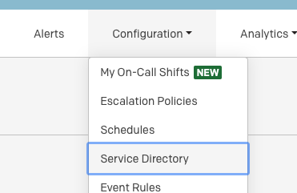
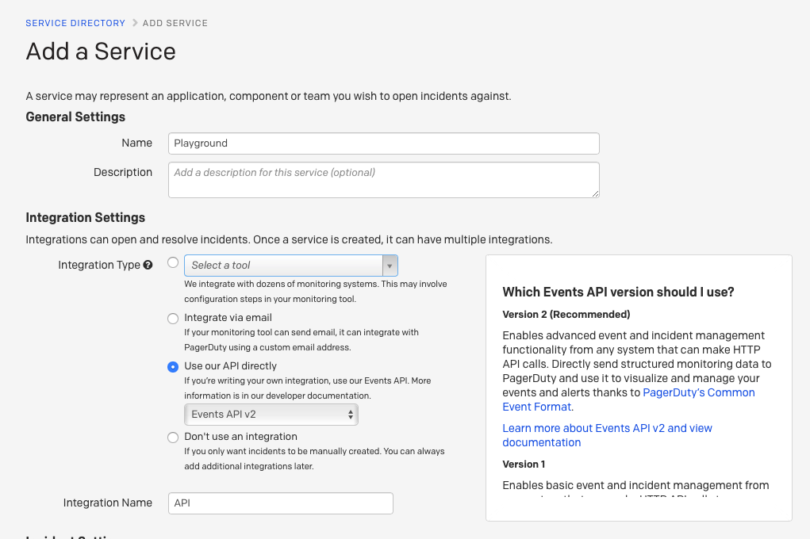
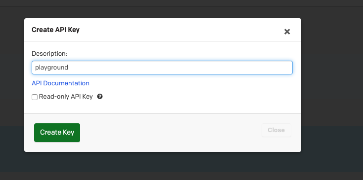
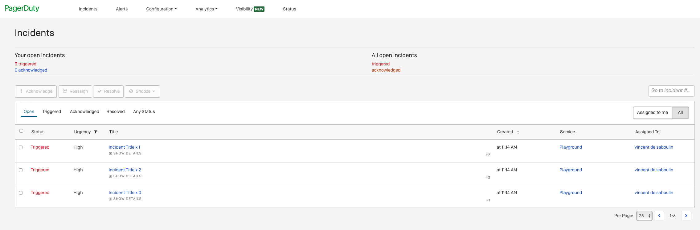

# PagerDuty Sink connector


## Objective

Quickly test [PagerDuty Sink](https://docs.confluent.io/current/connect/kafka-connect-pagerduty/index.html#pagerduty-sink-connector-for-cp) connector.


## Register a trial account

Go to [PagerDuty portal](https://www.pagerduty.com/sign-up/?type=team) and register an account.


## Get Service ID

Select `Configuration`->`Service Directory`:



Click on `+New Service` and select `Use our API directly` as the Integration type:



Get the service ID from URL bar:

Example: `https://xxx.pagerduty.com/service-directory/PY7K7O3`

## Get PagerDuty Api Key

Select `Configuration`->`API Access` and create New API Key:



## How to run

Simply run:

```bash
$ ./pagerduty-sink.sh <PAGERDUTY_USER_EMAIL> <PAGERDUTY_API_KEY> <PAGERDUTY_SERVICE_ID>
```

Note: you can also export these values as environment variable

## Details of what the script is doing

Sending messages to topic `incidents`:

```bash
docker exec -i connect kafka-avro-console-producer --broker-list broker:9092 --property schema.registry.url=http://schema-registry:8081 --topic incidents --property value.schema='{"type":"record","name":"details","fields":[{"name":"fromEmail","type":"string"}, {"name":"serviceId","type":"string"},{"name":"incidentTitle","type":"string"}]}' << EOF
{"fromEmail":"$PAGERDUTY_USER_EMAIL", "serviceId":"$PAGERDUTY_SERVICE_ID", "incidentTitle":"Incident Title x 0"}
{"fromEmail":"$PAGERDUTY_USER_EMAIL", "serviceId":"$PAGERDUTY_SERVICE_ID", "incidentTitle":"Incident Title x 1"}
{"fromEmail":"$PAGERDUTY_USER_EMAIL", "serviceId":"$PAGERDUTY_SERVICE_ID", "incidentTitle":"Incident Title x 2"}
EOF
```

Creating PagerDuty Sink connector

```bash
$ curl -X PUT \
     -H "Content-Type: application/json" \
     --data '{
                    "connector.class": "io.confluent.connect.pagerduty.PagerDutySinkConnector",
                    "topics": "incidents",
                    "pagerduty.api.key": "'"$PAGERDUTY_API_KEY"'",
                    "tasks.max": "1",
                    "behavior.on.error":"fail",
                    "key.converter": "org.apache.kafka.connect.storage.StringConverter",
                    "value.converter": "io.confluent.connect.avro.AvroConverter",
                    "value.converter.schema.registry.url": "http://schema-registry:8081",
                    "reporter.bootstrap.servers": "broker:9092",
                    "reporter.error.topic.replication.factor": 1,
                    "reporter.result.topic.replication.factor": 1,
                    "confluent.license": "",
                    "confluent.topic.bootstrap.servers": "broker:9092",
                    "confluent.topic.replication.factor": "1"
          }' \
     http://localhost:8083/connectors/pagerduty-sink/config | jq .
```

Confirm that the incidents were created:

```bash
curl --request GET \
  --url https://api.pagerduty.com/incidents \
  --header "accept: application/vnd.pagerduty+json;version=2" \
  --header "authorization: Token token=$PAGERDUTY_API_KEY" \
  --header "content-type: application/json" \
  --data '{"time_zone": "UTC"}'
```

Results:

```json
{"incidents":[{"incident_number":1,"title":"Incident Title x 0","description":"Incident Title x 0","created_at":"2020-09-01T09:14:16Z","status":"triggered","incident_key":"ea80180c6a4e4b62a87b92a9d5d5553c","service":{"id":"PY7K7O3","type":"service_reference","summary":"Playground","self":"https://api.pagerduty.com/services/PY7K7O3","html_url":"https://vdesaboucorp.pagerduty.com/service-directory/PY7K7O3"},"assignments":[{"at":"2020-09-01T09:14:17Z","assignee":{"id":"PQOLXVA","type":"user_reference","summary":"vincent de saboulin","self":"https://api.pagerduty.com/users/PQOLXVA","html_url":"https://vdesaboucorp.pagerduty.com/users/PQOLXVA"}}],"assigned_via":"escalation_policy","last_status_change_at":"2020-09-01T09:14:16Z","first_trigger_log_entry":{"id":"R6YJD0L1VGB2JUTLONB74H4OU6","type":"trigger_log_entry_reference","summary":"Triggered through the website","self":"https://api.pagerduty.com/log_entries/R6YJD0L1VGB2JUTLONB74H4OU6","html_url":"https://vdesaboucorp.pagerduty.com/incidents/PQJ9TNL/log_entries/R6YJD0L1VGB2JUTLONB74H4OU6"},"alert_counts":{"all":0,"triggered":0,"resolved":0},"is_mergeable":true,"escalation_policy":{"id":"PE5AA24","type":"escalation_policy_reference","summary":"Default","self":"https://api.pagerduty.com/escalation_policies/PE5AA24","html_url":"https://vdesaboucorp.pagerduty.com/escalation_policies/PE5AA24"},"teams":[],"pending_actions":[],"acknowledgements":[],"basic_alert_grouping":null,"alert_grouping":null,"last_status_change_by":{"id":"PY7K7O3","type":"service_reference","summary":"Playground","self":"https://api.pagerduty.com/services/PY7K7O3","html_url":"https://vdesaboucorp.pagerduty.com/service-directory/PY7K7O3"},"incidents_responders":[],"responder_requests":[],"subscriber_requests":[],"urgency":"high","id":"PQJ9TNL","type":"incident","summary":"[#1] Incident Title x 0","self":"https://api.pagerduty.com/incidents/PQJ9TNL","html_url":"https://vdesaboucorp.pagerduty.com/incidents/PQJ9TNL"},{"incident_number":2,"title":"Incident Title x 1","description":"Incident Title x 1","created_at":"2020-09-01T09:14:17Z","status":"triggered","incident_key":"e62f3c3998584b35b3fc95d3b019483a","service":{"id":"PY7K7O3","type":"service_reference","summary":"Playground","self":"https://api.pagerduty.com/services/PY7K7O3","html_url":"https://vdesaboucorp.pagerduty.com/service-directory/PY7K7O3"},"assignments":[{"at":"2020-09-01T09:14:17Z","assignee":{"id":"PQOLXVA","type":"user_reference","summary":"vincent de saboulin","self":"https://api.pagerduty.com/users/PQOLXVA","html_url":"https://vdesaboucorp.pagerduty.com/users/PQOLXVA"}}],"assigned_via":"escalation_policy","last_status_change_at":"2020-09-01T09:14:17Z","first_trigger_log_entry":{"id":"R0M5AGLPVR2VXZVCTGD7KC4D6B","type":"trigger_log_entry_reference","summary":"Triggered through the website","self":"https://api.pagerduty.com/log_entries/R0M5AGLPVR2VXZVCTGD7KC4D6B","html_url":"https://vdesaboucorp.pagerduty.com/incidents/PXTQOAZ/log_entries/R0M5AGLPVR2VXZVCTGD7KC4D6B"},"alert_counts":{"all":0,"triggered":0,"resolved":0},"is_mergeable":true,"escalation_policy":{"id":"PE5AA24","type":"escalation_policy_reference","summary":"Default","self":"https://api.pagerduty.com/escalation_policies/PE5AA24","html_url":"https://vdesaboucorp.pagerduty.com/escalation_policies/PE5AA24"},"teams":[],"pending_actions":[],"acknowledgements":[],"basic_alert_grouping":null,"alert_grouping":null,"last_status_change_by":{"id":"PY7K7O3","type":"service_reference","summary":"Playground","self":"https://api.pagerduty.com/services/PY7K7O3","html_url":"https://vdesaboucorp.pagerduty.com/service-directory/PY7K7O3"},"incidents_responders":[],"responder_requests":[],"subscriber_requests":[],"urgency":"high","id":"PXTQOAZ","type":"incident","summary":"[#2] Incident Title x 1","self":"https://api.pagerduty.com/incidents/PXTQOAZ","html_url":"https://vdesaboucorp.pagerduty.com/incidents/PXTQOAZ"},{"incident_number":3,"title":"Incident Title x 2","description":"Incident Title x 2","created_at":"2020-09-01T09:14:17Z","status":"triggered","incident_key":"cdb5c090ceec4badb726d6acc227579d","service":{"id":"PY7K7O3","type":"service_reference","summary":"Playground","self":"https://api.pagerduty.com/services/PY7K7O3","html_url":"https://vdesaboucorp.pagerduty.com/service-directory/PY7K7O3"},"assignments":[{"at":"2020-09-01T09:14:17Z","assignee":{"id":"PQOLXVA","type":"user_reference","summary":"vincent de saboulin","self":"https://api.pagerduty.com/users/PQOLXVA","html_url":"https://vdesaboucorp.pagerduty.com/users/PQOLXVA"}}],"assigned_via":"escalation_policy","last_status_change_at":"2020-09-01T09:14:17Z","first_trigger_log_entry":{"id":"R2HEVD89X34LTXQI6X8T8LEBG2","type":"trigger_log_entry_reference","summary":"Triggered through the website","self":"https://api.pagerduty.com/log_entries/R2HEVD89X34LTXQI6X8T8LEBG2","html_url":"https://vdesaboucorp.pagerduty.com/incidents/P2PH84G/log_entries/R2HEVD89X34LTXQI6X8T8LEBG2"},"alert_counts":{"all":0,"triggered":0,"resolved":0},"is_mergeable":true,"escalation_policy":{"id":"PE5AA24","type":"escalation_policy_reference","summary":"Default","self":"https://api.pagerduty.com/escalation_policies/PE5AA24","html_url":"https://vdesaboucorp.pagerduty.com/escalation_policies/PE5AA24"},"teams":[],"pending_actions":[],"acknowledgements":[],"basic_alert_grouping":null,"alert_grouping":null,"last_status_change_by":{"id":"PY7K7O3","type":"service_reference","summary":"Playground","self":"https://api.pagerduty.com/services/PY7K7O3","html_url":"https://vdesaboucorp.pagerduty.com/service-directory/PY7K7O3"},"incidents_responders":[],"responder_requests":[],"subscriber_requests":[],"urgency":"high","id":"P2PH84G","type":"incident","summary":"[#3] Incident Title x 2","self":"https://api.pagerduty.com/incidents/P2PH84G","html_url":"https://vdesaboucorp.pagerduty.com/incidents/P2PH84G"},{"incident_number":4,"title":"Incident Title x 0","description":"Incident Title x 0","created_at":"2020-09-01T09:35:30Z","status":"triggered","incident_key":"230392aec1ed4b6b88f37d7273c61ead","service":{"id":"PY7K7O3","type":"service_reference","summary":"Playground","self":"https://api.pagerduty.com/services/PY7K7O3","html_url":"https://vdesaboucorp.pagerduty.com/service-directory/PY7K7O3"},"assignments":[{"at":"2020-09-01T09:35:30Z","assignee":{"id":"PQOLXVA","type":"user_reference","summary":"vincent de saboulin","self":"https://api.pagerduty.com/users/PQOLXVA","html_url":"https://vdesaboucorp.pagerduty.com/users/PQOLXVA"}}],"assigned_via":"escalation_policy","last_status_change_at":"2020-09-01T09:35:30Z","first_trigger_log_entry":{"id":"RQCTGCPOHYNO5MVLNVTFJZB6MT","type":"trigger_log_entry_reference","summary":"Triggered through the website","self":"https://api.pagerduty.com/log_entries/RQCTGCPOHYNO5MVLNVTFJZB6MT","html_url":"https://vdesaboucorp.pagerduty.com/incidents/PQE4J2P/log_entries/RQCTGCPOHYNO5MVLNVTFJZB6MT"},"alert_counts":{"all":0,"triggered":0,"resolved":0},"is_mergeable":true,"escalation_policy":{"id":"PE5AA24","type":"escalation_policy_reference","summary":"Default","self":"https://api.pagerduty.com/escalation_policies/PE5AA24","html_url":"https://vdesaboucorp.pagerduty.com/escalation_policies/PE5AA24"},"teams":[],"pending_actions":[],"acknowledgements":[],"basic_alert_grouping":null,"alert_grouping":null,"last_status_change_by":{"id":"PY7K7O3","type":"service_reference","summary":"Playground","self":"https://api.pagerduty.com/services/PY7K7O3","html_url":"https://vdesaboucorp.pagerduty.com/service-directory/PY7K7O3"},"incidents_responders":[],"responder_requests":[],"subscriber_requests":[],"urgency":"high","id":"PQE4J2P","type":"incident","summary":"[#4] Incident Title x 0","self":"https://api.pagerduty.com/incidents/PQE4J2P","html_url":"https://vdesaboucorp.pagerduty.com/incidents/PQE4J2P"},{"incident_number":5,"title":"Incident Title x 1","description":"Incident Title x 1","created_at":"2020-09-01T09:35:31Z","status":"triggered","incident_key":"ffea081342844506b16a65736ae9b78f","service":{"id":"PY7K7O3","type":"service_reference","summary":"Playground","self":"https://api.pagerduty.com/services/PY7K7O3","html_url":"https://vdesaboucorp.pagerduty.com/service-directory/PY7K7O3"},"assignments":[{"at":"2020-09-01T09:35:31Z","assignee":{"id":"PQOLXVA","type":"user_reference","summary":"vincent de saboulin","self":"https://api.pagerduty.com/users/PQOLXVA","html_url":"https://vdesaboucorp.pagerduty.com/users/PQOLXVA"}}],"assigned_via":"escalation_policy","last_status_change_at":"2020-09-01T09:35:31Z","first_trigger_log_entry":{"id":"R5WTOFMNTX0U760TU0E6G1QL8V","type":"trigger_log_entry_reference","summary":"Triggered through the website","self":"https://api.pagerduty.com/log_entries/R5WTOFMNTX0U760TU0E6G1QL8V","html_url":"https://vdesaboucorp.pagerduty.com/incidents/PLFTH8T/log_entries/R5WTOFMNTX0U760TU0E6G1QL8V"},"alert_counts":{"all":0,"triggered":0,"resolved":0},"is_mergeable":true,"escalation_policy":{"id":"PE5AA24","type":"escalation_policy_reference","summary":"Default","self":"https://api.pagerduty.com/escalation_policies/PE5AA24","html_url":"https://vdesaboucorp.pagerduty.com/escalation_policies/PE5AA24"},"teams":[],"pending_actions":[],"acknowledgements":[],"basic_alert_grouping":null,"alert_grouping":null,"last_status_change_by":{"id":"PY7K7O3","type":"service_reference","summary":"Playground","self":"https://api.pagerduty.com/services/PY7K7O3","html_url":"https://vdesaboucorp.pagerduty.com/service-directory/PY7K7O3"},"incidents_responders":[],"responder_requests":[],"subscriber_requests":[],"urgency":"high","id":"PLFTH8T","type":"incident","summary":"[#5] Incident Title x 1","self":"https://api.pagerduty.com/incidents/PLFTH8T","html_url":"https://vdesaboucorp.pagerduty.com/incidents/PLFTH8T"},{"incident_number":6,"title":"Incident Title x 2","description":"Incident Title x 2","created_at":"2020-09-01T09:35:31Z","status":"triggered","incident_key":"7f928910263f491d8ed4ded3ceafdc2f","service":{"id":"PY7K7O3","type":"service_reference","summary":"Playground","self":"https://api.pagerduty.com/services/PY7K7O3","html_url":"https://vdesaboucorp.pagerduty.com/service-directory/PY7K7O3"},"assignments":[{"at":"2020-09-01T09:35:31Z","assignee":{"id":"PQOLXVA","type":"user_reference","summary":"vincent de saboulin","self":"https://api.pagerduty.com/users/PQOLXVA","html_url":"https://vdesaboucorp.pagerduty.com/users/PQOLXVA"}}],"assigned_via":"escalation_policy","last_status_change_at":"2020-09-01T09:35:31Z","first_trigger_log_entry":{"id":"RR1AZBM8LOOFNDP6YGE1ATPO2X","type":"trigger_log_entry_reference","summary":"Triggered through the website","self":"https://api.pagerduty.com/log_entries/RR1AZBM8LOOFNDP6YGE1ATPO2X","html_url":"https://vdesaboucorp.pagerduty.com/incidents/PQ2ZD0N/log_entries/RR1AZBM8LOOFNDP6YGE1ATPO2X"},"alert_counts":{"all":0,"triggered":0,"resolved":0},"is_mergeable":true,"escalation_policy":{"id":"PE5AA24","type":"escalation_policy_reference","summary":"Default","self":"https://api.pagerduty.com/escalation_policies/PE5AA24","html_url":"https://vdesaboucorp.pagerduty.com/escalation_policies/PE5AA24"},"teams":[],"pending_actions":[],"acknowledgements":[],"basic_alert_grouping":null,"alert_grouping":null,"last_status_change_by":{"id":"PY7K7O3","type":"service_reference","summary":"Playground","self":"https://api.pagerduty.com/services/PY7K7O3","html_url":"https://vdesaboucorp.pagerduty.com/service-directory/PY7K7O3"},"incidents_responders":[],"responder_requests":[],"subscriber_requests":[],"urgency":"high","id":"PQ2ZD0N","type":"incident","summary":"[#6] Incident Title x 2","self":"https://api.pagerduty.com/incidents/PQ2ZD0N","html_url":"https://vdesaboucorp.pagerduty.com/incidents/PQ2ZD0N"}],"limit":25,"offset":0,"total":null,"more":false}
```

Or using UI:



N.B: Control Center is reachable at [http://127.0.0.1:9021](http://127.0.0.1:9021])
