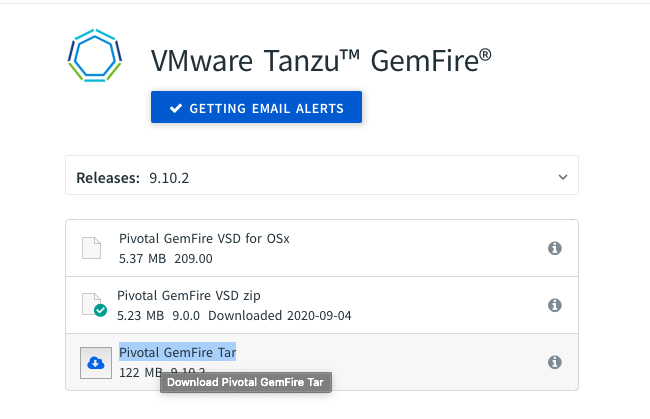
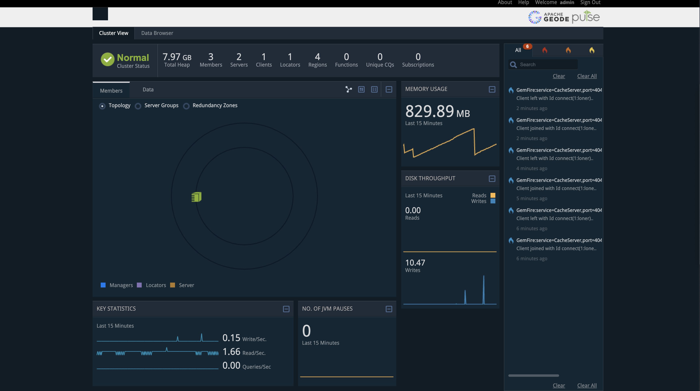

# Pivotal Gemfire sink connector


## Objective

Quickly test [Pivotal Gemfire sink](https://docs.confluent.io/current/connect/kafka-connect-pivotal-gemfire/index.html#pivotal-gemfire-sink-connector-for-cp) connector.


* Create an account [here](https://account.run.pivotal.io/z/uaa/sign-up) and download from [here](https://network.pivotal.io/products/pivotal-gemfire#/releases/692529) `[Pivotal GemFire Tar]` version `9.10.2`, then rename it to `pivotal-gemfire.tgz` and put it into `docker-pivotal-gemfire` directory



## How to run

Simply run:

```
$ ./pivotal-gemfire-sink.sh
```

## Details of what the script is doing

Pulse UI is reachable at [http://127.0.0.1:7070](http://127.0.0.1:7070]) (`admin/admin`)



Starting up locator

```bash
docker exec -i pivotal-gemfire sh /opt/pivotal/workdir/startLocator.sh
```

Starting up server1

```bash
docker exec -i pivotal-gemfire sh /opt/pivotal/workdir/startServer1.sh
```

Starting up server2

```bash
docker exec -i pivotal-gemfire sh /opt/pivotal/workdir/startServer2.sh
```

Sending messages to topic `input_topic`

```bash
docker exec -i connect kafka-avro-console-producer --broker-list broker:9092 --property schema.registry.url=http://schema-registry:8081 --topic input_topic --property value.schema='{"type":"record","name":"myrecord","fields":[{"name":"f1","type":"string"}]}' << EOF
{"f1": "value1"}
{"f1": "value2"}
{"f1": "value3"}
EOF
```

Creating Pivotal Gemfire sink connector

```bash
curl -X PUT \
     -H "Content-Type: application/json" \
     --data '{
               "connector.class": "io.confluent.connect.pivotal.gemfire.PivotalGemfireSinkConnector",
               "tasks.max": "1",
               "topics": "input_topic",
               "gemfire.locator.host":"pivotal-gemfire",
               "gemfire.locator.port":"10334",
               "gemfire.username":"",
               "gemfire.password":"",
               "gemfire.region":"exampleRegion",
               "confluent.topic.bootstrap.servers": "broker:9092",
               "confluent.topic.replication.factor": "1"
          }' \
     http://localhost:8083/connectors/pivotal-gemfire-sink/config | jq .
```

Check messages received in Pivotal Gemfire

```bash
docker exec -i pivotal-gemfire gfsh  << EOF
connect --locator=localhost[10334]
query --query="select * from /exampleRegion"
EOF
```

Results:

```
    _________________________     __
   / _____/ ______/ ______/ /____/ /
  / /  __/ /___  /_____  / _____  /
 / /__/ / ____/  _____/ / /    / /
/______/_/      /______/_/    /_/    9.10.2

Monitor and Manage Pivotal GemFire
gfsh>connect --locator=localhost[10334]
Connecting to Locator at [host=localhost, port=10334] ..
Connecting to Manager at [host=pivotal-gemfire, port=1099] ..
Successfully connected to: [host=pivotal-gemfire, port=1099]

Cluster-1 gfsh>query --query="select * from /exampleRegion"
Result : true
Limit  : 100
Rows   : 3

Result
---------------
{"f1":"value1"}
{"f1":"value2"}
{"f1":"value3"}

Cluster-1 gfsh>
Exiting...
```

N.B: Control Center is reachable at [http://127.0.0.1:9021](http://127.0.0.1:9021])
