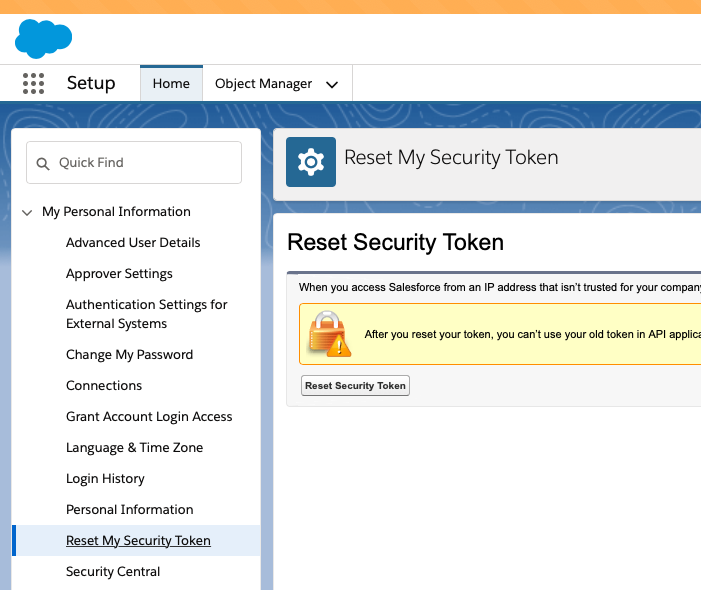
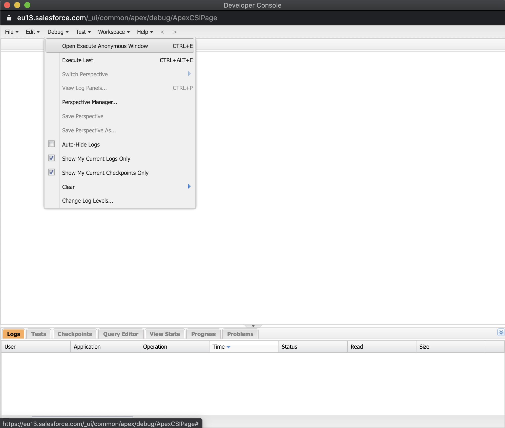
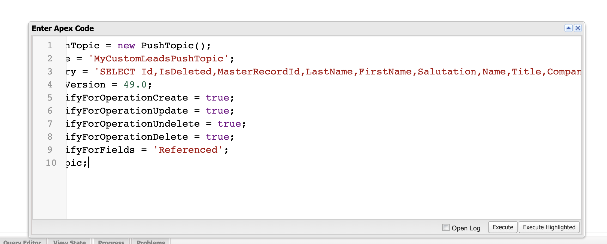

# Salesforce Bulk API Sink connector


## Objective

Quickly test [Salesforce Bulk API Sink](https://docs.confluent.io/current/connect/kafka-connect-salesforce-bulk-api/sink/index.html#salesforce-bulk-api-sink-connector-for-cp) connector.


## Register a test account

Go to [Salesforce developer portal](https://developer.salesforce.com/signup/) and register an account.

## Register another test account

Go to [Salesforce developer portal](https://developer.salesforce.com/signup/) and register an account.

## Salesforce Account

### Create a new Connected App

Full details available [here](https://docs.confluent.io/current/connect/kafka-connect-salesforce/pushtopics/salesforce_pushtopic_source_connector_quickstart.html#salesforce-account)

Steps are:

* Select the gear icon in the upper right hand corner and choose Setup.

* Enter App in the Quick Find search box, and choose *App Manager* in the filtered results.

* Click the *New Connected App* button in the upper right corner of the Setup panel.


* Supply a Connected App Name, API Name, and Contact Email.

* Select *Enable OAuth Settings* checkbox and select the *Enable for Device Flow* checkbox. These selections enable the connector to use the Salesforce API.
* Under the *Select OAuth Scopes* field, select all of the items under Available OAuth scopes and add them to the *Selected OAuth Scopes*.

Example:


* Save the new app and press Continue at the prompt.
* Look for the Consumer Key and Consumer Secret in the displayed form. Save these so you can put them in the configuration properties file for the Salesforce connect worker.

### Find your Security token

Find your Security Token (emailed to you from Salesforce.com). If you need to reset your token or view your profile on Salesforce.com, select `Settings->My Personal Information->Reset My Security Token` and follow the instructions.



## Add a Lead to Salesforce

Full details available [here](https://docs.confluent.io/current/connect/kafka-connect-salesforce/pushtopics/salesforce_pushtopic_source_connector_quickstart.html#add-a-lead-to-salesforce)

* Clic the + button in top right corner:


* Fill the lead details and click save:


N.B: The connector will only get the leads for the last 24 hours.

## Create custom PushTopic

Follow instructions [here](https://developer.salesforce.com/docs/atlas.en-us.api_streaming.meta/api_streaming/code_sample_java_create_pushtopic.htm), otherwise we get with default PushTopic:

```
"[{message:Statut de mise à jour: valeur incorrecte pour le champ de liste de sélection restreinte : 5, fields:[CleanStatus], code:INVALID_OR_NULL_FOR_RESTRICTED_PICKLIST}]"
```




`CleanStatus` was removed from default PushTopic:

```java
PushTopic pushTopic = new PushTopic();
pushTopic.Name = 'MyCustomLeadsPushTopic';
pushTopic.Query = 'SELECT Id,IsDeleted,MasterRecordId,LastName,FirstName,Salutation,Name,Title,Company,City,State,PostalCode,Country,Latitude,Longitude,GeocodeAccuracy,Address,Phone,MobilePhone,Fax,Email,Website,PhotoUrl,LeadSource,Status,Industry,Rating,AnnualRevenue,NumberOfEmployees,OwnerId,IsConverted,ConvertedDate,ConvertedAccountId,ConvertedContactId,ConvertedOpportunityId,IsUnreadByOwner,CreatedDate,CreatedById,LastModifiedDate,LastModifiedById,SystemModstamp,LastActivityDate,LastViewedDate,LastReferencedDate,Jigsaw,JigsawContactId,CompanyDunsNumber,DandbCompanyId,EmailBouncedReason,EmailBouncedDate,IndividualId,SICCode__c,ProductInterest__c,Primary__c,CurrentGenerators__c,NumberofLocations__c FROM Lead';
pushTopic.ApiVersion = 49.0;
pushTopic.NotifyForOperationCreate = true;
pushTopic.NotifyForOperationUpdate = true;
pushTopic.NotifyForOperationUndelete = true;
pushTopic.NotifyForOperationDelete = true;
pushTopic.NotifyForFields = 'Referenced';
insert pushTopic;
```


## How to run

Simply run:

```
$ ./salesforce-bukapi-sink.sh <SALESFORCE_USERNAME> <SALESFORCE_PASSWORD> <CONSUMER_KEY> <CONSUMER_PASSWORD> <SECURITY_TOKEN> <SALESFORCE_USERNAME_ACCOUNT2> <SALESFORCE_PASSWORD_ACCOUNT2> <SECURITY_TOKEN_ACCOUNT2>
```

Note: you can also export these values as environment variable


## Details of what the script is doing

The Salesforce PushTopic source connector is used to get data into Kafka and the Salesforce Bulk API sink connector is used to export data from Kafka to Salesforce

Creating Salesforce PushTopics Source connector

```bash
$ docker exec -e SALESFORCE_USERNAME="$SALESFORCE_USERNAME" -e SALESFORCE_PASSWORD="$SALESFORCE_PASSWORD" -e CONSUMER_KEY="$CONSUMER_KEY" -e CONSUMER_PASSWORD="$CONSUMER_PASSWORD" -e SECURITY_TOKEN="$SECURITY_TOKEN" connect \
     curl -X PUT \
     -H "Content-Type: application/json" \
     --data '{
                    "connector.class": "io.confluent.salesforce.SalesforcePushTopicSourceConnector",
                    "kafka.topic": "sfdc-pushtopic-leads",
                    "tasks.max": "1",
                    "curl.logging": "true",
                    "salesforce.object" : "Lead",
                    "salesforce.push.topic.name" : "MyCustomLeadsPushTopic",
                    "salesforce.username" : "'"$SALESFORCE_USERNAME"'",
                    "salesforce.password" : "'"$SALESFORCE_PASSWORD"'",
                    "salesforce.password.token" : "'"$SECURITY_TOKEN"'",
                    "salesforce.consumer.key" : "'"$CONSUMER_KEY"'",
                    "salesforce.consumer.secret" : "'"$CONSUMER_PASSWORD"'",
                    "salesforce.initial.start" : "all",
                    "key.converter": "org.apache.kafka.connect.json.JsonConverter",
                    "value.converter": "org.apache.kafka.connect.json.JsonConverter",
                    "confluent.license": "",
                    "confluent.topic.bootstrap.servers": "broker:9092",
                    "confluent.topic.replication.factor": "1"
          }' \
     http://localhost:8083/connectors/salesforce-pushtopic-source/config | jq .
```

Verify we have received the data in `sfdc-pushtopic-leads` topic

```bash
$ docker exec broker kafka-console-consumer -bootstrap-server broker:9092 --topic sfdc-pushtopic-leads --from-beginning --max-messages 1
```

Creating Salesforce Bulk API Sink connector

```bash
$ docker exec -e SALESFORCE_USERNAME_ACCOUNT2="$SALESFORCE_USERNAME_ACCOUNT2" -e SALESFORCE_PASSWORD_ACCOUNT2="$SALESFORCE_PASSWORD_ACCOUNT2" -e SECURITY_TOKEN_ACCOUNT2="$SECURITY_TOKEN_ACCOUNT2" connect \
     curl -X PUT \
     -H "Content-Type: application/json" \
     --data '{
                    "connector.class": "io.confluent.connect.salesforce.SalesforceBulkApiSinkConnector",
                    "topics": "sfdc-pushtopic-leads",
                    "tasks.max": "1",
                    "curl.logging": "true",
                    "salesforce.object" : "Lead",
                    "salesforce.username" : "'"$SALESFORCE_USERNAME_ACCOUNT2"'",
                    "salesforce.password" : "'"$SALESFORCE_PASSWORD_ACCOUNT2"'",
                    "salesforce.password.token" : "'"$SECURITY_TOKEN_ACCOUNT2"'",
                    "key.converter": "org.apache.kafka.connect.json.JsonConverter",
                    "value.converter": "org.apache.kafka.connect.json.JsonConverter",
                    "reporter.bootstrap.servers": "broker:9092",
                    "reporter.error.topic.name": "error-responses",
                    "reporter.error.topic.replication.factor": 1,
                    "reporter.result.topic.name": "success-responses",
                    "reporter.result.topic.replication.factor": 1,
                    "confluent.license": "",
                    "confluent.topic.bootstrap.servers": "broker:9092",
                    "confluent.topic.replication.factor": "1"
          }' \
     http://localhost:8083/connectors/salesforce-bulkapi-sink/config | jq .
````

Verify topic `success-responses`

```bash
docker exec broker kafka-console-consumer -bootstrap-server broker:9092 --topic success-responses --from-beginning --max-messages 1
```

Verify topic `error-responses`

```bash
docker exec broker kafka-console-consumer -bootstrap-server broker:9092 --topic error-responses --from-beginning --max-messages 1
```

**FIXTHIS**: Salesforce Bulk API sink is broken [#42](https://github.com/vdesabou/kafka-docker-playground/issues/42)

```
"[{message:Clean Status: bad value for restricted picklist field: 5, fields:[CleanStatus], code:INVALID_OR_NULL_FOR_RESTRICTED_PICKLIST}]"
"[{message:Clean Status: bad value for restricted picklist field: 5, fields:[CleanStatus], code:INVALID_OR_NULL_FOR_RESTRICTED_PICKLIST}]"
"[{message:invalid cross reference id, fields:[], code:INVALID_CROSS_REFERENCE_KEY}]"
"[{message:invalid cross reference id, fields:[], code:INVALID_CROSS_REFERENCE_KEY}]"
"[{message:invalid cross reference id, fields:[], code:INVALID_CROSS_REFERENCE_KEY}]"
"[{message:invalid cross reference id, fields:[], code:INVALID_CROSS_REFERENCE_KEY}]"
"[{message:invalid cross reference id, fields:[], code:INVALID_CROSS_REFERENCE_KEY}]"
"[{message:invalid cross reference id, fields:[], code:INVALID_CROSS_REFERENCE_KEY}]"
"[{message:invalid cross reference id, fields:[], code:INVALID_CROSS_REFERENCE_KEY}]"
"[{message:invalid cross reference id, fields:[], code:INVALID_CROSS_REFERENCE_KEY}]"
"[{message:invalid cross reference id, fields:[], code:INVALID_CROSS_REFERENCE_KEY}]"
```

Login to your SFDC account for account #2 to check that Lead has been added

```bash

N.B: Control Center is reachable at [http://127.0.0.1:9021](http://127.0.0.1:9021])
