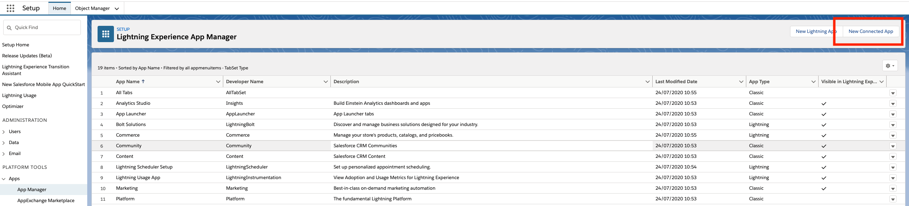
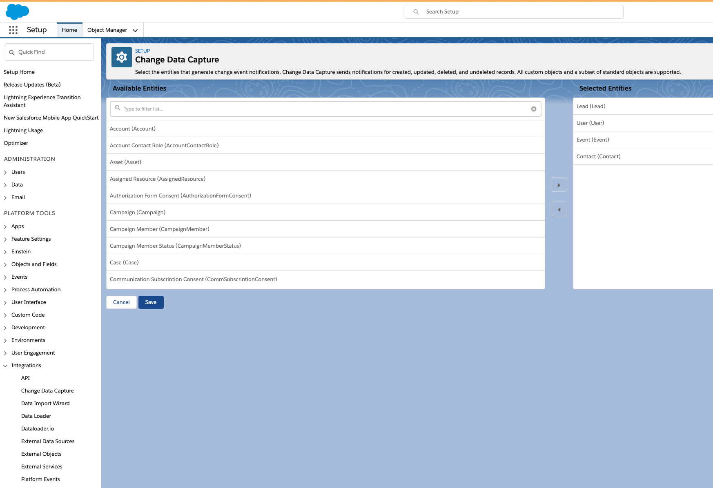
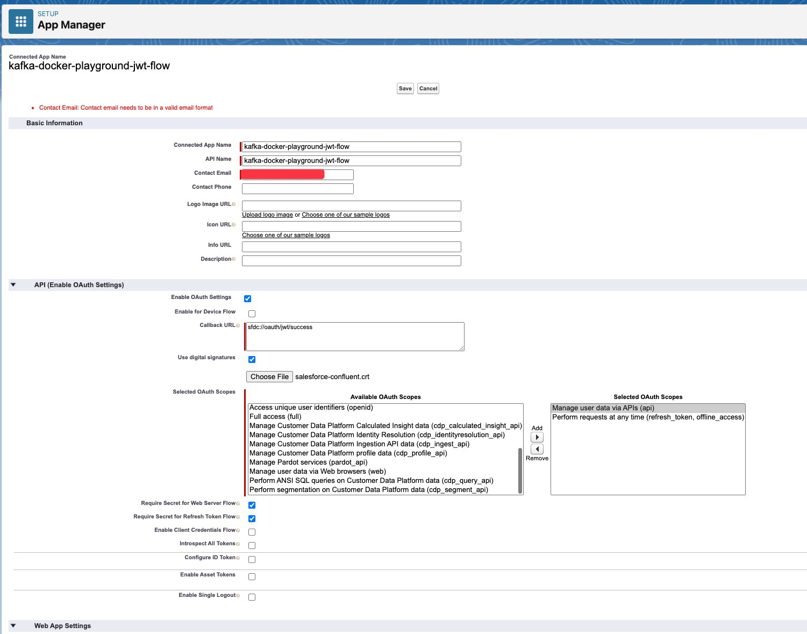
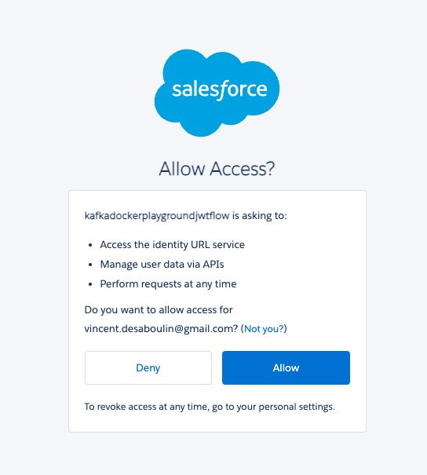

# Salesforce CDC Source connector


## Objective

Quickly test [Salesforce CDC Source](https://docs.confluent.io/current/connect/kafka-connect-salesforce/change-data-capture/index.html#salesforce-cdc-source-connector-for-cp) connector.


## Register a test account

Go to [Salesforce developer portal](https://developer.salesforce.com/signup/) and register an account.

## Salesforce Account

### Create a new Connected App

Full details available [here](https://docs.confluent.io/current/connect/kafka-connect-salesforce/pushtopics/salesforce_pushtopic_source_connector_quickstart.html#salesforce-account)

Steps are:

* Select the gear icon in the upper right hand corner and choose Setup.

* Enter App in the Quick Find search box, and choose *App Manager* in the filtered results.

* Click the *New Connected App* button in the upper right corner of the Setup panel.



* Supply a Connected App Name, API Name, and Contact Email.

* Select *Enable OAuth Settings* checkbox and select the *Enable for Device Flow* checkbox. These selections enable the connector to use the Salesforce API.
* Under the *Select OAuth Scopes* field, select all of the items under Available OAuth scopes and add them to the *Selected OAuth Scopes*.

Example:


* Save the new app and press Continue at the prompt.
* Look for the Consumer Key and Consumer Secret in the displayed form. Save these so you can put them in the configuration for the Salesforce connect or

### Find your Security token

Find your Security Token (emailed to you from Salesforce.com). If you need to reset your token or view your profile on Salesforce.com, select `Settings->My Personal Information->Reset My Security Token` and follow the instructions.


## Enable Change Data Capture

Search for "Change Data Capture" in Settings and then select `Contact`:



## How to run

Simply run:

```
$ playground run -f salesforce-cdc-source<use tab key to activate [fzf completion](https://kafka-docker-playground.io/#/cli?id=%e2%9a%a1-setup-completion) (otherwise use full path, i.e *not relative path*> <SALESFORCE_USERNAME> <SALESFORCE_PASSWORD> <SALESFORCE_CONSUMER_KEY> <SALESFORCE_CONSUMER_PASSWORD> <SALESFORCE_SECURITY_TOKEN>
```

or with JWT flow:

```
$ playground run -f salesforce-cdc-source-jwt-flow<use tab key to activate [fzf completion](https://kafka-docker-playground.io/#/cli?id=%e2%9a%a1-setup-completion) (otherwise use full path, i.e *not relative path*> <SALESFORCE_USERNAME> <SALESFORCE_PASSWORD> <SALESFORCE_CONSUMER_KEY_WITH_JWT> <SALESFORCE_CONSUMER_PASSWORD_WITH_JWT> <SALESFORCE_SECURITY_TOKEN>
```

Note: you can also export these values as environment variable


## Details of what the script is doing

Login with sfdx CLI

```bash
$ docker exec sfdx-cli sh -c "sfdx sfpowerkit:auth:login -u \"$SALESFORCE_USERNAME\" -p \"$SALESFORCE_PASSWORD\" -r \"$SALESFORCE_INSTANCE\" -s \"$SALESFORCE_SECURITY_TOKEN\""
```

Add a Contact to Salesforce

```bash
$ docker exec sfdx-cli sh -c "sfdx data:create:record  --target-org \"$SALESFORCE_USERNAME\" -s Lead -v \"FirstName='John_$RANDOM' LastName='Doe_$RANDOM'\""
```

Creating Salesforce CDC Source connector

```bash
$ curl -X PUT \
     -H "Content-Type: application/json" \
     --data '{
                    "connector.class": "io.confluent.salesforce.SalesforceCdcSourceConnector",
                    "kafka.topic": "sfdc-cdc-contacts",
                    "tasks.max": "1",
                    "curl.logging": "true",
                    "salesforce.cdc.name" : "ContactChangeEvent",
                    "__comment" : "from 2.0.0 salesforce.cdc.name is renamed salesforce.cdc.channel",
                    "salesforce.cdc.channel" : "ContactChangeEvent",
                    "salesforce.instance" : "$SALESFORCE_INSTANCE",
                    "salesforce.username" : "$SALESFORCE_USERNAME",
                    "salesforce.password" : "$SALESFORCE_PASSWORD",
                    "salesforce.password.token" : "$SALESFORCE_SECURITY_TOKEN",
                    "salesforce.consumer.key" : "$SALESFORCE_CONSUMER_KEY",
                    "salesforce.consumer.secret" : "$SALESFORCE_CONSUMER_PASSWORD",
                    "salesforce.initial.start" : "latest",
                    "key.converter": "org.apache.kafka.connect.json.JsonConverter",
                    "value.converter": "org.apache.kafka.connect.json.JsonConverter",
                    "confluent.license": "",
                    "confluent.topic.bootstrap.servers": "broker:9092",
                    "confluent.topic.replication.factor": "1"
          }' \
     http://localhost:8083/connectors/salesforce-cdc-source/config | jq .
```


Verify we have received the data in `sfdc-cdc-contacts` topic

```bash
playground topic consume --topic sfdc-cdc-contacts --min-expected-messages 1 --timeout 60
```

Results:

```json
{
    "payload": {
        "AccountId": null,
        "AssistantName": null,
        "AssistantPhone": null,
        "Birthdate": null,
        "ChangeEventHeader": {
            "changeOrigin": "com/salesforce/api/rest/49.0;client=sfdx toolbelt",
            "changeType": "CREATE",
            "changedFields": [],
            "commitNumber": 10832042834831,
            "commitTimestamp": 1596116025000,
            "commitUser": "0052X00000AJGNCQA5",
            "entityName": "Contact",
            "recordIds": [
                "0032X00002QU10JQAT"
            ],
            "sequenceNumber": 1,
            "transactionKey": "000162ba-13b5-6862-79f9-0805a616799d"
        },
        "CleanStatus": "Pending",
        "CreatedById": "0052X00000AJGNCQA5",
        "CreatedDate": 1596116025000,
        "Department": null,
        "Description": null,
        "Email": null,
        "EmailBouncedDate": null,
        "EmailBouncedReason": null,
        "Fax": null,
        "FirstName": "John_1241",
        "HomePhone": null,
        "Id": "0032X00002QU10JQAT",
        "IndividualId": null,
        "Jigsaw": null,
        "JigsawContactId": null,
        "Languages__c": null,
        "LastCURequestDate": null,
        "LastCUUpdateDate": null,
        "LastModifiedById": "0052X00000AJGNCQA5",
        "LastModifiedDate": 1596116025000,
        "LastName": "Doe_19419",
        "LeadSource": null,
        "Level__c": null,
        "MailingAddress": null,
        "MailingCity": null,
        "MailingCountry": null,
        "MailingGeocodeAccuracy": null,
        "MailingLatitude": null,
        "MailingLongitude": null,
        "MailingPostalCode": null,
        "MailingState": null,
        "MailingStreet": null,
        "MobilePhone": null,
        "Name": null,
        "OtherAddress": null,
        "OtherCity": null,
        "OtherCountry": null,
        "OtherGeocodeAccuracy": null,
        "OtherLatitude": null,
        "OtherLongitude": null,
        "OtherPhone": null,
        "OtherPostalCode": null,
        "OtherState": null,
        "OtherStreet": null,
        "OwnerId": "0052X00000AJGNCQA5",
        "Phone": null,
        "ReplayId": "1305887",
        "ReportsToId": null,
        "Salutation": null,
        "Title": null,
        "_EventType": "R1-FSrKj5SMSfaXy7QNdEw",
        "_ObjectType": "ContactChangeEvent"
    },
    "schema": {
        "fields": [
            {
                "doc": "Unique identifier for the object.",
                "field": "Id",
                "optional": false,
                "type": "string"
            },
            {
                "field": "ReplayId",
                "optional": true,
                "type": "string"
            },
            {
                "field": "ChangeEventHeader",
                "fields": [
                    {
                        "field": "entityName",
                        "optional": true,
                        "type": "string"
                    },
                    {
                        "field": "recordIds",
                        "items": {
                            "optional": false,
                            "type": "string"
                        },
                        "optional": true,
                        "type": "array"
                    },
                    {
                        "field": "changeType",
                        "optional": true,
                        "type": "string"
                    },
                    {
                        "field": "changedFields",
                        "items": {
                            "optional": false,
                            "type": "string"
                        },
                        "optional": true,
                        "type": "array"
                    },
                    {
                        "field": "changeOrigin",
                        "optional": true,
                        "type": "string"
                    },
                    {
                        "field": "transactionKey",
                        "optional": true,
                        "type": "string"
                    },
                    {
                        "field": "sequenceNumber",
                        "optional": true,
                        "type": "int64"
                    },
                    {
                        "field": "commitTimestamp",
                        "optional": true,
                        "type": "int64"
                    },
                    {
                        "field": "commitUser",
                        "optional": true,
                        "type": "string"
                    },
                    {
                        "field": "commitNumber",
                        "optional": true,
                        "type": "int64"
                    }
                ],
                "name": "ChangeEventHeader",
                "optional": false,
                "type": "struct"
            },
            {
                "field": "AccountId",
                "optional": true,
                "type": "string"
            },
            {
                "field": "LastName",
                "optional": true,
                "type": "string"
            },
            {
                "field": "FirstName",
                "optional": true,
                "type": "string"
            },
            {
                "field": "Salutation",
                "optional": true,
                "type": "string"
            },
            {
                "field": "Name",
                "optional": true,
                "type": "string"
            },
            {
                "field": "OtherStreet",
                "optional": true,
                "type": "string"
            },
            {
                "field": "OtherCity",
                "optional": true,
                "type": "string"
            },
            {
                "field": "OtherState",
                "optional": true,
                "type": "string"
            },
            {
                "field": "OtherPostalCode",
                "optional": true,
                "type": "string"
            },
            {
                "field": "OtherCountry",
                "optional": true,
                "type": "string"
            },
            {
                "field": "OtherLatitude",
                "optional": true,
                "type": "double"
            },
            {
                "field": "OtherLongitude",
                "optional": true,
                "type": "double"
            },
            {
                "field": "OtherGeocodeAccuracy",
                "optional": true,
                "type": "string"
            },
            {
                "field": "OtherAddress",
                "fields": [
                    {
                        "field": "GeocodeAccuracy",
                        "optional": true,
                        "type": "string"
                    },
                    {
                        "doc": "",
                        "field": "State",
                        "optional": true,
                        "type": "string"
                    },
                    {
                        "field": "Street",
                        "optional": true,
                        "type": "string"
                    },
                    {
                        "field": "PostalCode",
                        "optional": true,
                        "type": "string"
                    },
                    {
                        "field": "Country",
                        "optional": true,
                        "type": "string"
                    },
                    {
                        "field": "Latitude",
                        "optional": true,
                        "type": "double"
                    },
                    {
                        "field": "City",
                        "optional": true,
                        "type": "string"
                    },
                    {
                        "field": "Longitude",
                        "optional": true,
                        "type": "double"
                    }
                ],
                "name": "io.confluent.salesforce.Address",
                "optional": true,
                "type": "struct"
            },
            {
                "field": "MailingStreet",
                "optional": true,
                "type": "string"
            },
            {
                "field": "MailingCity",
                "optional": true,
                "type": "string"
            },
            {
                "field": "MailingState",
                "optional": true,
                "type": "string"
            },
            {
                "field": "MailingPostalCode",
                "optional": true,
                "type": "string"
            },
            {
                "field": "MailingCountry",
                "optional": true,
                "type": "string"
            },
            {
                "field": "MailingLatitude",
                "optional": true,
                "type": "double"
            },
            {
                "field": "MailingLongitude",
                "optional": true,
                "type": "double"
            },
            {
                "field": "MailingGeocodeAccuracy",
                "optional": true,
                "type": "string"
            },
            {
                "field": "MailingAddress",
                "fields": [
                    {
                        "field": "GeocodeAccuracy",
                        "optional": true,
                        "type": "string"
                    },
                    {
                        "doc": "",
                        "field": "State",
                        "optional": true,
                        "type": "string"
                    },
                    {
                        "field": "Street",
                        "optional": true,
                        "type": "string"
                    },
                    {
                        "field": "PostalCode",
                        "optional": true,
                        "type": "string"
                    },
                    {
                        "field": "Country",
                        "optional": true,
                        "type": "string"
                    },
                    {
                        "field": "Latitude",
                        "optional": true,
                        "type": "double"
                    },
                    {
                        "field": "City",
                        "optional": true,
                        "type": "string"
                    },
                    {
                        "field": "Longitude",
                        "optional": true,
                        "type": "double"
                    }
                ],
                "name": "io.confluent.salesforce.Address",
                "optional": true,
                "type": "struct"
            },
            {
                "field": "Phone",
                "optional": true,
                "type": "string"
            },
            {
                "field": "Fax",
                "optional": true,
                "type": "string"
            },
            {
                "field": "MobilePhone",
                "optional": true,
                "type": "string"
            },
            {
                "field": "HomePhone",
                "optional": true,
                "type": "string"
            },
            {
                "field": "OtherPhone",
                "optional": true,
                "type": "string"
            },
            {
                "field": "AssistantPhone",
                "optional": true,
                "type": "string"
            },
            {
                "field": "ReportsToId",
                "optional": true,
                "type": "string"
            },
            {
                "field": "Email",
                "optional": true,
                "type": "string"
            },
            {
                "field": "Title",
                "optional": true,
                "type": "string"
            },
            {
                "field": "Department",
                "optional": true,
                "type": "string"
            },
            {
                "field": "AssistantName",
                "optional": true,
                "type": "string"
            },
            {
                "field": "LeadSource",
                "optional": true,
                "type": "string"
            },
            {
                "field": "Birthdate",
                "name": "org.apache.kafka.connect.data.Date",
                "optional": true,
                "type": "int32",
                "version": 1
            },
            {
                "field": "Description",
                "optional": true,
                "type": "string"
            },
            {
                "field": "OwnerId",
                "optional": true,
                "type": "string"
            },
            {
                "field": "CreatedDate",
                "name": "org.apache.kafka.connect.data.Timestamp",
                "optional": true,
                "type": "int64",
                "version": 1
            },
            {
                "field": "CreatedById",
                "optional": true,
                "type": "string"
            },
            {
                "field": "LastModifiedDate",
                "name": "org.apache.kafka.connect.data.Timestamp",
                "optional": true,
                "type": "int64",
                "version": 1
            },
            {
                "field": "LastModifiedById",
                "optional": true,
                "type": "string"
            },
            {
                "field": "LastCURequestDate",
                "name": "org.apache.kafka.connect.data.Timestamp",
                "optional": true,
                "type": "int64",
                "version": 1
            },
            {
                "field": "LastCUUpdateDate",
                "name": "org.apache.kafka.connect.data.Timestamp",
                "optional": true,
                "type": "int64",
                "version": 1
            },
            {
                "field": "EmailBouncedReason",
                "optional": true,
                "type": "string"
            },
            {
                "field": "EmailBouncedDate",
                "name": "org.apache.kafka.connect.data.Timestamp",
                "optional": true,
                "type": "int64",
                "version": 1
            },
            {
                "field": "Jigsaw",
                "optional": true,
                "type": "string"
            },
            {
                "field": "JigsawContactId",
                "optional": true,
                "type": "string"
            },
            {
                "field": "CleanStatus",
                "optional": true,
                "type": "string"
            },
            {
                "field": "IndividualId",
                "optional": true,
                "type": "string"
            },
            {
                "field": "Level__c",
                "optional": true,
                "type": "string"
            },
            {
                "field": "Languages__c",
                "optional": true,
                "type": "string"
            },
            {
                "field": "_ObjectType",
                "optional": true,
                "type": "string"
            },
            {
                "field": "_EventType",
                "optional": true,
                "type": "string"
            }
        ],
        "name": "io.confluent.salesforce.ContactChangeEvent",
        "optional": false,
        "type": "struct"
    }
}
```

## OAuth with JWT Bearer Flow

### Generate a private Key and a Certificate

The private key is used by the external app to sign the JWT and the digital certificate is used by Salesforce to validate the signature and issue an access token.

Install OpenSSL and generate a private key and a digital certificate using the command line terminal.

For example:

```bash
keytool -genkey -noprompt -alias salesforce-confluent -dname "CN=ca1.test.confluent.io/OU=TEST/O=CONFLUENT/L=PaloAlto/ST=Ca/C=US" -keystore salesforce-confluent.keystore.jks -keyalg RSA -storepass confluent -keypass confluent -deststoretype pkcs12
keytool -keystore salesforce-confluent.keystore.jks -alias salesforce-confluent -export -file salesforce-confluent.crt -storepass confluent -keypass confluent -trustcacerts -noprompt
```

### Create a new Connected App

Steps are:

* Select the gear icon in the upper right hand corner and choose Setup.

* Enter App in the Quick Find search box, and choose *App Manager* in the filtered results.

* Click the *New Connected App* button in the upper right corner of the Setup panel.


* Supply a Connected App Name, API Name, and Contact Email.

* Select *Enable OAuth Settings* checkbox and select the *Enable for Device Flow* checkbox. These selections enable the connector to use the Salesforce API.
* Enable OAuth Settings
* Set the callback URL to `sfdc://oauth/jwt/success`
* Enable `Use digital signatures` and upload the digital certificate created in the previous step (`salesforce-confluent.crt` file)
* Selected OAuth Scopes : `Manage user data via APIs (api)` + `Perform requests at any time (refresh_token, offline_access)`

Example:



* Save the connected app, it takes between 2 and 10 minutes to be activated.
* Look for the Consumer Key `SALESFORCE_CONSUMER_KEY_WITH_JWT` and Consumer Secret `SALESFORCE_CONSUMER_PASSWORD_WITH_JWT`in the displayed form. Save these so you can put them in the configuration for the Salesforce connector.

### Pre-Approve the connected app with the User-Agent OAuth Flow

One way to pre-approve the connected is by using another simple OAuth Flow. We will use the User-Agent OAuth Flow in this example.


With your environment variables correctly set, do:

```bash
echo "$SALESFORCE_INSTANCE/services/oauth2/authorize?response_type=token&client_id=$SALESFORCE_CONSUMER_KEY_WITH_JWT&redirect_uri=sfdc://oauth/jwt/success"
```

Copy and paste this link in the browser

Login to Salesforce and authorize the connected app.



### Relax IP restrictions

Go to `Manage Connected Apps` and Relax IP restrictions:


N.B: Control Center is reachable at [http://127.0.0.1:9021](http://127.0.0.1:9021])
