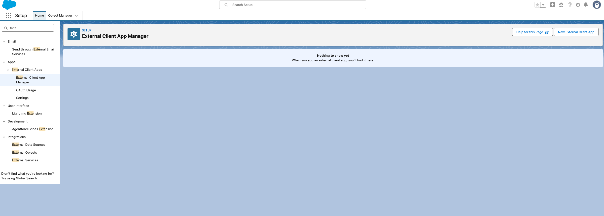
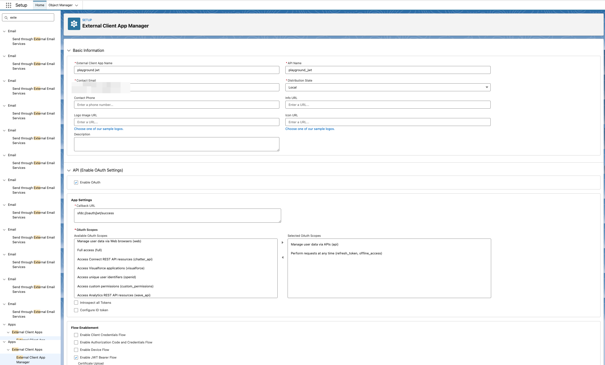
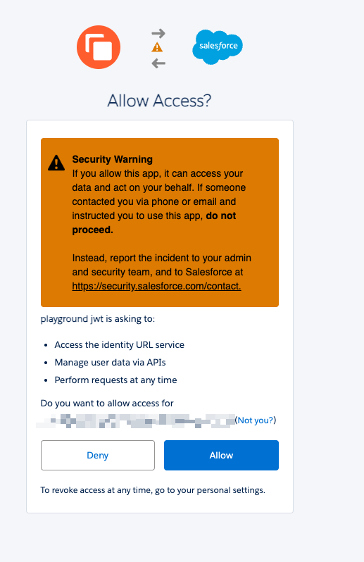
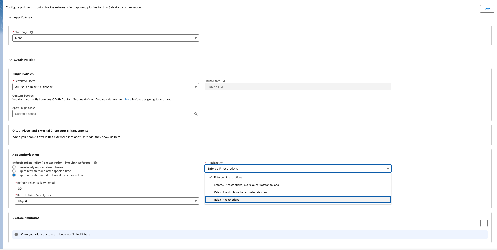

# Salesforce CDC Source connector


## Objective

Quickly test [Salesforce CDC Source](https://docs.confluent.io/current/connect/kafka-connect-salesforce/change-data-capture/index.html#salesforce-cdc-source-connector-for-cp) connector.


## Register a test account

Go to [Salesforce developer portal](https://developer.salesforce.com/signup/) and register an account.

## OAuth with JWT Bearer Flow

### Generate a private Key and a Certificate

The private key is used by the external app to sign the JWT and the digital certificate is used by Salesforce to validate the signature and issue an access token.

Install OpenSSL and generate a private key and a digital certificate using the command line terminal.

For example:

```bash
keytool -genkey -noprompt -alias salesforce-confluent -dname "CN=ca1.test.confluent.io/OU=TEST/O=CONFLUENT/L=PaloAlto/ST=Ca/C=US" -keystore salesforce-confluent.keystore.jks -keyalg RSA -storepass confluent -keypass confluent -deststoretype pkcs12

keytool -exportcert -rfc \
  -keystore salesforce-confluent.p12 \
  -alias salesforce-confluent \
  -file salesforce-confluent.crt \
  -storepass confluent
```

### Create a new External Client App

Steps are:

* Select the gear icon in the upper right hand corner and choose Setup.

* Enter App in the Quick Find search box, and choose *External Client App Manager* in the filtered results.

* Click the *New External Client App* button in the upper right corner of the Setup panel.



* Supply a Connected App Name, API Name, and Contact Email. Distribution State can be set to Local. The API Name is automatically populated based on the Connected App Name.

* Select *API (Enable OAuth Settings)* menu and click on *Enable OAuth* checkbox
* Set the callback URL to `sfdc://oauth/jwt/success`
* Selected OAuth Scopes : `Manage user data via APIs (api)` + `Perform requests at any time (refresh_token, offline_access)`
* Select the *Enable JWT Bearer Flow* checkbox in *Flow Enablement* section.
* Upload the digital certificate created in the previous step (`salesforce-confluent.crt` file)


Example:



* Save the External Client App, it takes between 2 and 10 minutes to be activated.
* Look for the Consumer Key `SALESFORCE_CONSUMER_KEY_WITH_JWT` in the *Settings*/*OAuth Section*/*App Settings*/*Consumer Key and Secret* section. Save these so you can put them in the configuration for the Salesforce connector.

### Pre-Approve the External Client app with the User-Agent OAuth Flow

One way to pre-approve the External Client app is by using another simple OAuth Flow. We will use the User-Agent OAuth Flow in this example.

With your environment variables correctly set, do:

```bash
echo "$SALESFORCE_INSTANCE/services/oauth2/authorize?response_type=token&client_id=$SALESFORCE_CONSUMER_KEY_WITH_JWT&redirect_uri=sfdc://oauth/jwt/success"
```

Copy and paste this link in the browser

Login to Salesforce and authorize the External Client app.



### Relax IP restrictions

Go to `External Client App Manager` and Relax IP restrictions:




N.B: Control Center is reachable at [http://127.0.0.1:9021](http://127.0.0.1:9021])
