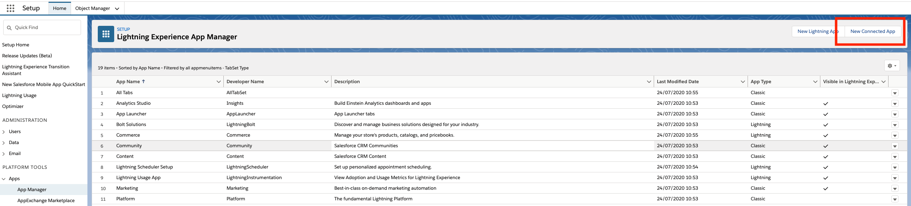
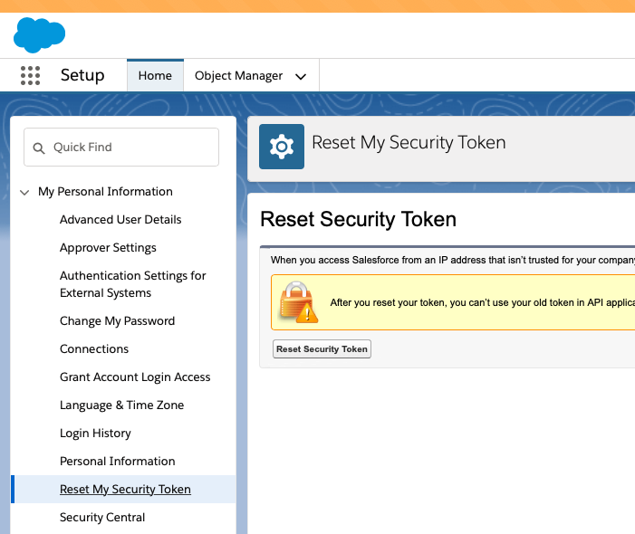
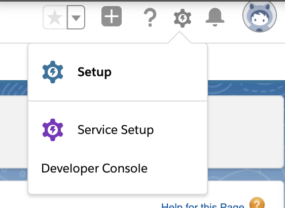

# Salesforce Platform Events Sink connector


## Objective

Quickly test [Salesforce Platform Events Sink](https://docs.confluent.io/current/connect/kafka-connect-salesforce/platformevents_sink/index.html#salesforce-platform-events-sink-connector-for-cp) connector.


## Register a test account

Go to [Salesforce developer portal](https://developer.salesforce.com/signup/) and register an account.

## Salesforce Account

### Create a new Connected App

Full details available [here](https://docs.confluent.io/current/connect/kafka-connect-salesforce/pushtopics/salesforce_pushtopic_source_connector_quickstart.html#salesforce-account)

Steps are:

* Select the gear icon in the upper right hand corner and choose Setup.

* Enter App in the Quick Find search box, and choose *App Manager* in the filtered results.

* Click the *New Connected App* button in the upper right corner of the Setup panel.



* Supply a Connected App Name, API Name, and Contact Email.

* Select *Enable OAuth Settings* checkbox and select the *Enable for Device Flow* checkbox. These selections enable the connector to use the Salesforce API.
* Under the *Select OAuth Scopes* field, select all of the items under Available OAuth scopes and add them to the *Selected OAuth Scopes*.

Example:


* Save the new app and press Continue at the prompt.
* Look for the Consumer Key and Consumer Secret in the displayed form. Save these so you can put them in the configuration properties file for the Salesforce connect worker.

### Find your Security token

Find your Security Token (emailed to you from Salesforce.com). If you need to reset your token or view your profile on Salesforce.com, select `Settings->My Personal Information->Reset My Security Token` and follow the instructions.



## Create a Platform Event in SFDC

In Setup, search for *Platform Events*:


Create new Platform Event called *MyPlatformEvent* as following:


Add a text field *Message*:


## Send a Platform Event using Developer Console (NOT REQUIRED - AUTOMATICALLY DONE)

Select *Developer Console* in upper right menu:



Then choose `Debug->Open Execute Anonymous Window`


Copy/paste the following and Execute it:

```java
List<MyPlatformEvent__e> myEvents = new List<MyPlatformEvent__e>();
myEvents.add(new MyPlatformEvent__e(Message__c ='test message 1'));
myEvents.add(new MyPlatformEvent__e(Message__c ='test message 2'));


// Call method to publish events
List<Database.SaveResult> results = EventBus.publish(myEvents);

// Inspect publishing result for each event
for (Database.SaveResult sr : results) {
    if (sr.isSuccess()) {
        System.debug('Successfully published event.');
    } else {
        for(Database.Error err : sr.getErrors()) {
            System.debug('Error returned: ' +
                        err.getStatusCode() +
                        ' - ' +
                        err.getMessage());
        }
    }
}
```

## How to run

Simply run:

```
$ ./salesforce-Platform-events-sink.sh <SALESFORCE_USERNAME> <SALESFORCE_PASSWORD> <CONSUMER_KEY> <CONSUMER_PASSWORD> <SECURITY_TOKEN>
```

Note: you can also export these values as environment variable


## Details of what the script is doing

Login with sfdx CLI

```bash
$ docker exec sfdx-cli sh -c "sfdx sfpowerkit:auth:login -u \"$SALESFORCE_USERNAME\" -p \"$SALESFORCE_PASSWORD\" -r \"$SALESFORCE_INSTANCE\" -s \"$SECURITY_TOKEN\""
```

Send Platform Events

```bash
$ docker exec sfdx-cli sh -c "sfdx force:apex:execute  -u \"$SALESFORCE_USERNAME\" -f \"/tmp/event.apex\""
```

Creating Salesforce Platform Events Source connector

```bash
$ curl -X PUT \
     -H "Content-Type: application/json" \
     --data '{
                    "connector.class": "io.confluent.salesforce.SalesforcePlatformEventSourceConnector",
                    "kafka.topic": "sfdc-platform-events",
                    "tasks.max": "1",
                    "curl.logging": "true",
                    "salesforce.platform.event.name" : "MyPlatformEvent__e",
                    "salesforce.instance" : "'"$SALESFORCE_INSTANCE"'",
                    "salesforce.username" : "'"$SALESFORCE_USERNAME"'",
                    "salesforce.password" : "'"$SALESFORCE_PASSWORD"'",
                    "salesforce.password.token" : "'"$SECURITY_TOKEN"'",
                    "salesforce.consumer.key" : "'"$CONSUMER_KEY"'",
                    "salesforce.consumer.secret" : "'"$CONSUMER_PASSWORD"'",
                    "salesforce.initial.start" : "all",
                    "key.converter": "org.apache.kafka.connect.json.JsonConverter",
                    "value.converter": "org.apache.kafka.connect.json.JsonConverter",
                    "confluent.license": "",
                    "confluent.topic.bootstrap.servers": "broker:9092",
                    "confluent.topic.replication.factor": "1"
          }' \
     http://localhost:8083/connectors/salesforce-platform-events-source/config | jq .
```


Verify we have received the data in `sfdc-platform-events` topic

```bash
$ timeout 60 docker exec broker kafka-console-consumer -bootstrap-server broker:9092 --topic sfdc-platform-events --from-beginning --max-messages 1
```

Results:

```json
{"schema":{"type":"struct","fields":[{"type":"string","optional":true,"field":"ReplayId"},{"type":"int64","optional":true,"name":"org.apache.kafka.connect.data.Timestamp","version":1,"field":"CreatedDate"},{"type":"string","optional":true,"field":"CreatedById"},{"type":"string","optional":true,"field":"Message__c"},{"type":"string","optional":true,"field":"_ObjectType"},{"type":"string","optional":true,"field":"_EventType"}],"optional":false,"name":"io.confluent.salesforce.MyPlatformEvent__e"},"payload":{"ReplayId":"2956549","CreatedDate":1596010416799,"CreatedById":"0052X00000AJGNCQA5","Message__c":"test message 1","_ObjectType":"MyPlatformEvent__e","_EventType":"ir4e6bGYBtJYSX5x2vc4DQ"}}
{"schema":{"type":"struct","fields":[{"type":"string","optional":true,"field":"ReplayId"},{"type":"int64","optional":true,"name":"org.apache.kafka.connect.data.Timestamp","version":1,"field":"CreatedDate"},{"type":"string","optional":true,"field":"CreatedById"},{"type":"string","optional":true,"field":"Message__c"},{"type":"string","optional":true,"field":"_ObjectType"},{"type":"string","optional":true,"field":"_EventType"}],"optional":false,"name":"io.confluent.salesforce.MyPlatformEvent__e"},"payload":{"ReplayId":"2956550","CreatedDate":1596010416799,"CreatedById":"0052X00000AJGNCQA5","Message__c":"test message 2","_ObjectType":"MyPlatformEvent__e","_EventType":"ir4e6bGYBtJYSX5x2vc4DQ"}}s
```


N.B: Control Center is reachable at [http://127.0.0.1:9021](http://127.0.0.1:9021])
