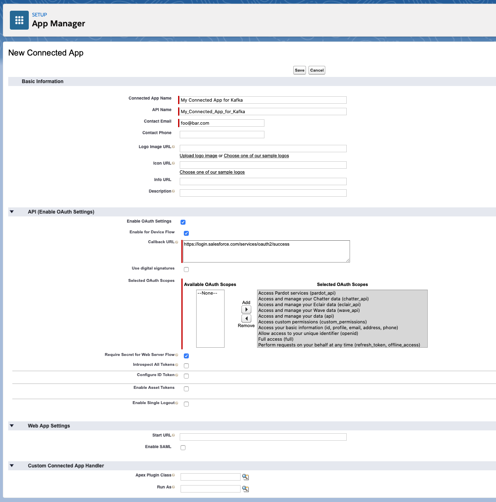

# Salesforce PushTopics Source connector


## Objective

Quickly test [Salesforce PushTopics Source](https://docs.confluent.io/current/connect/kafka-connect-salesforce/pushtopics/salesforce_pushtopic_source_connector_quickstart.html#example-configure-salesforce-pushtopic-source-connector) connector.


## Register a test account

Go to [Salesforce developer portal](https://developer.salesforce.com/signup/) and register an account.

## Salesforce Account

### Create a new Connected App

Full details available [here](https://docs.confluent.io/current/connect/kafka-connect-salesforce/pushtopics/salesforce_pushtopic_source_connector_quickstart.html#salesforce-account)

Steps are:

* Select the gear icon in the upper right hand corner and choose Setup.

* Enter App in the Quick Find search box, and choose *App Manager* in the filtered results.

* Click the *New Connected App* button in the upper right corner of the Setup panel.


* Supply a Connected App Name, API Name, and Contact Email.

* Select *Enable OAuth Settings* checkbox and select the *Enable for Device Flow* checkbox. These selections enable the connector to use the Salesforce API.
* Under the *Select OAuth Scopes* field, select all of the items under Available OAuth scopes and add them to the *Selected OAuth Scopes*.

Example:



* Save the new app and press Continue at the prompt.
* Look for the Consumer Key and Consumer Secret in the displayed form. Save these so you can put them in the configuration properties file for the Salesforce connect worker.

### Find your Security token

Find your Security Token (emailed to you from Salesforce.com). If you need to reset your token or view your profile on Salesforce.com, select `Settings->My Personal Information->Reset My Security Token` and follow the instructions.


## How to run

Simply run:

```
$ ./salesforce-pushtopic-source.sh <SALESFORCE_USERNAME> <SALESFORCE_PASSWORD> <CONSUMER_KEY> <CONSUMER_PASSWORD> <SECURITY_TOKEN>
```

Note: you can also export these values as environment variable


## Details of what the script is doing

Login with sfdx CLI

```bash
$ docker exec sfdx-cli sh -c "sfdx sfpowerkit:auth:login -u \"$SALESFORCE_USERNAME\" -p \"$SALESFORCE_PASSWORD\" -r \"$SALESFORCE_INSTANCE\" -s \"$SECURITY_TOKEN\""
```

Add a Lead to Salesforce

```bash
$ docker exec sfdx-cli sh -c "sfdx force:data:record:create  -u \"$SALESFORCE_USERNAME\" -s Lead -v \"FirstName='$LEAD_FIRSTNAME' LastName='$LEAD_LASTNAME' Company=Confluent\""
```

Creating Salesforce PushTopics Source connector

```bash
$ curl -X PUT \
     -H "Content-Type: application/json" \
     --data '{
                    "connector.class": "io.confluent.salesforce.SalesforcePushTopicSourceConnector",
                    "kafka.topic": "sfdc-pushtopic-leads",
                    "tasks.max": "1",
                    "curl.logging": "true",
                    "salesforce.object" : "Lead",
                    "salesforce.push.topic.name" : "LeadsPushTopic",
                    "salesforce.instance" : "'"$SALESFORCE_INSTANCE"'",
                    "salesforce.username" : "'"$SALESFORCE_USERNAME"'",
                    "salesforce.password" : "'"$SALESFORCE_PASSWORD"'",
                    "salesforce.password.token" : "'"$SECURITY_TOKEN"'",
                    "salesforce.consumer.key" : "'"$CONSUMER_KEY"'",
                    "salesforce.consumer.secret" : "'"$CONSUMER_PASSWORD"'",
                    "salesforce.initial.start" : "all",
                    "key.converter": "org.apache.kafka.connect.json.JsonConverter",
                    "value.converter": "org.apache.kafka.connect.json.JsonConverter",
                    "confluent.license": "",
                    "confluent.topic.bootstrap.servers": "broker:9092",
                    "confluent.topic.replication.factor": "1"
          }' \
     http://localhost:8083/connectors/salesforce-pushtopic-source/config | jq .
```


Verify we have received the data in `sfdc-pushtopic-leads` topic

```bash
$ docker exec broker kafka-console-consumer -bootstrap-server broker:9092 --topic sfdc-pushtopic-leads --from-beginning --max-messages 1
```

Results:

```json
{
    "payload": {
        "Address": {
            "City": null,
            "Country": null,
            "GeocodeAccuracy": null,
            "Latitude": null,
            "Longitude": null,
            "PostalCode": null,
            "State": null,
            "Street": null
        },
        "AnnualRevenue": null,
        "City": null,
        "CleanStatus": "5",
        "Company": "cdscsdcsdcsd",
        "CompanyDunsNumber": null,
        "ConvertedAccountId": null,
        "ConvertedContactId": null,
        "ConvertedDate": null,
        "ConvertedOpportunityId": null,
        "Country": null,
        "CreatedById": "0052X00000AJGNCQA5",
        "CreatedDate": 1595578138000,
        "CurrentGenerators__c": null,
        "DandbCompanyId": null,
        "Description": null,
        "Email": "csdcsd@titi.com",
        "EmailBouncedDate": null,
        "EmailBouncedReason": null,
        "Fax": null,
        "FirstName": "csdcds",
        "GeocodeAccuracy": null,
        "Id": "00Q2X00001OPBbQUAX",
        "IndividualId": null,
        "Industry": null,
        "IsConverted": false,
        "IsDeleted": false,
        "IsUnreadByOwner": true,
        "Jigsaw": null,
        "JigsawContactId": null,
        "LastActivityDate": null,
        "LastModifiedById": "0052X00000AJGNCQA5",
        "LastModifiedDate": 1595578138000,
        "LastName": "csdcsd",
        "LastReferencedDate": null,
        "LastViewedDate": null,
        "Latitude": null,
        "LeadSource": null,
        "Longitude": null,
        "MasterRecordId": null,
        "MobilePhone": null,
        "Name": "csdcds csdcsd",
        "NumberOfEmployees": null,
        "NumberofLocations__c": null,
        "OwnerId": "0052X00000AJGNCQA5",
        "Phone": null,
        "PhotoUrl": null,
        "PostalCode": null,
        "Primary__c": null,
        "ProductInterest__c": null,
        "Rating": null,
        "SICCode__c": null,
        "Salutation": "Mr.",
        "State": null,
        "Status": "Open - Not Contacted",
        "Street": null,
        "SystemModstamp": 1595578138000,
        "Title": "cdcs",
        "Website": null,
        "_EventType": "created",
        "_ObjectType": "Lead"
    },
    "schema": {
        "fields": [
            {
                "doc": "Unique identifier for the object.",
                "field": "Id",
                "optional": false,
                "type": "string"
            },
            {
                "field": "IsDeleted",
                "optional": true,
                "type": "boolean"
            },
            {
                "field": "MasterRecordId",
                "optional": true,
                "type": "string"
            },
            {
                "field": "LastName",
                "optional": true,
                "type": "string"
            },
            {
                "field": "FirstName",
                "optional": true,
                "type": "string"
            },
            {
                "field": "Salutation",
                "optional": true,
                "type": "string"
            },
            {
                "field": "Name",
                "optional": true,
                "type": "string"
            },
            {
                "field": "Title",
                "optional": true,
                "type": "string"
            },
            {
                "field": "Company",
                "optional": true,
                "type": "string"
            },
            {
                "field": "Street",
                "optional": true,
                "type": "string"
            },
            {
                "field": "City",
                "optional": true,
                "type": "string"
            },
            {
                "field": "State",
                "optional": true,
                "type": "string"
            },
            {
                "field": "PostalCode",
                "optional": true,
                "type": "string"
            },
            {
                "field": "Country",
                "optional": true,
                "type": "string"
            },
            {
                "field": "Latitude",
                "optional": true,
                "type": "double"
            },
            {
                "field": "Longitude",
                "optional": true,
                "type": "double"
            },
            {
                "field": "GeocodeAccuracy",
                "optional": true,
                "type": "string"
            },
            {
                "field": "Address",
                "fields": [
                    {
                        "field": "GeocodeAccuracy",
                        "optional": true,
                        "type": "string"
                    },
                    {
                        "doc": "",
                        "field": "State",
                        "optional": true,
                        "type": "string"
                    },
                    {
                        "field": "Street",
                        "optional": true,
                        "type": "string"
                    },
                    {
                        "field": "PostalCode",
                        "optional": true,
                        "type": "string"
                    },
                    {
                        "field": "Country",
                        "optional": true,
                        "type": "string"
                    },
                    {
                        "field": "Latitude",
                        "optional": true,
                        "type": "double"
                    },
                    {
                        "field": "City",
                        "optional": true,
                        "type": "string"
                    },
                    {
                        "field": "Longitude",
                        "optional": true,
                        "type": "double"
                    }
                ],
                "name": "io.confluent.salesforce.Address",
                "optional": true,
                "type": "struct"
            },
            {
                "field": "Phone",
                "optional": true,
                "type": "string"
            },
            {
                "field": "MobilePhone",
                "optional": true,
                "type": "string"
            },
            {
                "field": "Fax",
                "optional": true,
                "type": "string"
            },
            {
                "field": "Email",
                "optional": true,
                "type": "string"
            },
            {
                "field": "Website",
                "optional": true,
                "type": "string"
            },
            {
                "field": "PhotoUrl",
                "optional": true,
                "type": "string"
            },
            {
                "field": "Description",
                "optional": true,
                "type": "string"
            },
            {
                "field": "LeadSource",
                "optional": true,
                "type": "string"
            },
            {
                "field": "Status",
                "optional": true,
                "type": "string"
            },
            {
                "field": "Industry",
                "optional": true,
                "type": "string"
            },
            {
                "field": "Rating",
                "optional": true,
                "type": "string"
            },
            {
                "field": "AnnualRevenue",
                "optional": true,
                "type": "string"
            },
            {
                "field": "NumberOfEmployees",
                "optional": true,
                "type": "int32"
            },
            {
                "field": "OwnerId",
                "optional": true,
                "type": "string"
            },
            {
                "field": "IsConverted",
                "optional": true,
                "type": "boolean"
            },
            {
                "field": "ConvertedDate",
                "name": "org.apache.kafka.connect.data.Date",
                "optional": true,
                "type": "int32",
                "version": 1
            },
            {
                "field": "ConvertedAccountId",
                "optional": true,
                "type": "string"
            },
            {
                "field": "ConvertedContactId",
                "optional": true,
                "type": "string"
            },
            {
                "field": "ConvertedOpportunityId",
                "optional": true,
                "type": "string"
            },
            {
                "field": "IsUnreadByOwner",
                "optional": true,
                "type": "boolean"
            },
            {
                "field": "CreatedDate",
                "name": "org.apache.kafka.connect.data.Timestamp",
                "optional": true,
                "type": "int64",
                "version": 1
            },
            {
                "field": "CreatedById",
                "optional": true,
                "type": "string"
            },
            {
                "field": "LastModifiedDate",
                "name": "org.apache.kafka.connect.data.Timestamp",
                "optional": true,
                "type": "int64",
                "version": 1
            },
            {
                "field": "LastModifiedById",
                "optional": true,
                "type": "string"
            },
            {
                "field": "SystemModstamp",
                "name": "org.apache.kafka.connect.data.Timestamp",
                "optional": true,
                "type": "int64",
                "version": 1
            },
            {
                "field": "LastActivityDate",
                "name": "org.apache.kafka.connect.data.Date",
                "optional": true,
                "type": "int32",
                "version": 1
            },
            {
                "field": "LastViewedDate",
                "name": "org.apache.kafka.connect.data.Timestamp",
                "optional": true,
                "type": "int64",
                "version": 1
            },
            {
                "field": "LastReferencedDate",
                "name": "org.apache.kafka.connect.data.Timestamp",
                "optional": true,
                "type": "int64",
                "version": 1
            },
            {
                "field": "Jigsaw",
                "optional": true,
                "type": "string"
            },
            {
                "field": "JigsawContactId",
                "optional": true,
                "type": "string"
            },
            {
                "field": "CleanStatus",
                "optional": true,
                "type": "string"
            },
            {
                "field": "CompanyDunsNumber",
                "optional": true,
                "type": "string"
            },
            {
                "field": "DandbCompanyId",
                "optional": true,
                "type": "string"
            },
            {
                "field": "EmailBouncedReason",
                "optional": true,
                "type": "string"
            },
            {
                "field": "EmailBouncedDate",
                "name": "org.apache.kafka.connect.data.Timestamp",
                "optional": true,
                "type": "int64",
                "version": 1
            },
            {
                "field": "IndividualId",
                "optional": true,
                "type": "string"
            },
            {
                "field": "SICCode__c",
                "optional": true,
                "type": "string"
            },
            {
                "field": "ProductInterest__c",
                "optional": true,
                "type": "string"
            },
            {
                "field": "Primary__c",
                "optional": true,
                "type": "string"
            },
            {
                "field": "CurrentGenerators__c",
                "optional": true,
                "type": "string"
            },
            {
                "field": "NumberofLocations__c",
                "optional": true,
                "type": "double"
            },
            {
                "field": "_ObjectType",
                "optional": true,
                "type": "string"
            },
            {
                "field": "_EventType",
                "optional": true,
                "type": "string"
            }
        ],
        "name": "io.confluent.salesforce.Lead",
        "optional": false,
        "type": "struct"
    }
}
```
N.B: Control Center is reachable at [http://127.0.0.1:9021](http://127.0.0.1:9021])
