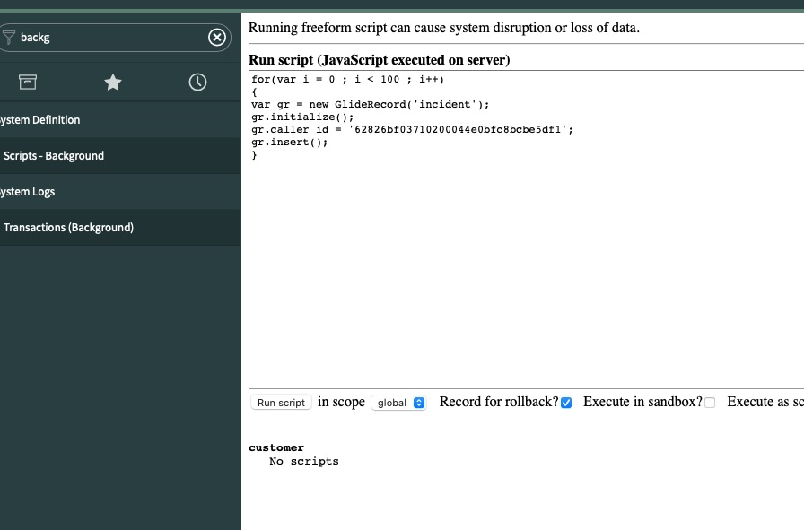
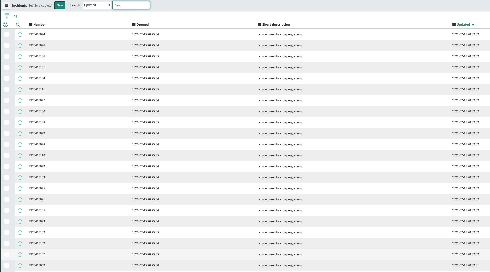

Before running the test go to ServiceNow UI and select `Scripts Background`

Execute the following:

```java
for(var i = 0 ; i < 100 ; i++)
{
var gr = new GlideRecord('incident');
gr.initialize();
gr.caller_id = '62826bf03710200044e0bfc8bcbe5df1';
gr.short_description = 'repro-connector-not-progressing';
gr.insert();
}
```



Then:


```java
var inc = new GlideRecord(“incident”);
inc.addEncodedQuery(“short_description=repro-connector-not-progressing”);
inc.query();
// Run a while loop and interate through the records found
while (inc.next()) {
 inc.work_notes = “Updating all repro-connector-not-progressing incidents“;
 inc.autoSysFields(true);
 inc.setWorkflow(false);
 inc.update();
}
```

You should see multiple incidents (more than 10 to reproduce, as `batch.max.rows` is set to 10) updated in same second:




In logs, I see:

```log
18:41:20,086] DEBUG Collected 10 records, new offset at <2021-07-15T17:05:45, null, null> (io.confluent.connect.servicenow.ServiceNowSourceTask)
[2021-07-15 18:41:20,101] INFO creating interceptor (io.confluent.monitoring.clients.interceptor.MonitoringProducerInterceptor)
[2021-07-15 18:41:20,102] DEBUG Launch HTTP request to following URL: /api/now/table/incident (io.confluent.connect.servicenow.rest.ServiceNowClientImpl)
[2021-07-15 18:41:20,102] DEBUG Calling GET on https://dev71747.service-now.com/api/now/table/incident?sysparm_query=sys_updated_on%3E%3D2021-07-15%2017:05:45%5EORDERBYsys_updated_on&sysparm_limit=10 (io.confluent.connect.servicenow.rest.ServiceNowClientImpl)

```

And then, over and over:

```log
[2021-07-15 18:41:20,486] DEBUG Collected 0 records, new offset at <2021-07-15T17:05:45, null, null> (io.confluent.connect.servicenow.ServiceNowSourceTask)
[2021-07-15 18:41:20,487] DEBUG Launch HTTP request to following URL: /api/now/table/incident (io.confluent.connect.servicenow.rest.ServiceNowClientImpl)
[2021-07-15 18:41:20,487] DEBUG Calling GET on https://dev71747.service-now.com/api/now/table/incident?sysparm_query=sys_updated_on%3E%3D2021-07-15%2017:05:45%5EORDERBYsys_updated_on&sysparm_limit=10 (io.confluent.connect.servicenow.rest.ServiceNowClientImpl)
[2021-07-15 18:41:20,857] DEBUG Collected 0 records, new offset at <2021-07-15T17:05:45, null, null> (io.confluent.connect.servicenow.ServiceNowSourceTask)
[2021-07-15 18:41:20,857] DEBUG Launch HTTP request to following URL: /api/now/table/incident (io.confluent.connect.servicenow.rest.ServiceNowClientImpl)
[2021-07-15 18:41:20,857] DEBUG Calling GET on https://dev71747.service-now.com/api/now/table/incident?sysparm_query=sys_updated_on%3E%3D2021-07-15%2017:05:45%5EORDERBYsys_updated_on&sysparm_limit=10 (io.confluent.connect.servicenow.rest.ServiceNowClientImpl)
```
