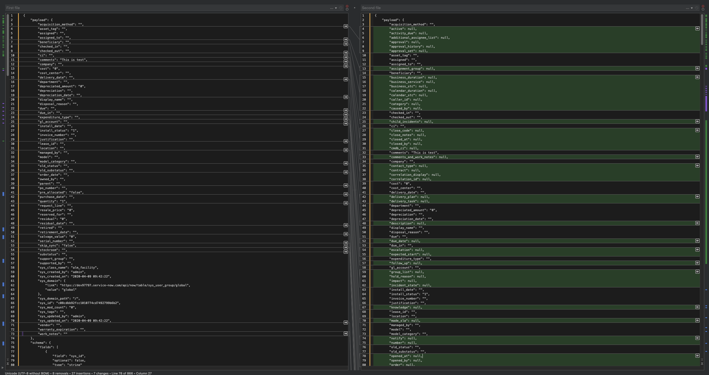

#

Create connector 1 (called `servicenow-source1`) reading table `incident`:

```bash
$ docker exec -e SERVICENOW_URL="$SERVICENOW_URL" -e SERVICENOW_PASSWORD="$SERVICENOW_PASSWORD" -e TODAY="$TODAY" connect \
curl -X PUT \
     -H "Content-Type: application/json" \
     --data '{
                    "connector.class": "io.confluent.connect.servicenow.ServiceNowSourceConnector",
                    "kafka.topic": "topic-servicenow1",
                    "servicenow.url": "'"$SERVICENOW_URL"'",
                    "tasks.max": "1",
                    "servicenow.table": "incident",
                    "servicenow.user": "admin",
                    "servicenow.password": "'"$SERVICENOW_PASSWORD"'",
                    "servicenow.since": "'"$TODAY"'",
                    "key.converter": "org.apache.kafka.connect.json.JsonConverter",
                    "value.converter": "org.apache.kafka.connect.json.JsonConverter",
                    "confluent.license": "",
                    "confluent.topic.bootstrap.servers": "broker:9092",
                    "confluent.topic.replication.factor": "1"
          }' \
     http://localhost:8083/connectors/servicenow-source1/config | jq .
```

Create one record to ServiceNow on table `incident`:

```bash
$ docker exec -e SERVICENOW_URL="$SERVICENOW_URL" -e SERVICENOW_PASSWORD="$SERVICENOW_PASSWORD" connect \
   curl -X POST \
    "${SERVICENOW_URL}/api/now/table/incident" \
    --user admin:"$SERVICENOW_PASSWORD" \
    -H 'Accept: application/json' \
    -H 'Content-Type: application/json' \
    -H 'cache-control: no-cache' \
    -d '{"short_description": "This is test"}'
```

Verify we have received the data in topic-servicenow1 topic

```bash
$ timeout 60 docker exec connect kafka-console-consumer -bootstrap-server broker:9092 --topic topic-servicenow1 --from-beginning --max-messages 1
```

```json
{
    "payload": {
        "active": "true",
        "activity_due": "",
        "additional_assignee_list": "",
        "approval": "not requested",
        "approval_history": "",
        "approval_set": "",
        "assigned_to": "",
        "assignment_group": "",
        "business_duration": "",
        "business_service": "",
        "business_stc": "",
        "calendar_duration": "",
        "calendar_stc": "",
        "caller_id": "",
        "category": "inquiry",
        "caused_by": "",
        "child_incidents": "0",
        "close_code": "",
        "close_notes": "",
        "closed_at": "",
        "closed_by": "",
        "cmdb_ci": "",
        "comments": "",
        "comments_and_work_notes": "",
        "company": "",
        "contact_type": "",
        "contract": "",
        "correlation_display": "",
        "correlation_id": "",
        "delivery_plan": "",
        "delivery_task": "",
        "description": "",
        "due_date": "",
        "escalation": "0",
        "expected_start": "",
        "follow_up": "",
        "group_list": "",
        "hold_reason": "",
        "impact": "3",
        "incident_state": "1",
        "knowledge": "false",
        "location": "",
        "made_sla": "true",
        "notify": "1",
        "number": "INC0010001",
        "opened_at": 0,
        "opened_by": {
            "link": "https://dev97797.service-now.com/api/now/table/sys_user/6816f79cc0a8016401c5a33be04be441",
            "value": "6816f79cc0a8016401c5a33be04be441"
        },
        "order": "",
        "parent": "",
        "parent_incident": "",
        "priority": "5",
        "problem_id": "",
        "reassignment_count": "0",
        "reopen_count": "0",
        "reopened_by": "",
        "reopened_time": "",
        "resolved_at": "",
        "resolved_by": "",
        "rfc": "",
        "service_offering": "",
        "severity": "3",
        "short_description": "This is test",
        "sla_due": "",
        "state": "1",
        "subcategory": "",
        "sys_class_name": "incident",
        "sys_created_by": "admin",
        "sys_created_on": "2020-04-09 09:18:15",
        "sys_domain": {
            "link": "https://dev97797.service-now.com/api/now/table/sys_user_group/global",
            "value": "global"
        },
        "sys_domain_path": "/",
        "sys_id": "76f61bf12fcc1010774cd7492799b6b1",
        "sys_mod_count": "0",
        "sys_tags": "",
        "sys_updated_by": "admin",
        "sys_updated_on": "2020-04-09 09:18:15",
        "time_worked": "",
        "upon_approval": "proceed",
        "upon_reject": "cancel",
        "urgency": "3",
        "user_input": "",
        "watch_list": "",
        "work_end": "",
        "work_notes": "",
        "work_notes_list": "",
        "work_start": ""
    }
}
```


Now if we create another connector `servicenow-source2`reading table `alm_facility`

Creating ServiceNow Source connector 2

```bash
$ docker exec -e SERVICENOW_URL="$SERVICENOW_URL" -e SERVICENOW_PASSWORD="$SERVICENOW_PASSWORD" -e TODAY="$TODAY" connect \
curl -X PUT \
     -H "Content-Type: application/json" \
     --data '{
                    "connector.class": "io.confluent.connect.servicenow.ServiceNowSourceConnector",
                    "kafka.topic": "topic-servicenow2",
                    "servicenow.url": "'"$SERVICENOW_URL"'",
                    "tasks.max": "1",
                    "servicenow.table": "alm_facility",
                    "servicenow.user": "admin",
                    "servicenow.password": "'"$SERVICENOW_PASSWORD"'",
                    "servicenow.since": "'"$TODAY"'",
                    "key.converter": "org.apache.kafka.connect.json.JsonConverter",
                    "value.converter": "org.apache.kafka.connect.json.JsonConverter",
                    "confluent.license": "",
                    "confluent.topic.bootstrap.servers": "broker:9092",
                    "confluent.topic.replication.factor": "1"
          }' \
     http://localhost:8083/connectors/servicenow-source2/config | jq .
```

Create one record to ServiceNow for table `alm_facility`

```bash
$ docker exec -e SERVICENOW_URL="$SERVICENOW_URL" -e SERVICENOW_PASSWORD="$SERVICENOW_PASSWORD" connect \
   curl -X POST \
    "${SERVICENOW_URL}/api/now/table/alm_facility" \
    --user admin:"$SERVICENOW_PASSWORD" \
    -H 'Accept: application/json' \
    -H 'Content-Type: application/json' \
    -H 'cache-control: no-cache' \
    -d '{"comments": "This is test"}'
```

Verify we have received the data in topic-servicenow2 topic:

```bash
$ timeout 60 docker exec connect kafka-console-consumer -bootstrap-server broker:9092 --topic topic-servicenow2 --from-beginning --max-messages 1
```

See the screenshot below: on the left is when there is only one connector running, on the right, it's when there are two. The extra fields are coming from the table loaded by first connector



We get:

```json
{
    "payload": {
        "acquisition_method": "",
        "active": null,
        "activity_due": null,
        "additional_assignee_list": null,
        "approval": null,
        "approval_history": null,
        "approval_set": null,
        "asset_tag": "",
        "assigned": "",
        "assigned_to": "",
        "assignment_group": null,
        "beneficiary": "",
        "business_duration": null,
        "business_service": null,
        "business_stc": null,
        "calendar_duration": null,
        "calendar_stc": null,
        "caller_id": null,
        "category": null,
        "caused_by": null,
        "checked_in": "",
        "checked_out": "",
        "child_incidents": null,
        "ci": "",
        "close_code": null,
        "close_notes": null,
        "closed_at": null,
        "closed_by": null,
        "cmdb_ci": null,
        "comments": "This is test",
        "comments_and_work_notes": null,
        "company": "",
        "contact_type": null,
        "contract": null,
        "correlation_display": null,
        "correlation_id": null,
        "cost": "0",
        "cost_center": "",
        "delivery_date": "",
        "delivery_plan": null,
        "delivery_task": null,
        "department": "",
        "depreciated_amount": "0",
        "depreciation": "",
        "depreciation_date": "",
        "description": null,
        "display_name": "",
        "disposal_reason": "",
        "due": "",
        "due_date": null,
        "due_in": "",
        "escalation": null,
        "expected_start": null,
        "expenditure_type": "",
        "follow_up": null,
        "gl_account": "",
        "group_list": null,
        "hold_reason": null,
        "impact": null,
        "incident_state": null,
        "install_date": "",
        "install_status": "1",
        "invoice_number": "",
        "justification": "",
        "knowledge": null,
        "lease_id": "",
        "location": "",
        "made_sla": null,
        "managed_by": "",
        "model": "",
        "model_category": "",
        "notify": null,
        "number": null,
        "old_status": "",
        "old_substatus": "",
        "opened_at": null,
        "opened_by": null,
        "order": null,
        "order_date": "",
        "owned_by": "",
        "parent": "",
        "parent_incident": null,
        "po_number": "",
        "pre_allocated": "false",
        "priority": null,
        "problem_id": null,
        "purchase_date": "",
        "quantity": "1",
        "reassignment_count": null,
        "reopen_count": null,
        "reopened_by": null,
        "reopened_time": null,
        "request_line": "",
        "resale_price": "0",
        "reserved_for": "",
        "residual": "0",
        "residual_date": "",
        "resolved_at": null,
        "resolved_by": null,
        "retired": "",
        "retirement_date": "",
        "rfc": null,
        "salvage_value": "0",
        "serial_number": "",
        "service_offering": null,
        "severity": null,
        "short_description": null,
        "skip_sync": "false",
        "sla_due": null,
        "state": null,
        "stockroom": "",
        "subcategory": null,
        "substatus": "",
        "support_group": "",
        "supported_by": "",
        "sys_class_name": "alm_facility",
        "sys_created_by": "admin",
        "sys_created_on": "2020-04-09 09:42:22",
        "sys_domain": {
            "link": "https://dev97797.service-now.com/api/now/table/sys_user_group/global",
            "value": "global"
        },
        "sys_domain_path": "/",
        "sys_id": "c08cdbb92fcc1010774cd7492799b6b2",
        "sys_mod_count": "0",
        "sys_tags": "",
        "sys_updated_by": "admin",
        "sys_updated_on": "2020-04-09 09:42:22",
        "time_worked": null,
        "upon_approval": null,
        "upon_reject": null,
        "urgency": null,
        "user_input": null,
        "vendor": "",
        "warranty_expiration": "",
        "watch_list": null,
        "work_end": null,
        "work_notes": "",
        "work_notes_list": null,
        "work_start": null
    }
}
```


whereas normally we should get:

```json
{
    "payload": {
        "acquisition_method": "",
        "asset_tag": "",
        "assigned": "",
        "assigned_to": "",
        "beneficiary": "",
        "checked_in": "",
        "checked_out": "",
        "ci": "",
        "comments": "This is test",
        "company": "",
        "cost": "0",
        "cost_center": "",
        "delivery_date": "",
        "department": "",
        "depreciated_amount": "0",
        "depreciation": "",
        "depreciation_date": "",
        "display_name": "",
        "disposal_reason": "",
        "due": "",
        "due_in": "",
        "expenditure_type": "",
        "gl_account": "",
        "install_date": "",
        "install_status": "1",
        "invoice_number": "",
        "justification": "",
        "lease_id": "",
        "location": "",
        "managed_by": "",
        "model": "",
        "model_category": "",
        "old_status": "",
        "old_substatus": "",
        "order_date": "",
        "owned_by": "",
        "parent": "",
        "po_number": "",
        "pre_allocated": "false",
        "purchase_date": "",
        "quantity": "1",
        "request_line": "",
        "resale_price": "0",
        "reserved_for": "",
        "residual": "0",
        "residual_date": "",
        "retired": "",
        "retirement_date": "",
        "salvage_value": "0",
        "serial_number": "",
        "skip_sync": "false",
        "stockroom": "",
        "substatus": "",
        "support_group": "",
        "supported_by": "",
        "sys_class_name": "alm_facility",
        "sys_created_by": "admin",
        "sys_created_on": "2020-04-09 09:42:22",
        "sys_domain": {
            "link": "https://dev97797.service-now.com/api/now/table/sys_user_group/global",
            "value": "global"
        },
        "sys_domain_path": "/",
        "sys_id": "c08cdbb92fcc1010774cd7492799b6b2",
        "sys_mod_count": "0",
        "sys_tags": "",
        "sys_updated_by": "admin",
        "sys_updated_on": "2020-04-09 09:42:22",
        "vendor": "",
        "warranty_expiration": "",
        "work_notes": ""
    }
}
```


**With the fix:**

```
{
    "payload": {
        "acquisition_method": "",
        "asset_tag": "",
        "assigned": "",
        "assigned_to": "",
        "beneficiary": "",
        "checked_in": "",
        "checked_out": "",
        "ci": "",
        "comments": "This is test",
        "company": "",
        "cost": "0",
        "cost_center": "",
        "delivery_date": "",
        "department": "",
        "depreciated_amount": "0",
        "depreciation": "",
        "depreciation_date": "",
        "display_name": "",
        "disposal_reason": "",
        "due": "",
        "due_in": "",
        "expenditure_type": "",
        "gl_account": "",
        "install_date": "",
        "install_status": "1",
        "invoice_number": "",
        "justification": "",
        "lease_id": "",
        "location": "",
        "managed_by": "",
        "model": "",
        "model_category": "",
        "old_status": "",
        "old_substatus": "",
        "order_date": "",
        "owned_by": "",
        "parent": "",
        "po_number": "",
        "pre_allocated": "false",
        "purchase_date": "",
        "quantity": "1",
        "request_line": "",
        "resale_price": "0",
        "reserved_for": "",
        "residual": "0",
        "residual_date": "",
        "retired": "",
        "retirement_date": "",
        "salvage_value": "0",
        "serial_number": "",
        "skip_sync": "false",
        "stockroom": "",
        "substatus": "",
        "support_group": "",
        "supported_by": "",
        "sys_class_name": "alm_facility",
        "sys_created_by": "admin",
        "sys_created_on": "2020-04-09 09:42:22",
        "sys_domain": {
            "link": "https://dev97797.service-now.com/api/now/table/sys_user_group/global",
            "value": "global"
        },
        "sys_domain_path": "/",
        "sys_id": "c08cdbb92fcc1010774cd7492799b6b2",
        "sys_mod_count": "0",
        "sys_tags": "",
        "sys_updated_by": "admin",
        "sys_updated_on": "2020-04-09 09:42:22",
        "vendor": "",
        "warranty_expiration": "",
        "work_notes": ""
    }
}
```
