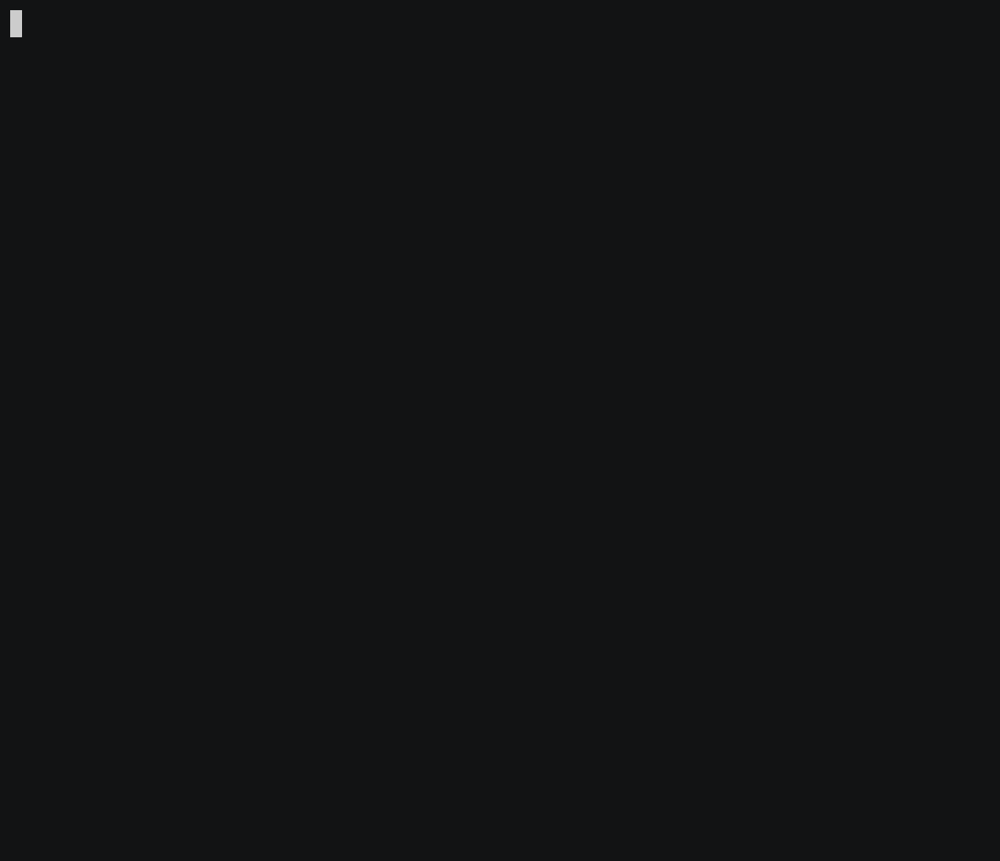

# SNMP Source connector



## Objective

Quickly test [SNMP Source](https://docs.confluent.io/current/connect/kafka-connect-snmp/index.html#quick-start) connector.


## How to run

Simply run:

```
$ ./snmp.sh
```

## Details of what the script is doing

Creating SNMP Source connector

```bash
$ docker exec connect \
     curl -X PUT \
     -H "Content-Type: application/json" \
     --data '{
               "tasks.max": "1",
                    "connector.class": "io.confluent.connect.snmp.SnmpSourceConnector",
                    "kafka.topic": "snmp-kafka-topic",
                    "snmp.v3.enabled": "true",
                    "snmp.batch.size": "50",
                    "snmp.listen.address": "0.0.0.0",
                    "snmp.listen.port": "10161",
                    "auth.password":"myauthpassword",
                    "privacy.password":"myprivacypassword",
                    "security.name":"mysecurityname",
                    "confluent.license": "",
                    "confluent.topic.bootstrap.servers": "broker:9092",
                    "confluent.topic.replication.factor": "1"
          }' \
     http://localhost:8083/connectors/snmp-source/config | jq .
```

Test with SNMP v3 trap

```bash
$ docker exec snmptrap snmptrap -v 3 -c public -u mysecurityname -a MD5 -A myauthpassword -x DES -X myprivacypassword connect:10161 '' 1.3.6.1.4.1.8072.2.3.0.1 1.3.6.1.4.1.8072.2.3.2.1 i 123456
```

Verify we have received the data in snmp-kafka-topic topic

```bash
$ docker exec connect kafka-avro-console-consumer -bootstrap-server broker:9092 --property schema.registry.url=http://schema-registry:8081 --topic snmp-kafka-topic --property schema.registry.url=http://schema-registry:8081 --from-beginning --max-messages 1
```

Results:

```json
{
    "peerAddress": "172.19.0.5/46028",
    "securityName": "mysecurityname",
    "variables": [
        {
            "counter32": null,
            "counter64": null,
            "gauge32": null,
            "integer": null,
            "ipaddress": null,
            "metadata": {
                "string": "39243974"
            },
            "null": null,
            "objectIdentifier": null,
            "octetString": null,
            "oid": "1.3.6.1.2.1.1.3.0",
            "opaque": null,
            "timeticks": null,
            "type": "timeticks"
        },
        {
            "counter32": null,
            "counter64": null,
            "gauge32": null,
            "integer": null,
            "ipaddress": null,
            "metadata": {
                "string": "1.3.6.1.4.1.8072.2.3.0.1"
            },
            "null": null,
            "objectIdentifier": null,
            "octetString": null,
            "oid": "1.3.6.1.6.3.1.1.4.1.0",
            "opaque": null,
            "timeticks": null,
            "type": "objectIdentifier"
        },
        {
            "counter32": null,
            "counter64": null,
            "gauge32": null,
            "integer": null,
            "ipaddress": null,
            "metadata": {
                "string": "123456"
            },
            "null": null,
            "objectIdentifier": null,
            "octetString": null,
            "oid": "1.3.6.1.4.1.8072.2.3.2.1",
            "opaque": null,
            "timeticks": null,
            "type": "integer"
        }
    ]
}
```

N.B: Control Center is reachable at [http://127.0.0.1:9021](http://127.0.0.1:9021])
