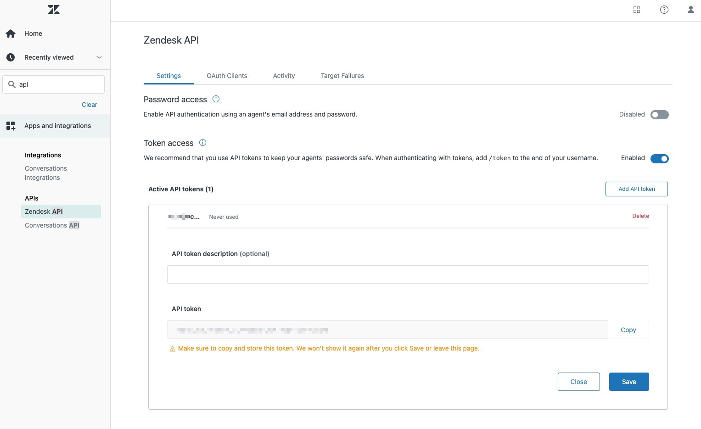

# Zendesk Source connector


## Objective

Quickly test [Zendesk Source](https://docs.confluent.io/current/connect/kafka-connect-zendesk/index.html#quick-start) connector.


## Admin account

In order to create the token and get `tickets`, you need to be an `Admin` (it doesn't work with `Agent` role), as it is using [Incremental Ticket Export](https://developer.zendesk.com/api-reference/ticketing/ticket-management/incremental_exports/#allowed-for-2).
This is why this example is using `organizations`.

## Create an API token

In your Zendesk account, create a token (if you're only an agent you need to ask it to an admin):



## How to run

Simply run:

```
$ playground run -f zendesk-source<use tab key to activate fzf completion (see https://kafka-docker-playground.io/#/cli?id=%e2%9a%a1-setup-completion), otherwise use full path, or correct relative path> <ZENDESK_URL> <ZENDESK_USERNAME> <ZENDESK_PASSWORD>
```

Note: you can also export these values as environment variable

P.S: `ZENDESK_USERNAME` should have format `email/token`

## Details of what the script is doing


Creating Zendesk Source connector

```bash
$ curl -X PUT \
     -H "Content-Type: application/json" \
     --data '{
               "connector.class": "io.confluent.connect.zendesk.ZendeskSourceConnector",
               "topic.name.pattern":"zendesk-topic-${entityName}",
               "tasks.max": "1",
               "poll.interval.ms": 1000,
               "zendesk.auth.type": "basic",
               "zendesk.url": "$ZENDESK_URL",
               "zendesk.user": "$ZENDESK_USERNAME",
               "zendesk.password": "$ZENDESK_PASSWORD",
               "zendesk.tables": "organizations",
               "zendesk.since": "$SINCE",
               "key.converter": "org.apache.kafka.connect.storage.StringConverter",
               "value.converter": "org.apache.kafka.connect.json.JsonConverter",
               "value.converter.schemas.enable": "false",
               "confluent.license": "",
               "confluent.topic.bootstrap.servers": "broker:9092",
               "confluent.topic.replication.factor": "1",
               "errors.tolerance": "all",
               "errors.log.enable": true,
               "errors.log.include.messages": true
          }' \
     http://localhost:8083/connectors/zendesk-source/config | jq .
```

Verify we have received the data in `zendesk-topic-organizations` topic:

```bash
playground topic consume --topic zendesk-topic-organizations --min-expected-messages 1 --timeout 60
```

Results:

```json
{
    "created_at": 1595013078000,
    "details": "",
    "domain_names": "",
    "external_id": null,
    "group_id": null,
    "id": 361115952791,
    "name": "/",
    "notes": "",
    "organization_fields": {
        "ae_name": null,
        "always_cc": null,
        "cam_name": null,
        "customer_id": null,
        "eam_name": null,
        "effective_date": null,
        "health_cloud_org_id": null,
        "license_key": null,
        "oem_partner": null,
        "organization_type": null,
        "parent_organization": null,
        "primary_support_contact": null,
        "region": null,
        "renewal_date": null,
        "resource_id": null,
        "se_name": null,
        "sfdc_account_name": null,
        "sfdc_opportunity_id": null,
        "sfdc_zorg_id": null,
        "special_handling_instructions": null,
        "subscription_type": null,
        "success_plan_link": null,
        "systems_engineer": null,
        "tam_name": null,
        "timezone": null
    },
    "shared_comments": false,
    "shared_tickets": false,
    "tags": "",
    "updated_at": 1595013275000,
    "url": "https://confluentxxxxx.zendesk.com/api/v2/organizations/361115952791.json"
}
```

N.B: Control Center is reachable at [http://127.0.0.1:9021](http://127.0.0.1:9021])
