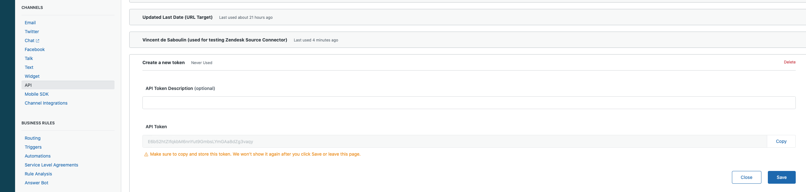

# Zendesk Source connector


## Objective

Quickly test [Zendesk Source](https://docs.confluent.io/current/connect/kafka-connect-zendesk/index.html#quick-start) connector.


## Create an API token

In your Zendesk account, create a token:



## How to run

Simply run:

```
$ ./zendesk-source.sh <ZENDESK_URL> <ZENDESK_USERNAME> <ZENDESK_PASSWORD>
```

Note: you can also export these values as environment variable

P.S: `ZENDESK_USERNAME` should have format `email/token`

## Details of what the script is doing


Creating Zendesk Source connector

```bash
$ curl -X PUT \
     -H "Content-Type: application/json" \
     --data '{
                    "connector.class": "io.confluent.connect.zendesk.ZendeskSourceConnector",
                    "topic.name.pattern":"zendesk-topic-${entityName}",
                    "tasks.max": "1",
                    "poll.interval.ms": 1000,
                    "zendesk.auth.type": "basic",
                    "zendesk.url": "'"$ZENDESK_URL"'",
                    "zendesk.user": "'"$ZENDESK_USERNAME"'",
                    "zendesk.password": "'"$ZENDESK_PASSWORD"'",
                    "zendesk.tables": "tickets",
                    "zendesk.since": "'"$SINCE"'",
                    "key.converter": "org.apache.kafka.connect.storage.StringConverter",
                    "value.converter": "org.apache.kafka.connect.json.JsonConverter",
                    "value.converter.schemas.enable": "false",
                    "confluent.license": "",
                    "confluent.topic.bootstrap.servers": "broker:9092",
                    "confluent.topic.replication.factor": "1",
                    "errors.tolerance": "all",
                    "errors.log.enable": true,
                    "errors.log.include.messages": true
          }' \
     http://localhost:8083/connectors/zendesk-source/config | jq .
```

Verify we have received the data in `zendesk-topic-tickets` topic:

```bash
$ docker exec broker kafka-console-consumer -bootstrap-server broker:9092 --topic zendesk-topic-tickets --from-beginning --max-messages 1
```

Results:

```json
{
    "allow_attachments": true,
    "allow_channelback": false,
    "assignee_id": 378670759732,
    "brand_id": 360002180531,
    "collaborator_ids": "",
    "created_at": 1575491588000,
    "custom_fields": [
        {
            "id": 360034610432,
            "value": null
        },
        {
            "id": 360034924032,
            "value": null
        },
        {
            "id": 360024642051,
            "value": null
        },
        {
            "id": 360024175891,
            "value": null
        },
        {
            "id": 360035566872,
            "value": null
        },
        {
            "id": 360034750791,
            "value": null
        },
        {
            "id": 360024175951,
            "value": null
        },
        {
            "id": 360023842131,
            "value": "interaction_office_hours"
        },
        {
            "id": 360035620191,
            "value": null
        },
        {
            "id": 360024316771,
            "value": null
        },
        {
            "id": 360032521572,
            "value": null
        },
        {
            "id": 360034750311,
            "value": null
        },
        {
            "id": 360024533612,
            "value": null
        },
        {
            "id": 360025312632,
            "value": null
        },
        {
            "id": 360034750331,
            "value": null
        },
        {
            "id": 360023842171,
            "value": null
        },
        {
            "id": 360024146812,
            "value": null
        },
        {
            "id": 360034750591,
            "value": null
        },
        {
            "id": 360024146832,
            "value": null
        },
        {
            "id": 360035619731,
            "value": null
        },
        {
            "id": 360024611992,
            "value": null
        },
        {
            "id": 360035655072,
            "value": null
        },
        {
            "id": 360024146852,
            "value": null
        },
        {
            "id": 360034750631,
            "value": null
        },
        {
            "id": 360024175531,
            "value": null
        },
        {
            "id": 360034750391,
            "value": null
        },
        {
            "id": 360024146872,
            "value": "3760"
        },
        {
            "id": 360024175551,
            "value": null
        },
        {
            "id": 360029945791,
            "value": null
        },
        {
            "id": 360034750411,
            "value": null
        },
        {
            "id": 360024146892,
            "value": "36"
        },
        {
            "id": 360024838352,
            "value": null
        },
        {
            "id": 360024175571,
            "value": null
        },
        {
            "id": 360024146912,
            "value": "false"
        },
        {
            "id": 360021091812,
            "value": null
        },
        {
            "id": 360024175591,
            "value": null
        },
        {
            "id": 360024146932,
            "value": "false"
        }
    ],
    "description": "Hi team,\n\nPlease forward this to those not on this email, but were in the meeting or would like to see this recap.\n\n**Date:**\n2019-12-04\n\n**Topic:**\n\n**Attendees**\n\n-\n\n**Discussions**\n\n-\n\n**Action Items**\n\n-\n\n**Next Steps**\n\n-\n\nThanks!\n\nDan Cooper\u200b",
    "due_at": null,
    "email_cc_ids": "",
    "external_id": null,
    "fields": [
        {
            "id": 360034610432,
            "value": null
        },
        {
            "id": 360034924032,
            "value": null
        },
        {
            "id": 360024642051,
            "value": null
        },
        {
            "id": 360024175891,
            "value": null
        },
        {
            "id": 360035566872,
            "value": null
        },
        {
            "id": 360034750791,
            "value": null
        },
        {
            "id": 360024175951,
            "value": null
        },
        {
            "id": 360023842131,
            "value": "interaction_office_hours"
        },
        {
            "id": 360035620191,
            "value": null
        },
        {
            "id": 360024316771,
            "value": null
        },
        {
            "id": 360032521572,
            "value": null
        },
        {
            "id": 360034750311,
            "value": null
        },
        {
            "id": 360024533612,
            "value": null
        },
        {
            "id": 360025312632,
            "value": null
        },
        {
            "id": 360034750331,
            "value": null
        },
        {
            "id": 360023842171,
            "value": null
        },
        {
            "id": 360024146812,
            "value": null
        },
        {
            "id": 360034750591,
            "value": null
        },
        {
            "id": 360024146832,
            "value": null
        },
        {
            "id": 360035619731,
            "value": null
        },
        {
            "id": 360024611992,
            "value": null
        },
        {
            "id": 360035655072,
            "value": null
        },
        {
            "id": 360024146852,
            "value": null
        },
        {
            "id": 360034750631,
            "value": null
        },
        {
            "id": 360024175531,
            "value": null
        },
        {
            "id": 360034750391,
            "value": null
        },
        {
            "id": 360024146872,
            "value": "3760"
        },
        {
            "id": 360024175551,
            "value": null
        },
        {
            "id": 360029945791,
            "value": null
        },
        {
            "id": 360034750411,
            "value": null
        },
        {
            "id": 360024146892,
            "value": "36"
        },
        {
            "id": 360024838352,
            "value": null
        },
        {
            "id": 360024175571,
            "value": null
        },
        {
            "id": 360024146912,
            "value": "false"
        },
        {
            "id": 360021091812,
            "value": null
        },
        {
            "id": 360024175591,
            "value": null
        },
        {
            "id": 360024146932,
            "value": "false"
        }
    ],
    "follower_ids": "",
    "followup_ids": "",
    "forum_topic_id": null,
    "generated_timestamp": 1599671106,
    "group_id": 360006487552,
    "has_incidents": false,
    "id": 37,
    "is_public": true,
    "organization_id": 360798929652,
    "priority": "normal",
    "problem_id": null,
    "raw_subject": "Office Hours 2020-02-28",
    "recipient": null,
    "requester_id": 390714150931,
    "satisfaction_probability": null,
    "satisfaction_rating": {
        "score": "unoffered"
    },
    "sharing_agreement_ids": "",
    "status": "open",
    "subject": "Office Hours 2020-02-28",
    "submitter_id": 378670759732,
    "tags": [
        "enterprise",
        "gmtplus1",
        "interaction_office_hours",
        "platinum"
    ],
    "ticket_form_id": 360000563811,
    "type": "incident",
    "updated_at": 1599671106000,
    "url": "https://confluent1549477387.zendesk.com/api/v2/tickets/37.json",
    "via": {
        "channel": "web",
        "source": {
            "from": {},
            "rel": null,
            "to": {}
        }
    }
}
```
N.B: Control Center is reachable at [http://127.0.0.1:9021](http://127.0.0.1:9021])
