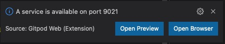
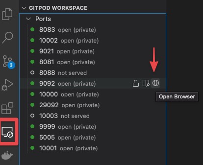

# 👨‍🏫 How to use

## Ways to run

### 💻️ Locally

* You just need to have [docker](https://docs.docker.com/get-docker/) and [docker-compose](https://docs.docker.com/compose/install/) installed on your machine !

> [!NOTE]
> Every command used in the playground is using Docker, this includes `jq` (except if you have it on your host already), `aws`, `az`, `gcloud`, etc..
The goal is to have a consistent behaviour and only depends on Docker.

> [!NOTE]
> The playground is tested on macOS and Linux.

* 🐳 Recommended Docker settings:


* Clone the repository

```bash
git clone https://github.com/vdesabou/kafka-docker-playground.git -–depth 1
```

> [!NOTE]
> Specifying `--depth 1` only get the latest version of the playground, which reduces a lot the size of the donwload

###  Gitpod.io

You can run the playground in your browser using [Gitpod.io](https://gitpod.io) workspace by clicking on this [link](https://gitpod.io/#https://github.com/vdesabou/kafka-docker-playground)

Look at awesome this is 🪄 !


> [!TIP]
> 50 hours/month can be used as part of the [free](https://www.gitpod.io/pricing) plan

You can login into Control Center (port `9021`) by clicking on `Open Browser` option in pop-up:



Or select `Remote Explorer` on the left sidebar and then click on the `Open Browser` option corresponding to the port you want to connect to:



### 🌩 AWS CloudFormation

If you want to run the playground on an EC2 instance, you can use the AWS CloudFormation template provided [here]([cloudformation/README.md](https://github.com/vdesabou/kafka-docker-playground/blob/master/cloudformation/kafka-docker-playground.json)).

For example, this is how I start it using aws CLI:

```bash
$ cp kafka-docker-playground/cloudformation/kafka-docker-playground.json tmp.json
$ aws cloudformation create-stack  --stack-name kafka-docker-playground-$USER \
    --template-body file://tmp.json --region eu-west-3 \ 
    --parameters ParameterKey=KeyName,ParameterValue=$KEY_NAME \
    ParameterKey=InstanceName,ParameterValue=kafka-docker-playground-$USER
```

## 🏎️ Start an example

Select an example in the **[Content](/content.md)** section and simply run the bash script you want !

Example: if you want to run a test with IBM MQ sink connector, check out the [README](https://github.com/vdesabou/kafka-docker-playground/tree/master/connect/connect-ibm-mq-sink) and the list of tests in [How to Run](https://github.com/vdesabou/kafka-docker-playground/tree/master/connect/connect-ibm-mq-sink#how-to-run) section, then simply execute the script you want:

```bash
cd connect/connect-ibm-mq-sink
./ibm-mq-sink-mtls.sh
```

> [!NOTE]
> When some addtional steps are required, it is specified in the corresponding `README` file, for example with [AWS S3 sink connector](https://github.com/vdesabou/kafka-docker-playground/tree/master/connect/connect-aws-s3-sink#aws-setup), `~/.aws/credentials` and `~/.aws/config` are required or for [Zendesk source connector](https://github.com/vdesabou/kafka-docker-playground/tree/master/connect/connect-zendesk-source#how-to-run), arguments `ZENDESK_URL`, `ZENDESK_USERNAME`and `ZENDESK_PASSWORD` are required (you can also pass them as enviroment variables).

> [!ATTENTION]
> Please ignore all the scripts containing `repro` in the name: they were used for reproduction models, and are **not maintained**.

## 🪄 Specify versions

### 🎯 For Confluent Platform (CP)

By default, latest Confluent Platform version is used (currently `6.2.1`).
Before running an example, you can change the CP version used (must be greater or equal to `5.0.0`), simply by exporting `TAG` environment variable:

Example:

```bash
export TAG=6.0.3
```

> [!TIP]
> To go back to default CP version, simply execute `unset TAG`

### 🔗 For Connectors

By default, for each connector, the latest available version on [Confluent Hub](https://www.confluent.io/hub/) is used (the only 2 exceptions are for replicator and JDBC which are using same version as CP).
Each latest version used is specified on the [Connectors list](https://kafka-docker-playground.io/#/content?id=connectors)

The playground has 3 different ways to use different connector version when running a connector test:

1. Specify the connector version

```bash
export CONNECTOR_TAG=x.x.x
```

2. Specify a connector ZIP file

```bash
export CONNECTOR_ZIP="path/to/connector.zip"
```

Example:

```bash
export CONNECTOR_ZIP="/Users/vsaboulin/Downloads/confluentinc-kafka-connect-http-1.2.3.zip"
17:37:20 ℹ️ 🚀 CONNECTOR_ZIP is set with /Users/vsaboulin/Downloads/confluentinc-kafka-connect-http-1.2.3.zip
17:37:20 ℹ️ 👷 Building Docker image vdesabou/kafka-docker-playground-connect:CP-6.2.1-confluentinc-kafka-connect-http-1.2.3.zip
```

3. Specify a connector JAR file

```bash
export CONNECTOR_JAR="path/to/connector.jar"
```

Example:

```bash
export CONNECTOR_JAR/tmp/kafka-connect-http-1.3.1-SNAPSHOT.jar
00:33:47 ℹ️ 🚀 CONNECTOR_JAR is set with /tmp/kafka-connect-http-1.3.1-SNAPSHOT.jar
/usr/share/confluent-hub-components/confluentinc-kafka-connect-http/lib/kafka-connect-http-1.2.4.jar
00:33:48 ℹ️ 👷 Building Docker image vdesabou/kafka-docker-playground-connect:CP-6.2.1-kafka-connect-http-1.2.4-kafka-connect-http-1.3.1-SNAPSHOT.jar
00:33:48 ℹ️ Remplacing kafka-connect-http-1.2.4.jar by kafka-connect-http-1.3.1-SNAPSHOT.jar
```

When jar to replace cannot be found automatically, the user is able to select the one to replace automatically:

```bash
export CONNECTOR_JAR=/tmp/debezium-connector-postgres-1.4.0-SNAPSHOT.jar
11:02:43 ℹ️ 🚀 CONNECTOR_JAR is set with /tmp/debezium-connector-postgres-1.4.0-SNAPSHOT.jar
ls: cannot access '/usr/share/confluent-hub-components/debezium-debezium-connector-postgresql/lib/debezium-connector-postgresql-1.4.0.jar': No such file or directory
11:02:44 ❗ debezium-debezium-connector-postgresql/lib/debezium-connector-postgresql-1.4.0.jar does not exist, the jar name to replace could not be found automatically
11:02:45 ℹ️ Select the jar to replace:
1) debezium-api-1.4.0.Final.jar
2) debezium-connector-postgres-1.4.0.Final.jar
3) debezium-core-1.4.0.Final.jar
```

> [!WARNING]
> you can use both `CONNECTOR_TAG` and `CONNECTOR_JAR` at same time (along with `TAG`), but `CONNECTOR_TAG` and `CONNECTOR_ZIP` are mutually exclusive.

> [!NOTE]
> The connect image [used](https://github.com/vdesabou/kafka-docker-playground/blob/714b36289981f9fe8f699ae3eab9a508127b625e/environment/plaintext/docker-compose.yml#L80) in the playground is `vdesabou/kafka-docker-playground-connect`, which is built [everyday](https://github.com/vdesabou/kafka-docker-playground-connect/actions) using the repo [vdesabou/kafka-docker-playground-connect](https://github.com/vdesabou/kafka-docker-playground-connect).

## 🛑 Disabling ksqldb

By default, [`ksqldb-server`](https://github.com/vdesabou/kafka-docker-playground/blob/7098800a582bfb2629005366b514a923d2fa037f/environment/plaintext/docker-compose.yml#L135-L171) and [`ksqldb-cli`](https://github.com/vdesabou/kafka-docker-playground/blob/7098800a582bfb2629005366b514a923d2fa037f/environment/plaintext/docker-compose.yml#L173-L183) containers is started for every test. You can disable this by setting environment variable `DISABLE_KSQLDB`:

Example:

```bash
export DISABLE_KSQLDB=true
```

## 🛑 Disabling control-center

By default, [`control-center`](https://github.com/vdesabou/kafka-docker-playground/blob/7098800a582bfb2629005366b514a923d2fa037f/environment/plaintext/docker-compose.yml#L185-L221) container is started for every test. You can disable this by setting environment variable `DISABLE_CONTROL_CENTER`:

Example:

```bash
export DISABLE_CONTROL_CENTER=true
```

## 🔢 JMX Metrics

JMX metrics are available locally on those ports:

* zookeeper: `9999`
* broker: `10000`
* schema-registry: `10001`
* connect: `10002`

There is a function [`get_jmx_metrics`](https://github.com/vdesabou/kafka-docker-playground/blob/68a765ba6f93c02187b8efd868cb6b4622c19095/scripts/utils.sh#L945) in [`scripts/utils.sh`](https://github.com/vdesabou/kafka-docker-playground/blob/master/scripts/utils.sh) that helps to gather JMX metrics easily.

To use it, you need to source [`scripts/utils.sh`](https://github.com/vdesabou/kafka-docker-playground/blob/master/scripts/utils.sh) first:

```bash
source scripts/utils.sh
```

And then you can call the function from your terminal:

```bash
get_jmx_metrics <component> [<domain>]
```

where:

*  `component` (mandatory) is one of `zookeeper`, `broker`, `schema-registry` or `connect`
*  `domain`(optional) is the JMX domain


Example (without specifying domain):

```bash
$ get_jmx_metrics connect
17:35:35 ❗ You did not specified a list of domains, all domains will be exported!
17:35:35 ℹ️ This is the list of domains for component connect
JMImplementation
com.sun.management
java.lang
java.nio
java.util.logging
jdk.management.jfr
kafka.admin.client
kafka.connect
kafka.consumer
kafka.producer
17:35:38 ℹ️ JMX metrics are available in /tmp/jmx_metrics.log file
```

Example (specifying domain):

```bash
$ get_jmx_metrics connect "kafka.connect kafka.consumer kafka.producer"
17:38:00 ℹ️ JMX metrics are available in /tmp/jmx_metrics.log file
```

> [!WARNING]
> Local install of `JDK` (at least 1.8) is required to run `get_jmx_metrics`
