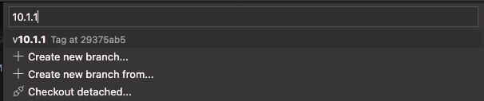
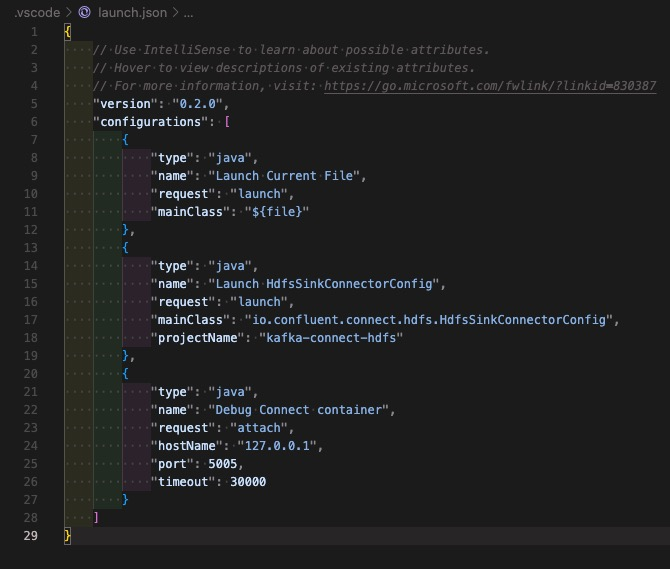
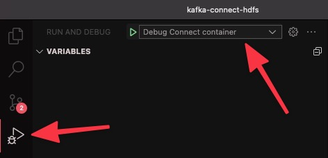
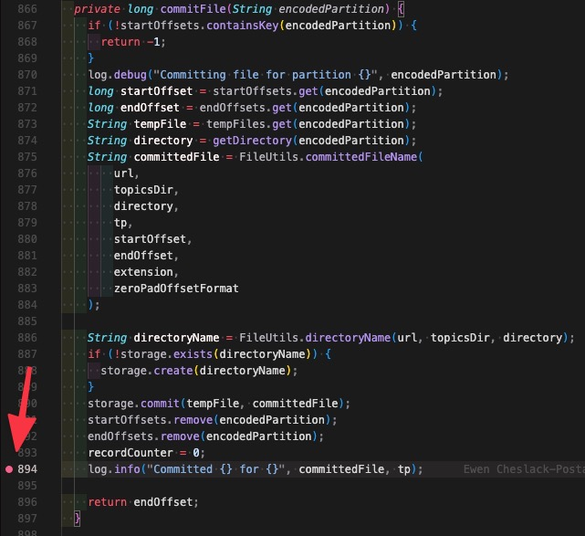
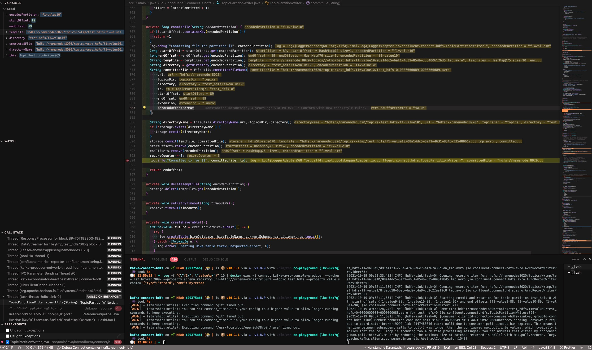

# 👷‍♂️ Reusables

Below is a collection of *how to* that you can re-use when you build your own reproduction models.

## 👉 Producing data

### 🔤 [kafka-console-producer](https://docs.confluent.io/platform/current/tutorials/examples/clients/docs/kafka-commands.html#produce-records)

* 1️⃣ Using `seq`

```bash
seq -f "This is a message %g" 10 | docker exec -i broker kafka-console-producer --broker-list broker:9092 --topic a-topic
```

* 2️⃣ Using [`Heredoc`](https://www.google.fr/url?sa=t&rct=j&q=&esrc=s&source=web&cd=&cad=rja&uact=8&ved=2ahUKEwjHrNGg8tPzAhVIOBoKHVsLA3wQFnoECAMQAw&url=https%3A%2F%2Flinuxize.com%2Fpost%2Fbash-heredoc%2F&usg=AOvVaw2Fsus1FqR5phtsBikk2-B6)

```bash
docker exec -i broker kafka-console-producer --broker-list broker:9092 --topic a-topic << EOF
This is my message 1
This is my message 2
EOF
```

* 3️⃣ Using a key:

```bash
docker exec -i broker kafka-console-producer --broker-list broker:9092 --topic a-topic --property parse.key=true --property key.separator=, << EOF
key1,value1
key1,value2
key2,value1
EOF
```

* 4️⃣ Using JSON with schema (and key):

```bash
docker exec -i broker kafka-console-producer --broker-list broker:9092 --topic a-topic --property parse.key=true --property key.separator=, << EOF
1,{"schema":{"type":"struct","fields":[{"type":"string","optional":false,"field":"record"}]},"payload":{"record":"record1"}}
2,{"schema":{"type":"struct","fields":[{"type":"string","optional":false,"field":"record"}]},"payload":{"record":"record2"}}
3,{"schema":{"type":"struct","fields":[{"type":"string","optional":false,"field":"record"}]},"payload":{"record":"record3"}}
EOF
```

### 🔣 [kafka-avro-console-producer](https://docs.confluent.io/platform/current/tutorials/examples/clients/docs/kafka-commands.html#produce-avro-records)

* 1️⃣ Using `seq`

```
seq -f "{\"f1\": \"value%g\"}" 10 | docker exec -i connect kafka-avro-console-producer --broker-list broker:9092 --property schema.registry.url=http://schema-registry:8081 --topic a-topic --property value.schema='{"type":"record","name":"myrecord","fields":[{"name":"f1","type":"string"}]}'
```

* 2️⃣ Using [`Heredoc`](https://www.google.fr/url?sa=t&rct=j&q=&esrc=s&source=web&cd=&cad=rja&uact=8&ved=2ahUKEwjHrNGg8tPzAhVIOBoKHVsLA3wQFnoECAMQAw&url=https%3A%2F%2Flinuxize.com%2Fpost%2Fbash-heredoc%2F&usg=AOvVaw2Fsus1FqR5phtsBikk2-B6)

```bash
docker exec -i connect kafka-avro-console-producer --broker-list broker:9092 --property schema.registry.url=http://schema-registry:8081 --topic a-topic --property value.schema='{"type":"record","name":"myrecord","fields":[{"name":"u_name","type":"string"},
{"name":"u_price", "type": "float"}, {"name":"u_quantity", "type": "int"}]}' << EOF
{"u_name": "scissors", "u_price": 2.75, "u_quantity": 3}
{"u_name": "tape", "u_price": 0.99, "u_quantity": 10}
{"u_name": "notebooks", "u_price": 1.99, "u_quantity": 5}
EOF
```

* 3️⃣ Using a key:

```bash
docker exec -i connect kafka-avro-console-producer --broker-list broker:9092 --property schema.registry.url=http://schema-registry:8081 --topic a-topic --property key.schema='{"type":"record","namespace": "io.confluent.connect.avro","name":"myrecordkey","fields":[{"name":"ID","type":"long"}]}' --property value.schema='{"type":"record","name":"myrecordvalue","fields":[{"name":"ID","type":"long"},{"name":"product", "type": "string"}, {"name":"quantity", "type": "int"}, {"name":"price",
"type": "float"}]}'  --property parse.key=true --property key.separator="|" << EOF
{"ID": 111}|{"ID": 111,"product": "foo", "quantity": 100, "price": 50}
{"ID": 222}|{"ID": 222,"product": "bar", "quantity": 100, "price": 50}
EOF
```

* 4️⃣ Using `value.schema.file` and message as separate file

This can be useful if schema is complex.

```bash
docker cp schema.avsc connect:/tmp/
docker cp message.json connect:/tmp/
docker exec -i connect bash -c "kafka-avro-console-producer --broker-list broker:9092 --property schema.registry.url=http://schema-registry:8081 --topic a-topic --property value.schema.file=/tmp/schema.avsc < /tmp/message.json"
```

Here are examples of [`schema.avsc`](https://github.com/vdesabou/kafka-docker-playground/blob/master/connect/connect-http-sink/schema.avsc) and [`message.json`](https://github.com/vdesabou/kafka-docker-playground/blob/master/connect/connect-http-sink/message.json)

> [!TIP]
> If Avro schema is very complex, it is better to use [♨️ Avro Java producer](/reusables?id=♨%EF%B8%8F-avro-java-producer) below.

### 🌪 kafka-producer-perf-test

```bash
docker exec broker kafka-producer-perf-test --topic a-topic --num-records 200000 --record-size 1000 --throughput 100000 --producer-props bootstrap.servers=broker:9092
```

### ♨️ Avro Java producer

If you want to send a complex AVRO message, the easiest way is to use an Avro JAVA producer which creates a Specific Record using Maven plugin and populate it using [j-easy/easy-random](https://github.com/j-easy/easy-random).

> [!TIP]
> A complete example is available [here](https://github.com/vdesabou/kafka-docker-playground/blob/master/connect/connect-gcp-bigquery-sink/gcp-bigquery-repro-66277.sh).

Here are the steps to follow:

1. Copy [`connect/connect-gcp-bigquery-sink/producer-v1`](https://github.com/vdesabou/kafka-docker-playground/tree/master/connect/connect-gcp-bigquery-sink/producer-v1) directory into your test directory.

2. Update [`connect/connect-gcp-bigquery-sink/producer-v1/src/main/resources/avro/customer-v1.avsc`](https://github.com/vdesabou/kafka-docker-playground/blob/master/connect/connect-gcp-bigquery-sink/producer-v1/src/main/resources/avro/customer-v1.avsc) with your AVRO schema but be careful, you need to keep `Customer` for the name and `com.github.vdesabou` for the namespace:

```json
    "name": "Customer",
    "namespace": "com.github.vdesabou",
```

3. In your script, and *before* `${DIR}/../../environment/plaintext/start.sh`, add this:

```bash
for component in producer-v1
do
    set +e
    log "🏗 Building jar for ${component}"
    docker run -i --rm -e KAFKA_CLIENT_TAG=$KAFKA_CLIENT_TAG -e TAG=$TAG_BASE -v "${DIR}/${component}":/usr/src/mymaven -v "$HOME/.m2":/root/.m2 -v "${DIR}/${component}/target:/usr/src/mymaven/target" -w /usr/src/mymaven maven:3.6.1-jdk-11 mvn -Dkafka.tag=$TAG -Dkafka.client.tag=$KAFKA_CLIENT_TAG package > /tmp/result.log 2>&1
    if [ $? != 0 ]
    then
        logerror "ERROR: failed to build java component $component"
        tail -500 /tmp/result.log
        exit 1
    fi
    set -e
done
```

4. Add this in your `docker-compose` file:

```yml
  producer-v1:
    build:
      context: ../../connect/connect-gcp-bigquery-sink/producer-v1/
    hostname: producer-v1
    container_name: producer-v1
    environment:
      KAFKA_BOOTSTRAP_SERVERS: broker:9092
      TOPIC: "customer-avro"
      REPLICATION_FACTOR: 1
      NUMBER_OF_PARTITIONS: 1
      MESSAGE_BACKOFF: 1000 # Frequency of message injection
      KAFKA_ACKS: "all" # default: "1"
      KAFKA_REQUEST_TIMEOUT_MS: 20000
      KAFKA_RETRY_BACKOFF_MS: 500
      KAFKA_CLIENT_ID: "my-java-producer-v1"
      KAFKA_SCHEMA_REGISTRY_URL: "http://schema-registry:8081"
```

You can change the environment values to your needs (for example `TOPIC`).

> [!WARNING]
> Make sure to update `context` above with the right path.

5. You can then invoke the Java producer by executing:

```bash
log "Run the Java producer-v1"
docker exec producer-v1 bash -c "java -jar producer-v1-1.0.0-jar-with-dependencies.jar"
```

## 👈 Consuming data

### 🔤 [kafka-console-consumer](https://docs.confluent.io/platform/current/tutorials/examples/clients/docs/kafka-commands.html#consume-records)

* 1️⃣ Simplest

```
timeout 60 docker exec broker kafka-console-consumer --bootstrap-server broker:9092 --topic a-topic --from-beginning --max-messages 1
```

> [!TIP]
> Using `timeout` command prevents the command to run forever.
> It is [ignored](https://github.com/vdesabou/kafka-docker-playground/blob/c65704df7b66a2c47321d04fb75f43a8bbb4fef1/scripts/utils.sh#L650-L658) if not present on your machine.

* 2️⃣ Displaying key:

```bash
timeout 60 docker exec broker kafka-console-consumer --bootstrap-server broker:9092 --topic a-topic --property print.key=true --property key.separator=, --from-beginning --max-messages 1
```

### 🔣 [kafka-avro-console-consumer](https://docs.confluent.io/platform/current/tutorials/examples/clients/docs/kafka-commands.html#consume-avro-records)

* 1️⃣ Simplest
  
```
docker exec connect kafka-avro-console-consumer -bootstrap-server broker:9092 --property schema.registry.url=http://schema-registry:8081 --topic a-topic --from-beginning --max-messages 1
```

* 2️⃣ Displaying key:
  
```
docker exec connect kafka-avro-console-consumer -bootstrap-server broker:9092 --property schema.registry.url=http://schema-registry:8081 --topic a-topic --property print.key=true --property key.separator=, --from-beginning --max-messages 1
```

## ✨ Remote debugging

Java Remote debugging is the perfect tool for troubleshooting Kafka connectors for example.

> [!TIP]
> Following are instructions for [Visual Studio Code ](https://code.visualstudio.com/docs/java/java-debugging), but it is exactly the same principle for [IntelliJ IDEA](https://www.jetbrains.com/help/idea/tutorial-remote-debug.html#436b3b68).

### ☑️ Prerequisites

Make sure you have already the required Visual Studio code extensions by following [this](https://code.visualstudio.com/docs/java/java-debugging#_install).

### 💫 Full example

Here is a full example using [HDFS 2 sink](https://github.com/vdesabou/kafka-docker-playground/tree/master/connect/connect-hdfs2-sink) connector and [Visual Studio Code ](https://code.visualstudio.com/docs/java/java-debugging):

1. Launch the example as usual, i.e start `./hdfs2-sink.sh`.

2. Clone and open [`confluentinc/kafka-connect-hdfs`](https://github.com/confluentinc/kafka-connect-hdfs) repository in Visual Studio Code.

3. Switch to the branch corresponding to the connector version you're going to run. 
 
In my example, the connector version is `10.1.1`, so I'm switching to branch tag `v10.1.1`:



4. Run script `../../scripts/enable-remote-debugging.sh`

```
namenode is up-to-date
zookeeper is up-to-date
hive-metastore-postgresql is up-to-date
datanode is up-to-date
presto-coordinator is up-to-date
hive-server is up-to-date
hive-metastore is up-to-date
broker is up-to-date
schema-registry is up-to-date
Recreating connect ... done
control-center is up-to-date
15:34:36 ℹ️ If you use Visual Studio Code:
15:34:36 ℹ️ Edit .vscode/launch.json with
15:34:36 ℹ️ 
{
    "version": "0.2.0",
    "configurations": [
    
        {
            "type": "java",
            "name": "Debug connect container",
            "request": "attach",
            "hostName": "127.0.0.1",
            "port": 5005,
            "timeout": 30000
        }
    ]
}

15:34:36 ℹ️ See https://kafka-docker-playground.io/#/reusables?id=✨-remote-debugging
```
   
5. [Configure](https://code.visualstudio.com/docs/java/java-debugging#_configure) remote debugging by clicking on menu `Run`->`Add Configuration...`:


Then copy/paste the following entry:

```json
{
    "type": "java",
    "name": "Debug connect container",
    "request": "attach",
    "hostName": "127.0.0.1",
    "port": 5005,
    "timeout": 30000
}
```

Note: you can also directly edit file `.vscode/launch.json`:

```json
{
    "version": "0.2.0",
    "configurations": [
    
        {
            "type": "java",
            "name": "Debug connect container",
            "request": "attach",
            "hostName": "127.0.0.1",
            "port": 5005,
            "timeout": 30000
        }
    ]
}
```

*Example:*



5. Go in `Run and Debug` and make sure to select the `Debug Connect container` config:



7. Click on the green play button


8. Add breakpoint(s) where you want, for example [here](https://github.com/confluentinc/kafka-connect-hdfs/blob/9a5e68d7294a79c40050efd7b51d7428c7f7c4d5/src/main/java/io/confluent/connect/hdfs/TopicPartitionWriter.java#L894):



9. Process some messages:

```bash
seq -f "{\"f1\": \"value%g\"}" 10 | docker exec -i connect kafka-avro-console-producer --broker-list broker:9092 --property schema.registry.url=http://schema-registry:8081 --topic test_hdfs --property value.schema='{"type":"record","name":"myrecord","fields":[{"name":"f1","type":"string"}]}'
```

10. See results 🍿:




## 🐛 Enable DEBUG

### 🔗 Connectors

In order to enable `TRACE`(or `DEBUG`) logs for connectors, use the `admin/loggers` endpoint (see docs [here](https://docs.confluent.io/platform/current/connect/logging.html#change-the-log-level-for-a-specific-logger)):

*Example:*

```bash
curl --request PUT \
  --url http://localhost:8083/admin/loggers/io.confluent.connect.oracle.cdc \
  --header 'Accept: application/json' \
  --header 'Content-Type: application/json' \
  --data '{
	"level": "TRACE"
}'
```

> [!WARNING]
> Make sure to update `io.confluent.connect.oracle.cdc` above with the package you want to troubleshoot.

### 🔑 SSL debug

Add `-Djavax.net.debug=all` in your `docker-compose` file:

*Example:*

```yml
  connect:
    KAFKA_OPTS: -Djavax.net.debug=all
```

### 🔒 Kerberos debug

Add `-Dsun.security.krb5.debug=true` in your `docker-compose` file:

*Example:*

```yml
  connect:
    KAFKA_OPTS: -Dsun.security.krb5.debug=true
```

### 🔬 Class loading

Add `-verbose:class` in your `docker-compose` file to troubleshoot a `ClassNotFoundException` for example:

*Example:*

```yml
  connect:
    KAFKA_OPTS: -verbose:class
```

In logs, you'll see:

```log
[Loaded org.apache.kafka.connect.runtime.isolation.DelegatingClassLoader$$Lambda$20/1007251739 from org.apache.kafka.connect.runtime.isolation.DelegatingClassLoader]
[Loaded java.lang.invoke.LambdaForm$MH/1556595366 from java.lang.invoke.LambdaForm]
[Loaded org.reflections.util.ConfigurationBuilder from file:/usr/share/java/kafka/reflections-0.9.12.jar]
[Loaded org.reflections.serializers.Serializer from file:/usr/share/java/kafka/reflections-0.9.12.jar]
[Loaded org.reflections.adapters.MetadataAdapter from file:/usr/share/java/kafka/reflections-0.9.12.jar]
[Loaded org.reflections.scanners.Scanner from file:/usr/share/java/kafka/reflections-0.9.12.jar]
[Loaded org.reflections.scanners.AbstractScanner from file:/usr/share/java/kafka/reflections-0.9.12.jar]
[Loaded org.reflections.scanners.TypeAnnotationsScanner from file:/usr/share/java/kafka/reflections-0.9.12.jar]
[Loaded org.reflections.scanners.AbstractScanner$$Lambda$21/1725097945 from org.reflections.scanners.AbstractScanner]
[Loaded org.reflections.scanners.SubTypesScanner from file:/usr/share/java/kafka/reflections-0.9.12.jar]
[Loaded org.reflections.util.FilterBuilder from file:/usr/share/java/kafka/reflections-0.9.12.jar]
[Loaded org.reflections.util.FilterBuilder$Matcher from file:/usr/share/java/kafka/reflections-0.9.12.jar]
```

## 🚫 Blocking traffic

It is sometime necessary for a reproduction model to simulate network issues like blocking incoming or outgoing traffic.

The [connect image](/how-it-works?id=🔗-connect-image-used) used by the playground contains [`iptables`](https://en.wikipedia.org/wiki/Iptables) tool, so it is really easy to simulate network issues:

*Examples:*

* Block outgoing HTTPS traffic

```bash
docker exec --privileged --user root connect bash -c "iptables -A OUTPUT -p tcp --dport 443 -j DROP"
```

* Block incoming traffic from an IP address

```bash
docker exec --privileged --user root connect bash -c 'iptables -A INPUT -p tcp -s 35.205.238.172 -j DROP'
```

> [!TIP]
> Notice the use of `--privileged --user root`.

## 🐌 Add latency

It is sometime necessary for a reproduction model to simulate latency between components.

The [connect image](/how-it-works?id=🔗-connect-image-used) used by the playground contains [`tc`](https://man7.org/linux/man-pages/man8/tc.8.html) tool, and most importantly contains functions [`add_latency()`](https://github.com/vdesabou/kafka-docker-playground/blob/495578d413ff6b9db1d612ee8b1ebdf695f7ab51/scripts/utils.sh#L1062-L1095), [`get_latency()`](https://github.com/vdesabou/kafka-docker-playground/blob/495578d413ff6b9db1d612ee8b1ebdf695f7ab51/scripts/utils.sh#L1052-L1059)` and `[clear_traffic_control()](https://github.com/vdesabou/kafka-docker-playground/blob/495578d413ff6b9db1d612ee8b1ebdf695f7ab51/scripts/utils.sh#L1039-L1050)`:

> [!TIP]
> A complete example is available [here](https://github.com/vdesabou/kafka-docker-playground/blob/master/connect/connect-servicenow-source/servicenow-source-repro-read-timeout.sh).

*Example:*

Adding latency from `nginx_proxy` to `connect`:

```bash
add_latency nginx_proxy connect 25000ms

latency_put=$(get_latency nginx_proxy connect)
log "Latency from nginx_proxy to connect AFTER traffic control: $latency_put ms"

log "Clear traffic control"
clear_traffic_control nginx_proxy
```

## 🏚 Simulate TCP connections problems

[emicklei/zazkia](https://github.com/emicklei/zazkia) is a nice tool to simulate a TCP connection issue (reset,delay,throttle,corrupt).

Here is an example with HDFS 2 sink connector:

1. Create a folder `zazkia`and put the config file `zazkia-routes.json` in there, with the config you want:

```json
[
    {
        "label": "hdfs",
        "service-hostname": "namenode",
        "service-port": 8020,
        "listen-port": 49998,
        "transport": {
            "accept-connections": true,
            "throttle-service-response": 0,
            "delay-service-response": 0,
            "break-service-response": 0,
            "service-response-corrupt-method": "",
            "sending-to-client": true,
            "receiving-from-client": true,
            "sending-to-service": true,
            "receiving-from-service": true,
            "verbose": true
        }
    }
]
```

2. In docker-compose, add the following:

```yml
  zazkia:
    hostname: zazkia
    container_name: zazkia
    image: emicklei/zazkia
    ports:
      - "9191:9191"
    volumes:
      - ../../connect/connect-azure-blob-storage-sink/zazkia:/data
```

3. In connector config, update `store.url`with `hdfs://zazkia:49998`:

```bash
curl -X PUT \
     -H "Content-Type: application/json" \
     --data '{
               "connector.class":"io.confluent.connect.hdfs.HdfsSinkConnector",
               "tasks.max":"1",
               "topics":"test_hdfs",
               "store.url":"hdfs://zazkia:49998",
               "flush.size":"3",
               "hadoop.conf.dir":"/etc/hadoop/",
               "partitioner.class":"io.confluent.connect.hdfs.partitioner.FieldPartitioner",
               "partition.field.name":"f1",
               "rotate.interval.ms":"120000",
               "logs.dir":"/tmp",
               "hive.integration": "true",
               "hive.metastore.uris": "thrift://hive-metastore:9083",
               "hive.database": "testhive",
               "confluent.license": "",
               "confluent.topic.bootstrap.servers": "broker:9092",
               "confluent.topic.replication.factor": "1",
               "key.converter":"org.apache.kafka.connect.storage.StringConverter",
               "value.converter":"io.confluent.connect.avro.AvroConverter",
               "value.converter.schema.registry.url":"http://schema-registry:8081",
               "schema.compatibility":"BACKWARD"
          }' \
     http://localhost:8083/connectors/hdfs-sink/config | jq .
```

4. zazkia UI is available on [http://localhost:9191](http://localhost:9191)


## 🕵 TCP Dump

It is sometime necessary to sniff the network in order to better undertsand what's going on.

The [connect image](/how-it-works?id=🔗-connect-image-used) used by the playground contains [`tcpdump`](https://www.tcpdump.org) tool for that purpose.

*Example:*

Sniff all traffic on port `8888`:

```bash
docker exec -d --privileged --user root connect bash -c 'tcpdump -w /tmp/tcpdump.pcap -i eth0 -s 0 port 8888'
```

The TCP dump will run in background (`-d` option is used).

Once you test is over, you can get the `tcpdump.pcap` file (that you can open with [Wireshark](https://www.wireshark.org) for example) using:

```bash
docker cp connect:/tmp/tcpdump.pcap .
```

## 🌐 Using HTTPS proxy

There are several connector examples which include HTTPS proxy (check for `also with 🌐 proxy` in the **[Content](/content.md)** section).

> [!TIP]
> A complete example is available [here](https://github.com/vdesabou/kafka-docker-playground/blob/master/connect/connect-aws-s3-sink/s3-sink-proxy.sh). 

Here are the steps to follow:

1. Copy [`connect/connect-aws-s3-sink/repro-proxy`](https://github.com/vdesabou/kafka-docker-playground/tree/master/connect/connect-aws-s3-sink/repro-proxy) directory into your test directory.

2. Update [`connect/connect-aws-s3-sink/repro-proxy/nginx_whitelist.conf`](https://github.com/vdesabou/kafka-docker-playground/blob/master/connect/connect-aws-s3-sink/repro-proxy/nginx_whitelist.conf) with the domain name required for your needs.

*Example:*

```conf
        server_name  service-now.com;
        server_name  *.service-now.com;
```

3. Add this in your `docker-compose` file:

```yml
  nginx-proxy:
    image: reiz/nginx_proxy:latest
    hostname: nginx-proxy
    container_name: nginx-proxy
    ports:
      - "8888:8888"
    volumes:
      - ../../connect/connect-aws-s3-sink/repro-proxy/nginx_whitelist.conf:/usr/local/nginx/conf/nginx.conf
```

> [!WARNING]
> Make sure to update `../../connect/connect-aws-s3-sink` above with the right path.

4. [Optional] In order to make sure the proxy is used, you can set `dns: 0.0.0.0` in the connect instance, so that there is no internet connectivity.

```yml
  connect:
    <snip>
    environment:
      <snip>
    dns: 0.0.0.0
```

5. In you connector configuration, update the proxy configuration parameter with `https://nginx-proxy:8888`.

*Example:*

```json
"s3.proxy.url": "https://nginx-proxy:8888"
```

> [!NOTE]
> If your proxy requires HTTP2 support, there is a full example available in this example: [GCP Pub/Sub Source connector](https://github.com/vdesabou/kafka-docker-playground/blob/master/connect/connect-gcp-pubsub-source/gcp-pubsub-repro-proxy.sh)

## ♨️ Using specific JDK

It is sometime necessary for an investigation to replace JDK installed on connect image for example.

Here are some examples:

### 🌀 Azul Zulu JDK

Here are the steps to follow:

1. Get the JDK `.rpm` version link you want to install from the [website](https://www.azul.com/downloads). In our example, that will be `https://cdn.azul.com/zulu/bin/zulu11.48.21-ca-jdk11.0.11-linux.x86_64.rpm`

2. Add this in your `docker-compose` file:

```yml
  connect:
    build:
      context: ../../connect/connect-filestream-sink/
      args:
        TAG: ${TAG}
```
> [!WARNING]
> Make sure to update `context` above with the right path.

3. Create a `Dockerfile` file in `context` directory above (`../../connect/connect-filestream-sink/`).

```yml
ARG TAG
FROM vdesabou/kafka-docker-playground-connect:${TAG}
USER root
RUN wget https://cdn.azul.com/zulu/bin/zulu11.48.21-ca-jdk11.0.11-linux.x86_64.rpm && yum install -y zulu11.48.21-ca-jdk11.0.11-linux.x86_64.rpm && alternatives --set java /usr/lib/jvm/zulu-11/bin/java
USER appuser
```

> [!WARNING]
> Make sure to update `alternatives --set java` above with the right path.

4. Verify the correct JDK version is installed once your test is started:

```bash
docker exec connect java -version
openjdk version "11.0.11" 2021-04-20 LTS
OpenJDK Runtime Environment Zulu11.48+21-CA (build 11.0.11+9-LTS)
OpenJDK 64-Bit Server VM Zulu11.48+21-CA (build 11.0.11+9-LTS, mixed mode)
```

### ⭕️ Oracle JDK

Here are the steps to follow:

1. Get the Oracle JDK `.rpm` version link you want to install from the [website](https://www.oracle.com/java/technologies/downloads/). In our example, that will be `jdk-8u201-linux-x64.rpm`

2. Add this in your `docker-compose` file:

```yml
  connect:
    build:
      context: ../../connect/connect-filestream-sink/
      args:
        TAG: ${TAG}
```
> [!WARNING]
> Make sure to update `context` above with the right path.

3. Create a `Dockerfile` file in `context` directory above (`../../connect/connect-filestream-sink/`).

```yml
ARG TAG
FROM vdesabou/kafka-docker-playground-connect:${TAG}
COPY jdk-8u201-linux-x64.rpm /tmp/
USER root
RUN yum -y install /tmp/jdk-8u201-linux-x64.rpm && alternatives --set java /usr/java/jdk1.8.0_201-amd64/jre/bin/java && rm /tmp/jdk-8u201-linux-x64.rpm
USER appuser
```

> [!WARNING]
> Make sure to update `alternatives --set java` above with the right path.

4. Verify the correct JDK version is installed once your test is started:

```bash
docker exec connect java -version
java version "1.8.0_201"
Java(TM) SE Runtime Environment (build 1.8.0_201-b09)
Java HotSpot(TM) 64-Bit Server VM (build 25.201-b09, mixed mode)
```