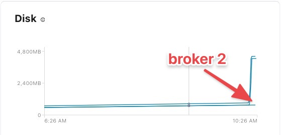
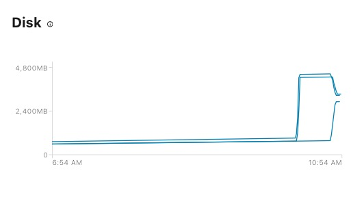

# Test Self Balancing with operator

Quickly test [self-balancing](https://docs.confluent.io/operator/current/co-management.html#scale-ak-clusters-and-balance-data) with replicator by following this [demo](https://github.com/confluentinc/demo-scene/tree/master/self-balancing).

Create a topic sbk, We are forcing the topic to not create replicas in broker 2 to create an uneven load

```bash
$ kubectl cp ${DIR}/kafka.properties operator/kafka-0:/tmp/config
$ kubectl -n confluent exec -i kafka-0 -- bash -c 'kafka-topics --create --topic sbk --bootstrap-server kafka:9071 --command-config /tmp/config --replica-assignment 0:1,0:1,0:1,0:1,0:1,0:1,0:1,0:1,0:1,0:1,0:1,0:1,0:1,0:1,0:1,0:1,0:1,0:1,0:1,0:1,0:1,0:1,0:1,0:1,0:1,0:1,0:1,0:1,0:1,0:1,0:1,0:1,0:1,0:1,0:1,0:1,0:1,0:1,0:1,0:1,0:1,0:1,0:1,0:1,0:1,0:1,0:1,0:1,0:1,0:1,0:1,0:1,0:1,0:1,0:1,0:1,0:1,0:1,0:1,0:1,0:1,0:1,0:1,0:1,0:1,0:1,0:1,0:1,0:1,0:1,0:1,0:1,0:1,0:1,0:1,0:1,0:1,0:1,0:1,0:1,0:1,0:1,0:1,0:1,0:1,0:1,0:1,0:1,0:1,0:1,0:1,0:1,0:1,0:1,0:1,0:1,0:1,0:1,0:1,0:1'
```

Produce Data

```bash
$ kubectl -n confluent exec -i kafka-0 -- bash -c 'kafka-producer-perf-test --producer-props bootstrap.servers=kafka:9071 --producer.config /tmp/config --topic sbk --record-size 1000 --throughput 100000 --num-records 3600000'
```



Enable self balancing

```bash
$ helm upgrade --install \
  kafka \
  ${DIR}/confluent-operator/helm/confluent-operator/ \
  --values $VALUES_FILE \
  --namespace confluent \
  --set kafka.enabled=true \
  --set kafka.replicas=3 \
  --set kafka.metricReporter.enabled=true \
  --set kafka.metricReporter.bootstrapEndpoint="kafka:9071" \
  --set kafka.oneReplicaPerNode=false \
  --set 'kafka.configOverrides.server[0]=confluent.license.topic.replication.factor=1' \
  --set 'kafka.configOverrides.server[1]=confluent.balancer.enable=true' \
  --set 'kafka.configOverrides.server[2]=confluent.balancer.heal.uneven.load.trigger=ANY_UNEVEN_LOAD'
```

* Wait for Self-Balancing to start the rebalance

Self-Balancing samples data about disk use, leader count, partition count, network throughput and other variables. It then aggregates this data to make informed decisions about how to reassign partitions. It needs between 10 and 20 minutes from startup to collect enough samples to generate a rebalacing plan (if one is needed). Self-Balancing also invalidates previous samples when the number of partitions in the cluster changes materially since they may not accurately reflect the current state of the cluster.

While Self-Balancing is still sampling, the following message will appear on the logs periodically: INFO Skipping proposal precomputing because load monitor does not have enough snapshots.

* Watch Self-Balancing rebalance the cluster

Once Self-balacing is ready to compute reassignment plans, the following message will appear: INFO Finished the precomputation proposal candidates in * ms (com.linkedin.kafka.cruisecontrol.analyzer.GoalOptimizer)

Self-Balancing should then start the rebalancing process. Monitor the logs and the watch kafka-topics command to observe the changes as they happen.

After about 20 minutes:


