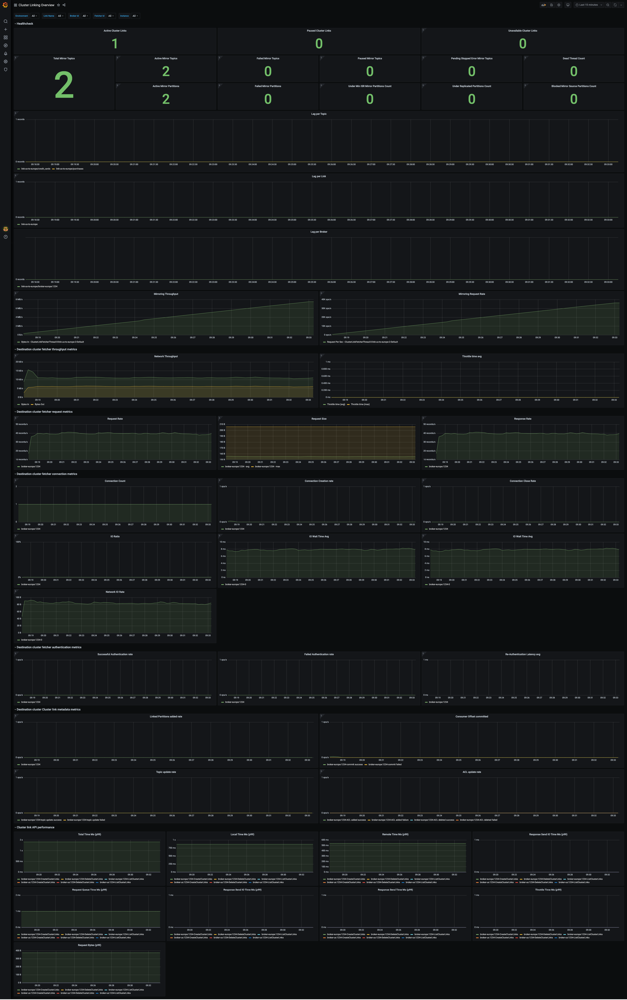

# Cluster Linking monitoring demo

## Objective
Showcase how to monitor Cluster Linking in a Confluent Platform context.

## Architecture

* `broker-europe` is replicating 2 topics (`credit_cards` and `purchases`) from `broker-us`.
* Grafana is listening on `http://localhost:3000`
* The dashboard is named "Cluster Linking Overview"

# Demo
[./]