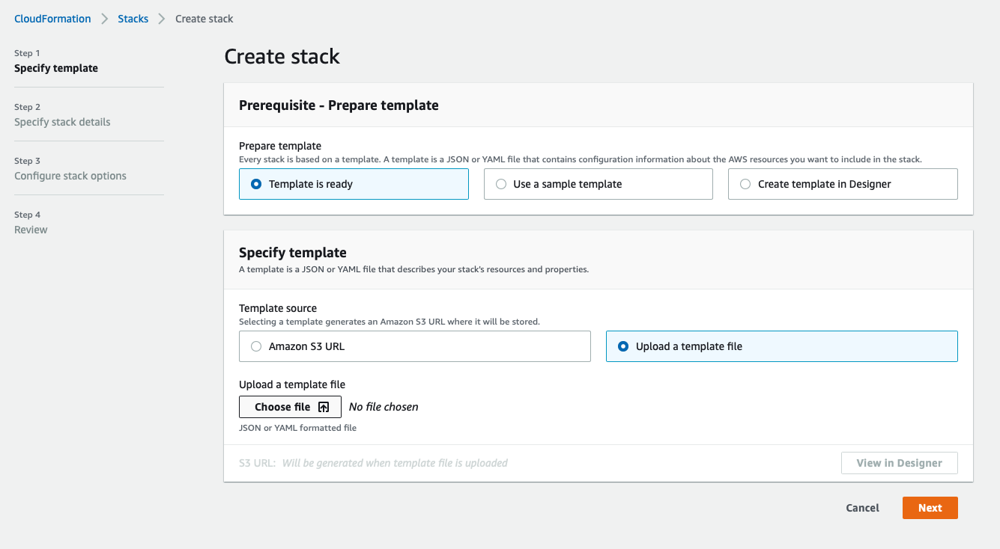
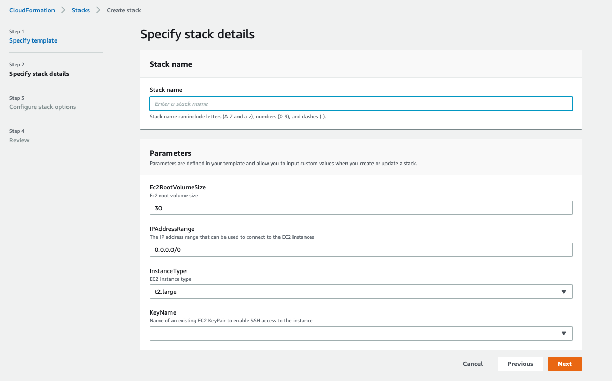
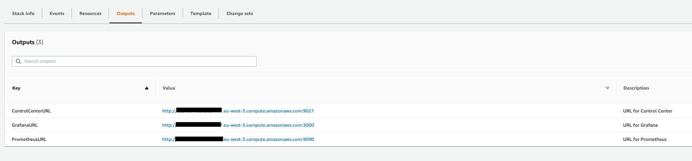

# Monitoring Demo

This is OnPrem version of [Confluent Cloud Demo](../../ccloud/ccloud-demo/README.md)

* Control Center is reachable at [http://127.0.0.1:9021](http://127.0.0.1:9021])
* Grafana is reachable at [http://127.0.0.1:3000](http://127.0.0.1:3000]) (login/password is `admin/admin`)
* Prometheus is reachable at [http://127.0.0.1:9090](http://127.0.0.1:9090])

## How to run with AWS CloudFormation

* Create stack in AWS CloudFormation and upload [this](cloudformation/kafka-docker-playground-monitorin-demo.json?raw=true) template file:

* Fill informtion as requested (default EC2 instance type and root volume are recommended):

* After about 15 minutes, the stack will be created and you can see in *outputs* tab the URLs for connecting to Control Center and Grafana (`admin`/`admin`)

