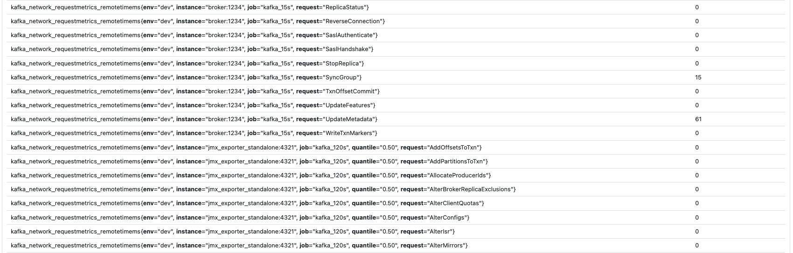

# Kafka Monitoring with different scrape intervals

## Objective

Showcase how isolate JMX metrics scraping and apply different scraping intervals using JMX exporter.

## Demo
The following screenshot show the `kafka_network_requestmetrics_remotetimems` collected by 2 prometheus different jobs (ie. kafka_15s and kafka_120s).
While kafka_15s collects aggregated metrics every 15s, kafka_120s captures the percentile information every 120s (2m).



## Start
Run `./start.sh` and go to http://locahost:9090 to query metrics.

* kafka_15s will collect metrics every 15s
* kafka_120s will collect metrics every 120s

## Architecture

### Start with one embedeed JMX Exporter Java Agent

JMX exporter is used as a java agent and embedded in the service commandline
```
-javaagent:/usr/share/jmx_exporter/jmx_prometheus_javaagent-0.16.1.jar=1234:/usr/share/jmx_exporter/broker-agent.yml
```

This agent will collect a set of metrics.

Because jmx exporter does not permit to run multiple agent in parallel, we need the other instances as standalone processes

## Continues with multiple standalone JMX Exporter collectors

At this point we will leverage JMX exporter standalone capability.

You need firs to enable the remote access to the service's JMX server as defined in
```
-Dcom.sun.management.jmxremote        
-Dcom.sun.management.jmxremote.port=5555
-Dcom.sun.management.jmxremote.ssl=false
-Dcom.sun.management.jmxremote.authenticate=false
```
This option will permit to expose a JMX Server access on port 5555 (note the absence of ssl or authentication, this configuration is not recommended for production).
The above option will allow connection from localhost (ie. the service and the standalone JMX exporter process run on the same machine).

If you need to allow  remote connections (ie. from other machines on the network) then you will have to add
```
-Dcom.sun.management.jmxremote.local.only=false
-Djava.rmi.server.hostname=broker
```

Once set up, you can use the JMX Exporter standalone version to access to the JMX Server and expose metrics.

Now that you can run different JMX Exporter instances, each can collect and expose a different set of metrics.
For instanc, one can expose only high-level critical information while another can expose fine grained values (like percentiles).

Please note that each JMX exporter instances (agent or standalone) must use a different HTTP port.

### Prometheus scrapping

On the Prometheus side, you can define different jobs with different scrapping intervals.
```
  - job_name: 'kafka_15s'
    scrape_interval: 15s
    static_configs:
    - targets:
      - 'broker:1234'
      labels:
        env: 'dev'

  - job_name: 'kafka_120s'
    scrape_interval: 120s
    static_configs:
    - targets:
      - 'jmx_exporter_standalone:4321'
      labels:
        env: 'dev'
```

With the above config Prometheus will scrape every 15s `http://broker:1234/metrics` but only every 2mins `http://jmx_exporter_standalone:4321/metrics`