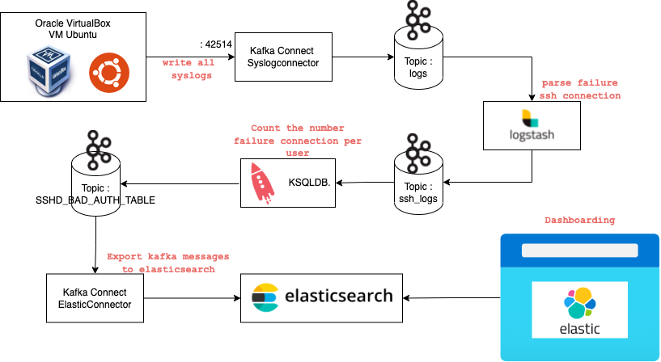
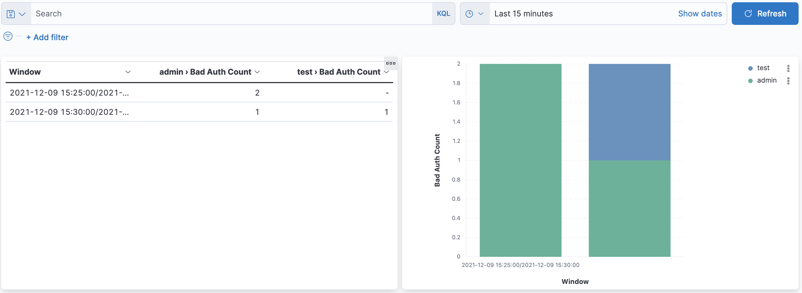

# Use case : Integrate syslogs to detect SSH failure connections



**Workflow :**
- Integrate syslogs from ubuntu docker container into a kafka topic `logs`
- Parse syslogs and extract only ssh connection (Failure & Accepted) via logstash into kafka topic `ssh_logs`
- Use KsqlDb to materialize only failed connection windowing 5 minutes, group by user
``` sql
CREATE OR REPLACE TABLE SSH_TABLE_LOGS
    WITH (kafka_topic='SSH_TABLE_LOGS') AS
    SELECT SSHD_USER,
           COUNT(SSHD_USER) AS BAD_AUTH_COUNT,
           WINDOWSTART as WINDOW_START,
           WINDOWEND as WINDOW_END,
           AS_VALUE(SSHD_USER) USER
    FROM SSH_LOGS
    WINDOW TUMBLING (SIZE 5 MINUTES)
    WHERE SSHD_RESULT = 'Failed'
    GROUP BY SSHD_USER;
```
- Stream this table into a kafka topic `SSH_BAD_AUTH_COUNT`
- Use ElasticSinkConnector to forward `SSH_BAD_AUTH_COUNT` record into an elasticsearch db
- Use Kibana Dashboarding to visualize metrics

## How to run

Start command:
```
$ playground run -f start<tab>
```

At the end of the `start.sh` log ouput, you have something similar like this :
``` log
15:23:29 ℹ️ Try to connect with a wrong password on ssh endoint localhost:7022
15:23:29 ℹ️ <ssh test@localhost -p 7022> or <ssh admin@localhost -p 7022>
15:23:29 ℹ️ Explore in parallel Kibana dashboarding at http://localhost:5601/app/dashboards#/view/076624e0-58f1-11ec-9ae7-ed37822fa749?_g=(filters:!(),refreshInterval:(pause:!f,value:2000),time:(from:now-15m,to:now)) to show in real time metrics on SSH failure connections
```

You have just to try to connect in ssh daemon container using this command :
``` bash
ssh test@localhost -p 7022
# OR
ssh admin@localhost -p 7022
```

Please enter a bad password to complete the workflow.

Visit the dashboard URL present in the end of `start.sh` logs output



Please try to connect with a right password, you can visualize that counter doesn't increase.
```
Below correct passwords
--------------------
USER | RIGHT PASSWORD
--------------------
test | test
--------------------
admin| admin
--------------------
```

## How to stop

Stop command:
```
$ playground run -f stop<tab>
```

