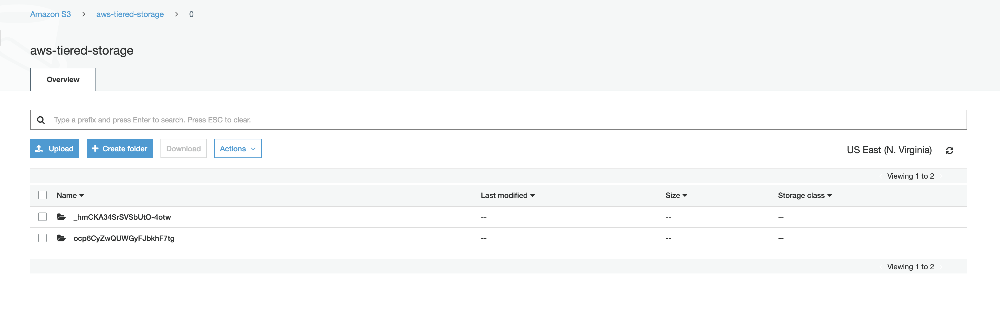
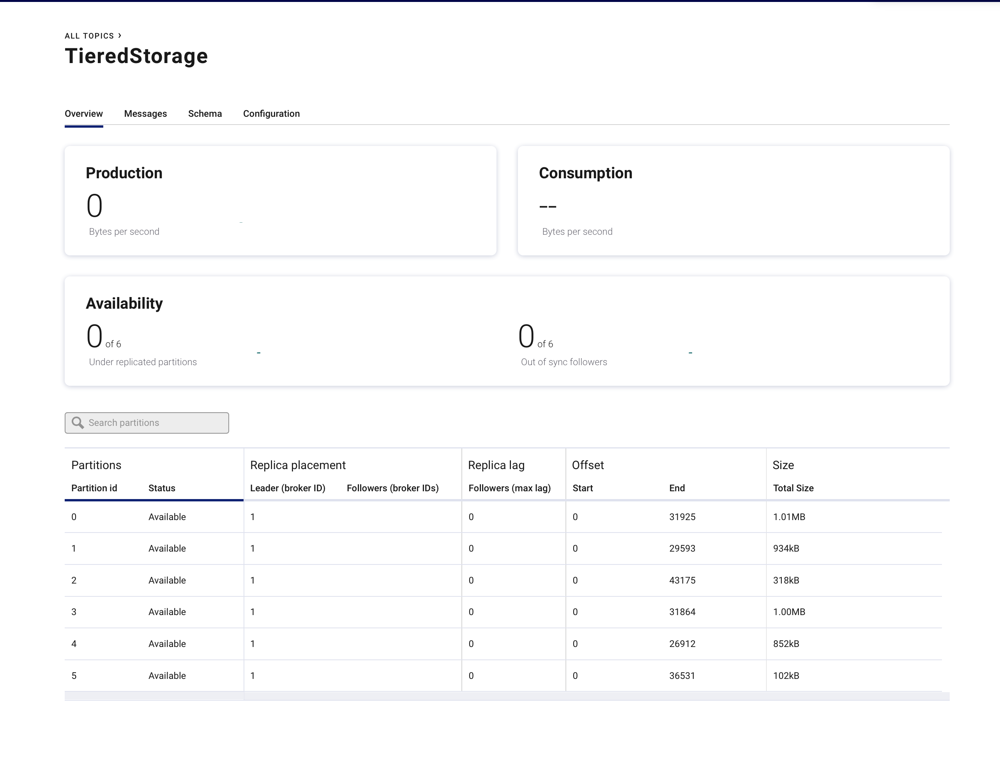

# Tiered storage with AWS S3


## Objective

Quickly test [Tiered Storage](https://docs.confluent.io/current/kafka/tiered-storage-preview.html#tiered-storage).


## AWS Setup

* Make sure you have an [AWS account](https://docs.aws.amazon.com/streams/latest/dev/before-you-begin.html#setting-up-sign-up-for-aws).
* Set up [AWS Credentials](https://docs.confluent.io/current/connect/kafka-connect-kinesis/quickstart.html#aws-credentials)

This project assumes `~/.aws/credentials` is set

## How to run

Simply run:

```
$ ./start.sh
```

## Details of what the script is doing

Broker has following configuration:

```yml
    environment:
      # Tiered Storage Configuration Parameters (v5.4.0)
      KAFKA_CONFLUENT_TIER_FEATURE: "true"
      KAFKA_CONFLUENT_TIER_ENABLE: "true"
      KAFKA_CONFLUENT_TIER_BACKEND: "S3"
      KAFKA_CONFLUENT_TIER_S3_BUCKET: "aws-playground-tiered-storage"
      KAFKA_CONFLUENT_TIER_S3_REGION: "$AWS_REGION"
      KAFKA_CONFLUENT_TIER_METADATA_REPLICATION_FACTOR: 1
      KAFKA_CONFLUENT_TIER_S3_AWS_ACCESS_KEY_ID: "$AWS_ACCESS_KEY_ID"
      KAFKA_CONFLUENT_TIER_S3_AWS_SECRET_ACCESS_KEY: "$AWS_SECRET_ACCESS_KEY"
      KAFKA_LOG_SEGMENT_BYTES: 1048576 #1Mb
```

Create bucket `aws-playground-tiered-storage` in S3

```bash
$ aws s3api create-bucket --bucket aws-playground-tiered-storage --region $AWS_REGION --create-bucket-configuration LocationConstraint=$AWS_REGION
```

Create topic `TieredStorage`

```bash
$ docker exec broker kafka-topics --bootstrap-server 127.0.0.1:9092 --create --topic TieredStorage --partitions 6 --replication-factor 1 --config confluent.tier.enable=true --config confluent.tier.local.hotset.ms=60000 --config retention.ms=86400000
```

Sending messages to topic `TieredStorage`

```bash
$ seq -f "This is a message %g" 200000 | docker exec -i broker kafka-console-producer --broker-list broker:9092 --topic TieredStorage
```

Check for uploaded log segments

```bash
$ docker container logs broker | grep "Uploaded"
```

```log
[2020-02-05 16:54:08,717] INFO Uploaded segment for h_8a8l9xQ-W-r-jUg4tFRg-TieredStorage-5 in 3004ms (kafka.tier.tasks.archive.ArchiveTask)
[2020-02-05 16:54:08,992] INFO Uploaded segment for h_8a8l9xQ-W-r-jUg4tFRg-TieredStorage-2 in 3368ms (kafka.tier.tasks.archive.ArchiveTask)
```



Listing objects of bucket aws-playground-tiered-storage in S3

```bash
$ aws s3api list-objects --bucket aws-playground-tiered-storage
```

```json
{
    "Contents": [
        {
            "Key": "0/_hmCKA34SrSVSbUtO-4otw/h_8a8l9xQ-W-r-jUg4tFRg/5/00000000000000000000_0_v0.epoch-state",
            "LastModified": "2020-02-05T16:54:09.000Z",
            "ETag": "\"b925aa43f02351d90c8a83178c9ac654\"",
            "Size": 8,
            "StorageClass": "STANDARD",
            "Owner": {
                "DisplayName": "aws-confluent-cops-root",
                "ID": "9185230836bd0b811896b3dc97974c8cb986dbcbf58ed554d6e9e6412a237e60"
            }
        },
        {
            "Key": "0/_hmCKA34SrSVSbUtO-4otw/h_8a8l9xQ-W-r-jUg4tFRg/5/00000000000000000000_0_v0.offset-index",
            "LastModified": "2020-02-05T16:54:08.000Z",
            "ETag": "\"aae1faac0e70c0c153472fe1ef69888f\"",
            "Size": 504,
            "StorageClass": "STANDARD",
            "Owner": {
                "DisplayName": "aws-confluent-cops-root",
                "ID": "9185230836bd0b811896b3dc97974c8cb986dbcbf58ed554d6e9e6412a237e60"
            }
        },
        {
            "Key": "0/_hmCKA34SrSVSbUtO-4otw/h_8a8l9xQ-W-r-jUg4tFRg/5/00000000000000000000_0_v0.producer-state",
            "LastModified": "2020-02-05T16:54:09.000Z",
            "ETag": "\"a752e94f68f16ff647bec265688ba488\"",
            "Size": 10,
            "StorageClass": "STANDARD",
            "Owner": {
                "DisplayName": "aws-confluent-cops-root",
                "ID": "9185230836bd0b811896b3dc97974c8cb986dbcbf58ed554d6e9e6412a237e60"
            }
        },
        {
            "Key": "0/_hmCKA34SrSVSbUtO-4otw/h_8a8l9xQ-W-r-jUg4tFRg/5/00000000000000000000_0_v0.segment",
            "LastModified": "2020-02-05T16:54:07.000Z",
            "ETag": "\"d8e5fb42d3904ec9ed4b53c9b6f808bb\"",
            "Size": 1048236,
            "StorageClass": "STANDARD",
            "Owner": {
                "DisplayName": "aws-confluent-cops-root",
                "ID": "9185230836bd0b811896b3dc97974c8cb986dbcbf58ed554d6e9e6412a237e60"
            }
        },
        {
            "Key": "0/_hmCKA34SrSVSbUtO-4otw/h_8a8l9xQ-W-r-jUg4tFRg/5/00000000000000000000_0_v0.timestamp-index",
            "LastModified": "2020-02-05T16:54:09.000Z",
            "ETag": "\"5124566aa2dbbdea55395fbcd0e65711\"",
            "Size": 756,
            "StorageClass": "STANDARD",
            "Owner": {
                "DisplayName": "aws-confluent-cops-root",
                "ID": "9185230836bd0b811896b3dc97974c8cb986dbcbf58ed554d6e9e6412a237e60"
            }
        },
        {
            "Key": "0/ocp6CyZwQUWGyFJbkhF7tg/h_8a8l9xQ-W-r-jUg4tFRg/2/00000000000000000000_0_v0.epoch-state",
            "LastModified": "2020-02-05T16:54:09.000Z",
            "ETag": "\"b925aa43f02351d90c8a83178c9ac654\"",
            "Size": 8,
            "StorageClass": "STANDARD",
            "Owner": {
                "DisplayName": "aws-confluent-cops-root",
                "ID": "9185230836bd0b811896b3dc97974c8cb986dbcbf58ed554d6e9e6412a237e60"
            }
        },
        {
            "Key": "0/ocp6CyZwQUWGyFJbkhF7tg/h_8a8l9xQ-W-r-jUg4tFRg/2/00000000000000000000_0_v0.offset-index",
            "LastModified": "2020-02-05T16:54:08.000Z",
            "ETag": "\"3fed21ec58c5eeb1bfe2a2dd1a3f1fff\"",
            "Size": 504,
            "StorageClass": "STANDARD",
            "Owner": {
                "DisplayName": "aws-confluent-cops-root",
                "ID": "9185230836bd0b811896b3dc97974c8cb986dbcbf58ed554d6e9e6412a237e60"
            }
        },
        {
            "Key": "0/ocp6CyZwQUWGyFJbkhF7tg/h_8a8l9xQ-W-r-jUg4tFRg/2/00000000000000000000_0_v0.producer-state",
            "LastModified": "2020-02-05T16:54:09.000Z",
            "ETag": "\"a752e94f68f16ff647bec265688ba488\"",
            "Size": 10,
            "StorageClass": "STANDARD",
            "Owner": {
                "DisplayName": "aws-confluent-cops-root",
                "ID": "9185230836bd0b811896b3dc97974c8cb986dbcbf58ed554d6e9e6412a237e60"
            }
        },
        {
            "Key": "0/ocp6CyZwQUWGyFJbkhF7tg/h_8a8l9xQ-W-r-jUg4tFRg/2/00000000000000000000_0_v0.segment",
            "LastModified": "2020-02-05T16:54:07.000Z",
            "ETag": "\"9ec3aee1a486b003adf00e20eb3d6067\"",
            "Size": 1043298,
            "StorageClass": "STANDARD",
            "Owner": {
                "DisplayName": "aws-confluent-cops-root",
                "ID": "9185230836bd0b811896b3dc97974c8cb986dbcbf58ed554d6e9e6412a237e60"
            }
        },
        {
            "Key": "0/ocp6CyZwQUWGyFJbkhF7tg/h_8a8l9xQ-W-r-jUg4tFRg/2/00000000000000000000_0_v0.timestamp-index",
            "LastModified": "2020-02-05T16:54:09.000Z",
            "ETag": "\"f49c6fcc0ba22b1cf8ba7879b97b3658\"",
            "Size": 756,
            "StorageClass": "STANDARD",
            "Owner": {
                "DisplayName": "aws-confluent-cops-root",
                "ID": "9185230836bd0b811896b3dc97974c8cb986dbcbf58ed554d6e9e6412a237e60"
            }
        }
    ]
}
```

Sleep 6 minutes (confluent.tier.local.hotset.ms=60000)

```bash
$ sleep 320
```

Check for deleted log segments:

```bash
$ docker container logs broker | grep "Found deletable segments"
```

```log
[2020-02-05 16:58:37,195] INFO [Log partition=TieredStorage-2, dir=/var/lib/kafka/data] Found deletable segments with base offsets [0] due to HotsetRetention time 60000ms breach (kafka.log.Log)
[2020-02-05 16:58:37,200] INFO [Log partition=TieredStorage-5, dir=/var/lib/kafka/data] Found deletable segments with base offsets [0] due to HotsetRetention time 60000ms breach (kafka.log.Log)
```

Control Center showing rolled and migrated segments (partitions 2 and 5)



Empty bucket `aws-playground-tiered-storage` in S3

```bash
aws s3 rm s3://aws-playground-tiered-storage --recursive
```

```log
delete: s3://aws-playground-tiered-storage/0/PwfHshZ2TxuED1bkNDvWHw/uncHJyzZT4yePUi8X3T2Cg/2/00000000000000000000_0_v0.epoch-state
delete: s3://aws-playground-tiered-storage/0/PwfHshZ2TxuED1bkNDvWHw/uncHJyzZT4yePUi8X3T2Cg/2/00000000000000000000_0_v0.offset-index
delete: s3://aws-playground-tiered-storage/0/kekUK2MjTcu6wqjGKUep_g/uncHJyzZT4yePUi8X3T2Cg/1/00000000000000000000_0_v0.epoch-state
delete: s3://aws-playground-tiered-storage/0/PwfHshZ2TxuED1bkNDvWHw/uncHJyzZT4yePUi8X3T2Cg/2/00000000000000000000_0_v0.producer-state
delete: s3://aws-playground-tiered-storage/0/gS85K19dQoC_x8FLzbkaqw/i33dAQ1UQA26SvTxTVaxig/0/00000000000000000000_0_v0.epoch-state
delete: s3://aws-playground-tiered-storage/0/PwfHshZ2TxuED1bkNDvWHw/uncHJyzZT4yePUi8X3T2Cg/2/00000000000000000000_0_v0.segment
delete: s3://aws-playground-tiered-storage/0/gS85K19dQoC_x8FLzbkaqw/i33dAQ1UQA26SvTxTVaxig/0/00000000000000000000_0_v0.timestamp-index
delete: s3://aws-playground-tiered-storage/0/gS85K19dQoC_x8FLzbkaqw/i33dAQ1UQA26SvTxTVaxig/0/00000000000000000000_0_v0.producer-state
delete: s3://aws-playground-tiered-storage/0/gS85K19dQoC_x8FLzbkaqw/i33dAQ1UQA26SvTxTVaxig/0/00000000000000000000_0_v0.offset-index
delete: s3://aws-playground-tiered-storage/0/PwfHshZ2TxuED1bkNDvWHw/uncHJyzZT4yePUi8X3T2Cg/2/00000000000000000000_0_v0.timestamp-index
delete: s3://aws-playground-tiered-storage/0/gS85K19dQoC_x8FLzbkaqw/i33dAQ1UQA26SvTxTVaxig/0/00000000000000000000_0_v0.segment
delete: s3://aws-playground-tiered-storage/0/kekUK2MjTcu6wqjGKUep_g/uncHJyzZT4yePUi8X3T2Cg/1/00000000000000000000_0_v0.offset-index
delete: s3://aws-playground-tiered-storage/0/kekUK2MjTcu6wqjGKUep_g/uncHJyzZT4yePUi8X3T2Cg/1/00000000000000000000_0_v0.producer-state
delete: s3://aws-playground-tiered-storage/0/kekUK2MjTcu6wqjGKUep_g/uncHJyzZT4yePUi8X3T2Cg/1/00000000000000000000_0_v0.segment
delete: s3://aws-playground-tiered-storage/0/kekUK2MjTcu6wqjGKUep_g/uncHJyzZT4yePUi8X3T2Cg/1/00000000000000000000_0_v0.timestamp-index
```

Delete bucket `aws-playground-tiered-storage` in S3

```bash
$ aws s3api delete-bucket --bucket aws-playground-tiered-storage
```

N.B: Control Center is reachable at [http://127.0.0.1:9021](http://127.0.0.1:9021])
