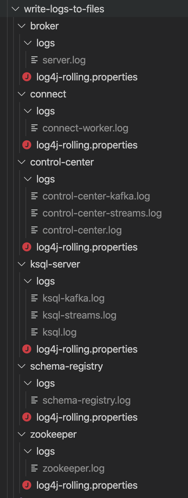

# Write logs to files

## Objective

Example using `docker-compose` on how to write to files instead of stdout by providing custom `log4j.properties` files.

In summary, we have:

| Compoennt  | Environment variable  |
|---|---|
| zookeeper  |  KAFKA_LOG4J_OPTS |
| broker     |  KAFKA_LOG4J_OPTS |
| schema-registry  |  SCHEMA_REGISTRY_LOG4J_OPTS |
| connect    |  KAFKA_LOG4J_OPTS |
| ksql-server  |  KSQL_LOG4J_OPTS |
| control-center  |  CONTROL_CENTER_LOG4J_OPTS |

## Results:

You should see logs in Docker container in `/var/log/<component>` and also in mounted volumes as following:

