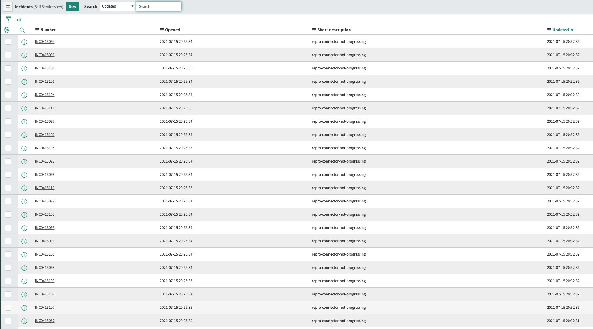

EDIT: THIS IS FIXED WITH VERSION `2.3.4`

Before running the test go to ServiceNow UI and select `Scripts Background`

Execute the following:

```java
for(var i = 0 ; i < 100 ; i++)
{
var gr = new GlideRecord('incident');
gr.initialize();
gr.caller_id = '62826bf03710200044e0bfc8bcbe5df1';
gr.short_description = 'repro-connector-not-progressing';
gr.insert();
}
```


Then:


```java
var inc = new GlideRecord(“incident”);
inc.addEncodedQuery(“short_description=repro-connector-not-progressing”);
inc.query();
while (inc.next()) {
 inc.work_notes = “Updating all repro-connector-not-progressing incidents“;
 inc.autoSysFields(true);
 inc.setWorkflow(false);
 inc.update();
}
```

You should see multiple incidents (more than 10 to reproduce, as `batch.max.rows` is set to 10) updated in same second:




In logs (full logs are [here](https://github.com/vdesabou/kafka-docker-playground/blob/master/connect/connect-servicenow-source/repro-connector-not-progressing/connect.log.zip?raw=true)), I see (you can inject more incidents, it will remain stuck at same offset `2021-08-11T15:23:11` in that case):

```log
[2021-08-11 15:23:58,818] DEBUG [servicenow-source|task-0] Check connectivity of url: https://dev71747.service-now.com/api/now/table/incident (io.confluent.connect.servicenow.rest.ServiceNowClientImpl:170)
[2021-08-11 15:23:58,823] DEBUG [servicenow-source|task-0] Launch HTTP request to following URL: /api/now/table/incident (io.confluent.connect.servicenow.rest.ServiceNowClientImpl:172)
[2021-08-11 15:23:58,824] DEBUG [servicenow-source|task-0] Calling GET on https://dev71747.service-now.com/api/now/table/incident?sysparm_limit=1 (io.confluent.connect.servicenow.rest.ServiceNowClientImpl:212)
[2021-08-11 15:24:03,977] INFO [servicenow-source|task-0] WorkerSourceTask{id=servicenow-source-0} Source task finished initialization and start (org.apache.kafka.connect.runtime.WorkerSourceTask:226)
[2021-08-11 15:24:03,979] DEBUG [servicenow-source|task-0] Launch HTTP request to following URL: /api/now/table/incident (io.confluent.connect.servicenow.rest.ServiceNowClientImpl:144)
[2021-08-11 15:24:03,980] DEBUG [servicenow-source|task-0] Calling GET on https://dev71747.service-now.com/api/now/table/incident?sysparm_query=sys_updated_on%3E%3D2021-08-11%2000:00:00%5EORDERBYsys_updated_on&sysparm_limit=10 (io.confluent.connect.servicenow.rest.ServiceNowClientImpl:212)
[2021-08-11 15:24:04,905] DEBUG [servicenow-source|task-0] Collected 10 records, new offset at <2021-08-11T15:23:11, null, null> (io.confluent.connect.servicenow.ServiceNowSourceTask:256)
[2021-08-11 15:24:04,920] DEBUG [servicenow-source|task-0] Launch HTTP request to following URL: /api/now/table/incident (io.confluent.connect.servicenow.rest.ServiceNowClientImpl:144)
[2021-08-11 15:24:04,921] DEBUG [servicenow-source|task-0] Calling GET on https://dev71747.service-now.com/api/now/table/incident?sysparm_query=sys_updated_on%3E%3D2021-08-11%2015:23:11%5EORDERBYsys_updated_on&sysparm_limit=10 (io.confluent.connect.servicenow.rest.ServiceNowClientImpl:212)
[2021-08-11 15:24:04,920] INFO [servicenow-source|task-0] creating interceptor (io.confluent.monitoring.clients.interceptor.MonitoringProducerInterceptor:74)
[2021-08-11 15:24:04,980] INFO [servicenow-source|task-0] MonitoringInterceptorConfig values:
	confluent.monitoring.interceptor.publishMs = 15000
	confluent.monitoring.interceptor.topic = _confluent-monitoring
 (io.confluent.monitoring.clients.interceptor.MonitoringInterceptorConfig:372)
[2021-08-11 15:24:05,015] INFO [servicenow-source|task-0] ProducerConfig values:
	acks = -1
	batch.size = 16384
	bootstrap.servers = [broker:9092]
	buffer.memory = 33554432
	client.dns.lookup = use_all_dns_ips
	client.id = confluent.monitoring.interceptor.connect-worker-producer
	compression.type = lz4
	connections.max.idle.ms = 540000
	delivery.timeout.ms = 120000
	enable.idempotence = false
	interceptor.classes = []
	internal.auto.downgrade.txn.commit = false
	key.serializer = class org.apache.kafka.common.serialization.ByteArraySerializer
	linger.ms = 500
	max.block.ms = 60000
	max.in.flight.requests.per.connection = 1
	max.request.size = 10485760
	metadata.max.age.ms = 300000
	metadata.max.idle.ms = 300000
	metric.reporters = []
	metrics.num.samples = 2
	metrics.recording.level = INFO
	metrics.sample.window.ms = 30000
	partitioner.class = class org.apache.kafka.clients.producer.internals.DefaultPartitioner
	receive.buffer.bytes = 32768
	reconnect.backoff.max.ms = 1000
	reconnect.backoff.ms = 50
	request.timeout.ms = 30000
	retries = 2147483647
	retry.backoff.ms = 500
	sasl.client.callback.handler.class = null
	sasl.jaas.config = null
	sasl.kerberos.kinit.cmd = /usr/bin/kinit
	sasl.kerberos.min.time.before.relogin = 60000
	sasl.kerberos.service.name = null
	sasl.kerberos.ticket.renew.jitter = 0.05
	sasl.kerberos.ticket.renew.window.factor = 0.8
	sasl.login.callback.handler.class = null
	sasl.login.class = null
	sasl.login.refresh.buffer.seconds = 300
	sasl.login.refresh.min.period.seconds = 60
	sasl.login.refresh.window.factor = 0.8
	sasl.login.refresh.window.jitter = 0.05
	sasl.mechanism = GSSAPI
	security.protocol = PLAINTEXT
	security.providers = null
	send.buffer.bytes = 131072
	socket.connection.setup.timeout.max.ms = 30000
	socket.connection.setup.timeout.ms = 10000
	ssl.cipher.suites = null
	ssl.enabled.protocols = [TLSv1.2, TLSv1.3]
	ssl.endpoint.identification.algorithm = https
	ssl.engine.factory.class = null
	ssl.key.password = null
	ssl.keymanager.algorithm = SunX509
	ssl.keystore.certificate.chain = null
	ssl.keystore.key = null
	ssl.keystore.location = null
	ssl.keystore.password = null
	ssl.keystore.type = JKS
	ssl.protocol = TLSv1.3
	ssl.provider = null
	ssl.secure.random.implementation = null
	ssl.trustmanager.algorithm = PKIX
	ssl.truststore.certificates = null
	ssl.truststore.location = null
	ssl.truststore.password = null
	ssl.truststore.type = JKS
	transaction.timeout.ms = 60000
	transactional.id = null
	value.serializer = class org.apache.kafka.common.serialization.ByteArraySerializer
 (org.apache.kafka.clients.producer.ProducerConfig:372)
[2021-08-11 15:24:05,022] INFO [servicenow-source|task-0] Kafka version: 6.2.0-ce (org.apache.kafka.common.utils.AppInfoParser:119)
[2021-08-11 15:24:05,022] INFO [servicenow-source|task-0] Kafka commitId: 5c753752ae1445a1 (org.apache.kafka.common.utils.AppInfoParser:120)
[2021-08-11 15:24:05,023] INFO [servicenow-source|task-0] Kafka startTimeMs: 1628695445022 (org.apache.kafka.common.utils.AppInfoParser:121)
[2021-08-11 15:24:05,026] INFO [servicenow-source|task-0] interceptor=confluent.monitoring.interceptor.connect-worker-producer created for client_id=connect-worker-producer client_type=PRODUCER session= cluster=1pwzDYw6QjSEkcVxU1SjXA (io.confluent.monitoring.clients.interceptor.MonitoringInterceptor:153)
[2021-08-11 15:24:05,037] INFO [servicenow-source|task-0] [Producer clientId=confluent.monitoring.interceptor.connect-worker-producer] Cluster ID: 1pwzDYw6QjSEkcVxU1SjXA (org.apache.kafka.clients.Metadata:279)
[2021-08-11 15:24:05,550] DEBUG [servicenow-source|task-0] Collected 6 records, new offset at <2021-08-11T15:23:11, null, null> (io.confluent.connect.servicenow.ServiceNowSourceTask:256)
[2021-08-11 15:24:05,556] DEBUG [servicenow-source|task-0] Launch HTTP request to following URL: /api/now/table/incident (io.confluent.connect.servicenow.rest.ServiceNowClientImpl:144)
[2021-08-11 15:24:05,556] DEBUG [servicenow-source|task-0] Calling GET on https://dev71747.service-now.com/api/now/table/incident?sysparm_query=sys_updated_on%3E%3D2021-08-11%2015:23:11%5EORDERBYsys_updated_on&sysparm_limit=10 (io.confluent.connect.servicenow.rest.ServiceNowClientImpl:212)
[2021-08-11 15:24:06,137] DEBUG [servicenow-source|task-0] Collected 0 records, new offset at <2021-08-11T15:23:11, null, null> (io.confluent.connect.servicenow.ServiceNowSourceTask:256)
[2021-08-11 15:24:06,138] DEBUG [servicenow-source|task-0] Launch HTTP request to following URL: /api/now/table/incident (io.confluent.connect.servicenow.rest.ServiceNowClientImpl:144)
[2021-08-11 15:24:06,138] DEBUG [servicenow-source|task-0] Calling GET on https://dev71747.service-now.com/api/now/table/incident?sysparm_query=sys_updated_on%3E%3D2021-08-11%2015:23:11%5EORDERBYsys_updated_on&sysparm_limit=10 (io.confluent.connect.servicenow.rest.ServiceNowClientImpl:212)
[2021-08-11 15:24:06,763] DEBUG [servicenow-source|task-0] Collected 0 records, new offset at <2021-08-11T15:23:11, null, null> (io.confluent.connect.servicenow.ServiceNowSourceTask:256)
[2021-08-11 15:24:06,764] DEBUG [servicenow-source|task-0] Launch HTTP request to following URL: /api/now/table/incident (io.confluent.connect.servicenow.rest.ServiceNowClientImpl:144)
[2021-08-11 15:24:06,764] DEBUG [servicenow-source|task-0] Calling GET on https://dev71747.service-now.com/api/now/table/incident?sysparm_query=sys_updated_on%3E%3D2021-08-11%2015:23:11%5EORDERBYsys_updated_on&sysparm_limit=10 (io.confluent.connect.servicenow.rest.ServiceNowClientImpl:212)
[2021-08-11 15:24:07,656] DEBUG [servicenow-source|task-0] Collected 0 records, new offset at <2021-08-11T15:23:11, null, null> (io.confluent.connect.servicenow.ServiceNowSourceTask:256)
[2021-08-11 15:24:07,657] DEBUG [servicenow-source|task-0] Launch HTTP request to following URL: /api/now/table/incident (io.confluent.connect.servicenow.rest.ServiceNowClientImpl:144)
[2021-08-11 15:24:07,657] DEBUG [servicenow-source|task-0] Calling GET on https://dev71747.service-now.com/api/now/table/incident?sysparm_query=sys_updated_on%3E%3D2021-08-11%2015:23:11%5EORDERBYsys_updated_on&sysparm_limit=10 (io.confluent.connect.servicenow.rest.ServiceNowClientImpl:212)
[2021-08-11 15:24:08,425] DEBUG [servicenow-source|task-0] Collected 0 records, new offset at <2021-08-11T15:23:11, null, null> (io.confluent.connect.servicenow.ServiceNowSourceTask:256)
[2021-08-11 15:24:08,425] DEBUG [servicenow-source|task-0] Launch HTTP request to following URL: /api/now/table/incident (io.confluent.connect.servicenow.rest.ServiceNowClientImpl:144)
[2021-08-11 15:24:08,426] DEBUG [servicenow-source|task-0] Calling GET on https://dev71747.service-now.com/api/now/table/incident?sysparm_query=sys_updated_on%3E%3D2021-08-11%2015:23:11%5EORDERBYsys_updated_on&sysparm_limit=10 (io.confluent.connect.servicenow.rest.ServiceNowClientImpl:212)
[2021-08-11 15:24:09,149] DEBUG [servicenow-source|task-0] Collected 0 records, new offset at <2021-08-11T15:23:11, null, null> (io.confluent.connect.servicenow.ServiceNowSourceTask:256)
[2021-08-11 15:24:09,149] DEBUG [servicenow-source|task-0] Launch HTTP request to following URL: /api/now/table/incident (io.confluent.connect.servicenow.rest.ServiceNowClientImpl:144)
[2021-08-11 15:24:09,149] DEBUG [servicenow-source|task-0] Calling GET on https://dev71747.service-now.com/api/now/table/incident?sysparm_query=sys_updated_on%3E%3D2021-08-11%2015:23:11%5EORDERBYsys_updated_on&sysparm_limit=10 (io.confluent.connect.servicenow.rest.ServiceNowClientImpl:212)
[2021-08-11 15:24:09,865] DEBUG [servicenow-source|task-0] Collected 0 records, new offset at <2021-08-11T15:23:11, null, null> (io.confluent.connect.servicenow.ServiceNowSourceTask:256)
[2021-08-11 15:24:09,865] DEBUG [servicenow-source|task-0] Launch HTTP request to following URL: /api/now/table/incident (io.confluent.connect.servicenow.rest.ServiceNowClientImpl:144)
[2021-08-11 15:24:09,865] DEBUG [servicenow-source|task-0] Calling GET on https://dev71747.service-now.com/api/now/table/incident?sysparm_query=sys_updated_on%3E%3D2021-08-11%2015:23:11%5EORDERBYsys_updated_on&sysparm_limit=10 (io.confluent.connect.servicenow.rest.ServiceNowClientImpl:212)
[2021-08-11 15:24:10,640] DEBUG [servicenow-source|task-0] Collected 0 records, new offset at <2021-08-11T15:23:11, null, null> (io.confluent.connect.servicenow.ServiceNowSourceTask:256)
[2021-08-11 15:24:10,641] DEBUG [servicenow-source|task-0] Launch HTTP request to following URL: /api/now/table/incident (io.confluent.connect.servicenow.rest.ServiceNowClientImpl:144)
[2021-08-11 15:24:10,641] DEBUG [servicenow-source|task-0] Calling GET on https://dev71747.service-now.com/api/now/table/incident?sysparm_query=sys_updated_on%3E%3D2021-08-11%2015:23:11%5EORDERBYsys_updated_on&sysparm_limit=10 (io.confluent.connect.servicenow.rest.ServiceNowClientImpl:212)
[2021-08-11 15:24:11,352] DEBUG [servicenow-source|task-0] Collected 0 records, new offset at <2021-08-11T15:23:11, null, null> (io.confluent.connect.servicenow.ServiceNowSourceTask:256)
[2021-08-11 15:24:11,353] DEBUG [servicenow-source|task-0] Launch HTTP request to following URL: /api/now/table/incident (io.confluent.connect.servicenow.rest.ServiceNowClientImpl:144)
[2021-08-11 15:24:11,353] DEBUG [servicenow-source|task-0] Calling GET on https://dev71747.service-now.com/api/now/table/incident?sysparm_query=sys_updated_on%3E%3D2021-08-11%2015:23:11%5EORDERBYsys_updated_on&sysparm_limit=10 (io.confluent.connect.servicenow.rest.ServiceNowClientImpl:212)
[2021-08-11 15:24:12,086] DEBUG [servicenow-source|task-0] Collected 0 records, new offset at <2021-08-11T15:23:11, null, null> (io.confluent.connect.servicenow.ServiceNowSourceTask:256)
[2021-08-11 15:24:12,086] DEBUG [servicenow-source|task-0] Launch HTTP request to following URL: /api/now/table/incident (io.confluent.connect.servicenow.rest.ServiceNowClientImpl:144)
[2021-08-11 15:24:12,087] DEBUG [servicenow-source|task-0] Calling GET on https://dev71747.service-now.com/api/now/table/incident?sysparm_query=sys_updated_on%3E%3D2021-08-11%2015:23:11%5EORDERBYsys_updated_on&sysparm_limit=10 (io.confluent.connect.servicenow.rest.ServiceNowClientImpl:212)
[2021-08-11 15:24:12,762] DEBUG [servicenow-source|task-0] Collected 0 records, new offset at <2021-08-11T15:23:11, null, null> (io.confluent.connect.servicenow.ServiceNowSourceTask:256)
[2021-08-11 15:24:12,762] DEBUG [servicenow-source|task-0] Launch HTTP request to following URL: /api/now/table/incident (io.confluent.connect.servicenow.rest.ServiceNowClientImpl:144)
[2021-08-11 15:24:12,763] DEBUG [servicenow-source|task-0] Calling GET on https://dev71747.service-now.com/api/now/table/incident?sysparm_query=sys_updated_on%3E%3D2021-08-11%2015:23:11%5EORDERBYsys_updated_on&sysparm_limit=10 (io.confluent.connect.servicenow.rest.ServiceNowClientImpl:212)
[2021-08-11 15:24:13,493] DEBUG [servicenow-source|task-0] Collected 0 records, new offset at <2021-08-11T15:23:11, null, null> (io.confluent.connect.servicenow.ServiceNowSourceTask:256)
[2021-08-11 15:24:13,493] DEBUG [servicenow-source|task-0] Launch HTTP request to following URL: /api/now/table/incident (io.confluent.connect.servicenow.rest.ServiceNowClientImpl:144)
[2021-08-11 15:24:13,493] DEBUG [servicenow-source|task-0] Calling GET on https://dev71747.service-now.com/api/now/table/incident?sysparm_query=sys_updated_on%3E%3D2021-08-11%2015:23:11%5EORDERBYsys_updated_on&sysparm_limit=10 (io.confluent.connect.servicenow.rest.ServiceNowClientImpl:212)
[2021-08-11 15:24:14,202] DEBUG [servicenow-source|task-0] Collected 0 records, new offset at <2021-08-11T15:23:11, null, null> (io.confluent.connect.servicenow.ServiceNowSourceTask:256)
[2021-08-11 15:24:14,202] DEBUG [servicenow-source|task-0] Launch HTTP request to following URL: /api/now/table/incident (io.confluent.connect.servicenow.rest.ServiceNowClientImpl:144)
[2021-08-11 15:24:14,202] DEBUG [servicenow-source|task-0] Calling GET on https://dev71747.service-now.com/api/now/table/incident?sysparm_query=sys_updated_on%3E%3D2021-08-11%2015:23:11%5EORDERBYsys_updated_on&sysparm_limit=10 (io.confluent.connect.servicenow.rest.ServiceNowClientImpl:212)
[2021-08-11 15:24:14,941] DEBUG [servicenow-source|task-0] Collected 0 records, new offset at <2021-08-11T15:23:11, null, null> (io.confluent.connect.servicenow.ServiceNowSourceTask:256)
[2021-08-11 15:24:14,942] DEBUG [servicenow-source|task-0] Launch HTTP request to following URL: /api/now/table/incident (io.confluent.connect.servicenow.rest.ServiceNowClientImpl:144)
[2021-08-11 15:24:14,942] DEBUG [servicenow-source|task-0] Calling GET on https://dev71747.service-now.com/api/now/table/incident?sysparm_query=sys_updated_on%3E%3D2021-08-11%2015:23:11%5EORDERBYsys_updated_on&sysparm_limit=10 (io.confluent.connect.servicenow.rest.ServiceNowClientImpl:212)
[2021-08-11 15:24:15,681] DEBUG [servicenow-source|task-0] Collected 0 records, new offset at <2021-08-11T15:23:11, null, null> (io.confluent.connect.servicenow.ServiceNowSourceTask:256)
[2021-08-11 15:24:15,682] DEBUG [servicenow-source|task-0] Launch HTTP request to following URL: /api/now/table/incident (io.confluent.connect.servicenow.rest.ServiceNowClientImpl:144)
[2021-08-11 15:24:15,682] DEBUG [servicenow-source|task-0] Calling GET on https://dev71747.service-now.com/api/now/table/incident?sysparm_query=sys_updated_on%3E%3D2021-08-11%2015:23:11%5EORDERBYsys_updated_on&sysparm_limit=10 (io.confluent.connect.servicenow.rest.ServiceNowClientImpl:212)
[2021-08-11 15:24:16,284] DEBUG [servicenow-source|task-0] Collected 0 records, new offset at <2021-08-11T15:23:11, null, null> (io.confluent.connect.servicenow.ServiceNowSourceTask:256)
[2021-08-11 15:24:16,284] DEBUG [servicenow-source|task-0] Launch HTTP request to following URL: /api/now/table/incident (io.confluent.connect.servicenow.rest.ServiceNowClientImpl:144)
[2021-08-11 15:24:16,285] DEBUG [servicenow-source|task-0] Calling GET on https://dev71747.service-now.com/api/now/table/incident?sysparm_query=sys_updated_on%3E%3D2021-08-11%2015:23:11%5EORDERBYsys_updated_on&sysparm_limit=10 (io.confluent.connect.servicenow.rest.ServiceNowClientImpl:212)
[2021-08-11 15:24:16,961] DEBUG [servicenow-source|task-0] Collected 0 records, new offset at <2021-08-11T15:23:11, null, null> (io.confluent.connect.servicenow.ServiceNowSourceTask:256)
[2021-08-11 15:24:16,961] DEBUG [servicenow-source|task-0] Launch HTTP request to following URL: /api/now/table/incident (io.confluent.connect.servicenow.rest.ServiceNowClientImpl:144)
[2021-08-11 15:24:16,962] DEBUG [servicenow-source|task-0] Calling GET on https://dev71747.service-now.com/api/now/table/incident?sysparm_query=sys_updated_on%3E%3D2021-08-11%2015:23:11%5EORDERBYsys_updated_on&sysparm_limit=10 (io.confluent.connect.servicenow.rest.ServiceNowClientImpl:212)
[2021-08-11 15:24:17,693] DEBUG [servicenow-source|task-0] Collected 0 records, new offset at <2021-08-11T15:23:11, null, null> (io.confluent.connect.servicenow.ServiceNowSourceTask:256)
```
