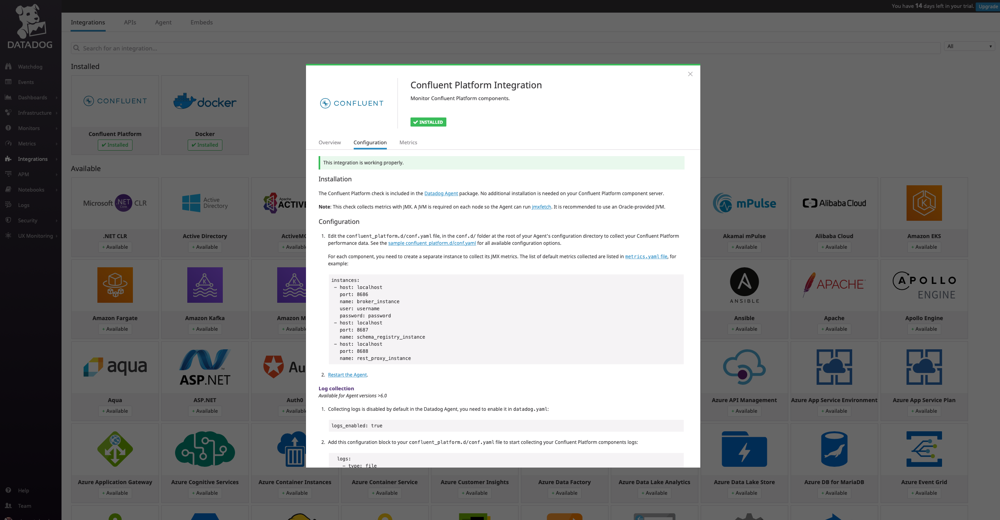
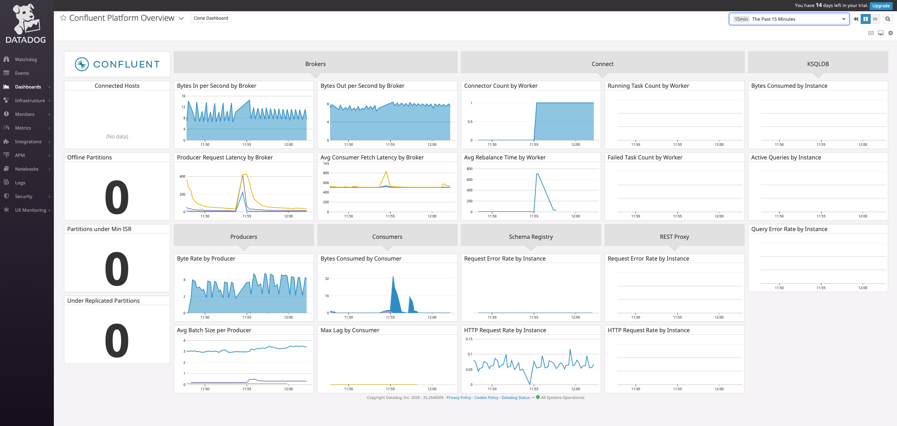

# Datadog

## Objective

Quickly test [Datadog Confluent Platform integration](https://docs.datadoghq.com/integrations/confluent_platform/)

## Prerequisites

Register for a Datadog trial if you don't already have an account.
Get your DD_API_KEY and DD_SITE and export them as environment variable

Activate `Confluent Platform` Integration in Datadog UI:



## How to run

```

$ start.sh <DD_API_KEY> <DD_SITE>

Note: you can also export these values as environment variable

```

Go to `Confluent Platform Overview` dashboard:



There is one replicator connector running


FIXTHIS:

```log
========
JMXFetch
========

  Initialized checks
  ==================
    confluent_platform
      instance_name : broker_instance
      message : Number of returned metrics is too high for instance: broker_instance. Please read http://docs.datadoghq.com/integrations/java/ or get in touch with Datadog Support for more details. Truncating to 350 metrics.
      metric_count : 350
      service_check_count : 0
      status : WARNING
      instance_name : schema_registry_instance
      message : <no value>
      metric_count : 92
      service_check_count : 0
      status : OK
      instance_name : connect_instance
      message : Number of returned metrics is too high for instance: connect_instance. Please read http://docs.datadoghq.com/integrations/java/ or get in touch with Datadog Support for more details. Truncating to 350 metrics.
      metric_count : 350
      service_check_count : 0
      status : WARNING
  Failed checks
  =============
    no checks

```

N.B: Control Center is reachable at [http://127.0.0.1:9021](http://127.0.0.1:9021])
