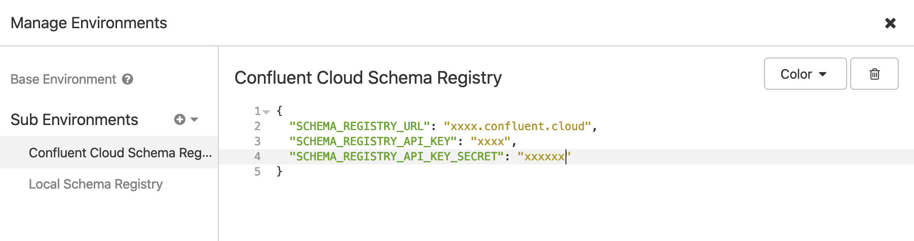
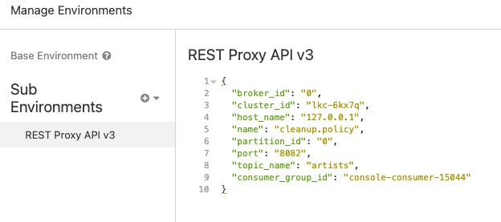

# Insomnia

## Connect API

You can use [Connect REST API](https://docs.confluent.io/current/connect/references/restapi.html#kconnect-long-rest-interface) with [insomnia](https://insomnia.rest/) (install it on Mac OS with `brew cask install insomnia`).
Then go to Preferences->Data and import this [JSON file](./connect-rest-api.json?raw=true).

You can set variables for your cluster by modifying sub environment called `Ccloud Demo Connect REST API`:


## Schema Registry HTTP API

You can use [Schema Registry HTTP API](https://docs.confluent.io/current/schema-registry/develop/api.html#sr-api-reference) with [insomnia](https://insomnia.rest/) (install it on Mac OS with `brew cask install insomnia`).
Then go to Preferences->Data and import this [JSON file](./schema-registry.json?raw=true).

You can set variables for your cluster by modifying sub environment called `Confluent Cloud Schema Registry`:



## REST Proxy API v3

You can use [REST Proxy API v3](https://docs.confluent.io/platform/current/kafka-rest/api.html#crest-api-v3) with [insomnia](https://insomnia.rest/) (install it on Mac OS with `brew cask install insomnia`).
Then go to Preferences->Data and import this [JSON file](./rest-proxy-api-v3.json?raw=true).

You can set variables for your cluster by modifying sub environment called `REST Proxy API v3`:




Link to Confluent [documentation](https://docs.confluent.io/current/cloud/connect/ksql-cloud-config.html)

#### Metrics API

You can use metrics API with [insomnia](https://insomnia.rest/) (install it on Mac OS with `brew cask install insomnia`), then go in Preferences->Plugins and install plugin called `insomnia-plugin-customtimestamp`.
Then go to Preferences->Data and import this [JSON file](./metrics-api.json?raw=true).

You can set variables for your cluster by modifying sub environment called `Metrics API`:


```json
{
  "api_key": "xxx",
  "api_key_secret": "xxx",
  "lkc": "lkc-xxxx",
  "topic": "demo-topic-1",
  "lsrc": "lsrc-xxxx"
}
```

Example:


