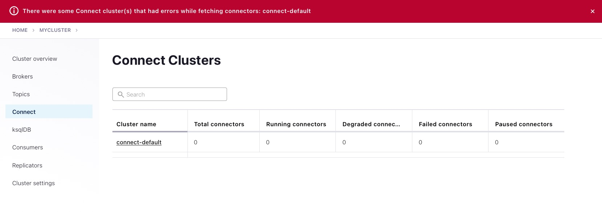

# Issue with Control Center when connector is missing.

This is to reproduce an upgrade issue from CP Connect 5.x where JDBC connector was included to Connect 6.x where JDBC connector needs to be installed manually (which was not done, hence connector missing).

This test is creating 2 connectors (SFTP and SpoolDir, type does not matter here), then to simulate the JDBC connector issue, I remove the spooldir connector:

Remove `/usr/share/confluent-hub-components/jcustenborder-kafka-connect-spooldir`:

```bash
$ docker exec connect rm -rf /usr/share/confluent-hub-components/jcustenborder-kafka-connect-spooldir
````

Restart connect container:

```bash
$ docker container restart connect
```

After that if I check the connect cluster status in Control Center (make sure to refresh the browser), I see:



Problem here is that one connector failing should not prevent the connect cluster to appear.

N.B: Control Center is reachable at [http://127.0.0.1:9021](http://127.0.0.1:9021])