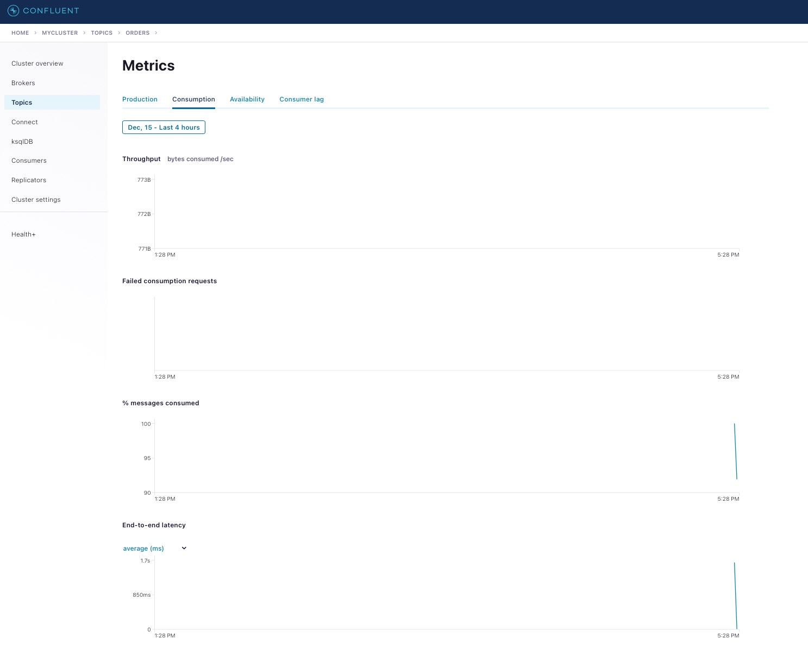
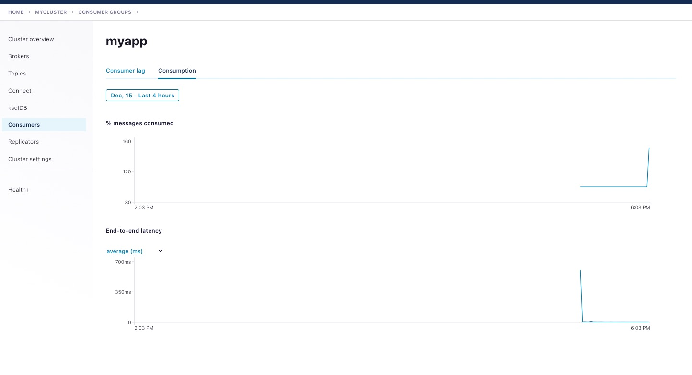

# Topic consumption is complaining about missing interceptors

## How to run

Simply run:

```
$ playground run -f start-plaintext<use tab key to activate [fzf completion](https://kafka-docker-playground.io/#/cli?id=%e2%9a%a1-setup-completion) (otherwise use full path, i.e *not relative path*>
```

or

```
$ playground run -f start-rbac<use tab key to activate [fzf completion](https://kafka-docker-playground.io/#/cli?id=%e2%9a%a1-setup-completion) (otherwise use full path, i.e *not relative path*>
```

## With PLAINTEXT



## With RBAC

`superUser/superUser`


Note that monitoring interceptors are set and working, for example in Consumers->Consumption we have:



### Properties (RBAC case)

broker:

```
advertised.listeners=INTERNAL://broker:9092,TOKEN://broker:10091
authorizer.class.name=io.confluent.kafka.security.authorizer.ConfluentServerAuthorizer
broker.id=1
confluent.authorizer.access.rule.providers=CONFLUENT,ZK_ACL
confluent.authorizer.group.provider=RBAC
confluent.balancer.enable=true
confluent.balancer.topic.replication.factor=1
confluent.license.topic.replication.factor=1
confluent.metadata.server.advertised.listeners=http://broker:8091
confluent.metadata.server.authentication.method=BEARER
confluent.metadata.server.listeners=http://0.0.0.0:8091
confluent.metadata.server.public.key.path=/tmp/conf/public.pem
confluent.metadata.server.token.auth.enable=true
confluent.metadata.server.token.key.path=/tmp/conf/keypair.pem
confluent.metadata.server.token.max.lifetime.ms=3600000
confluent.metadata.server.token.signature.algorithm=RS256
confluent.metadata.topic.replication.factor=1
confluent.metrics.enable=true
confluent.metrics.reporter.bootstrap.servers=broker:9092
confluent.metrics.reporter.sasl.jaas.config=org.apache.kafka.common.security.plain.PlainLoginModule required username="admin" password="admin-secret";
confluent.metrics.reporter.sasl.mechanism=PLAIN
confluent.metrics.reporter.security.protocol=SASL_PLAINTEXT
confluent.metrics.reporter.topic.replicas=1
confluent.support.customer.id=anonymous
inter.broker.listener.name=INTERNAL
jmx.hostname=localhost
jmx.port=10000
ldap.com.sun.jndi.ldap.read.timeout=3000
ldap.group.member.attribute.pattern=cn=(.*),ou=users,dc=confluentdemo,dc=io
ldap.group.member.attribute=memberUid
ldap.group.name.attribute=cn
ldap.group.object.class=posixGroup
ldap.group.search.base=ou=groups,dc=confluentdemo,dc=io
ldap.java.naming.factory.initial=com.sun.jndi.ldap.LdapCtxFactory
ldap.java.naming.provider.url=ldaps://openldap:636
ldap.java.naming.security.authentication=simple
ldap.java.naming.security.credentials=admin
ldap.java.naming.security.principal=cn=admin,dc=confluentdemo,dc=io
ldap.java.naming.security.protocol=SSL
ldap.search.mode=GROUPS
ldap.ssl.truststore.location=/tmp/ldap_certs/ldap_truststore.jks
ldap.ssl.truststore.password=welcome123
ldap.user.name.attribute=uid
ldap.user.object.class=inetOrgPerson
ldap.user.search.base=ou=users,dc=confluentdemo,dc=io
listener.name.internal.plain.sasl.jaas.config=org.apache.kafka.common.security.plain.PlainLoginModule required \
listener.name.token.oauthbearer.sasl.jaas.config=org.apache.kafka.common.security.oauthbearer.OAuthBearerLoginModule required \
listener.name.token.oauthbearer.sasl.login.callback.handler.class=io.confluent.kafka.server.plugins.auth.token.TokenBearerServerLoginCallbackHandler
listener.name.token.oauthbearer.sasl.server.callback.handler.class=io.confluent.kafka.server.plugins.auth.token.TokenBearerValidatorCallbackHandler
listener.security.protocol.map=INTERNAL:SASL_PLAINTEXT,TOKEN:SASL_PLAINTEXT
listeners=INTERNAL://:9092,TOKEN://:10091
log.dirs=/var/lib/kafka/data
metric.reporters=io.confluent.metrics.reporter.ConfluentMetricsReporter
offsets.topic.replication.factor=1
password="admin-secret" \
publicKeyPath="/tmp/conf/public.pem";
sasl.enabled.mechanisms=PLAIN, OAUTHBEARER
sasl.mechanism.inter.broker.protocol=PLAIN
super.users=User:admin;User:mds;User:superUser;User:ANONYMOUS
transaction.state.log.min.isr=1
transaction.state.log.replication.factor=1
user_admin="admin-secret" \
user_mds="mds-secret";
username="admin" \
zookeeper.connect=zookeeper:2181
zookeeper.set.acl=true
```

connect:

```
internal.key.converter.schemas.enable=false
group.id=connect-cluster
value.converter.schemas.enable=false
producer.confluent.monitoring.interceptor.sasl.mechanism=OAUTHBEARER
config.providers=file
status.storage.replication.factor=1
key.converter=org.apache.kafka.connect.storage.StringConverter
config.storage.topic=connect-configs
log4j.loggers=org.apache.zookeeper=ERROR,org.I0Itec.zkclient=ERROR,org.reflections=ERROR
config.providers.file.class=org.apache.kafka.common.config.provider.FileConfigProvider
producer.security.protocol=SASL_PLAINTEXT
sasl.login.callback.handler.class=io.confluent.kafka.clients.plugins.auth.token.TokenUserLoginCallbackHandler
topic.creation.enable=true
offset.storage.replication.factor=1
plugin.path=/usr/share/confluent-hub-components/confluentinc-kafka-connect-datagen
admin.sasl.mechanism=OAUTHBEARER
offset.storage.topic=connect-offsets
confluent.metadata.bootstrap.server.urls=http://broker:8091
consumer.sasl.mechanism=OAUTHBEARER
admin.sasl.login.callback.handler.class=io.confluent.kafka.clients.plugins.auth.token.TokenUserLoginCallbackHandler
producer.sasl.jaas.config=org.apache.kafka.common.security.oauthbearer.OAuthBearerLoginModule required \
username="connectAdmin" \
password="connectAdmin" \
metadataServerUrls="http://broker:8091";

producer.confluent.monitoring.interceptor.bootstrap.servers=broker:10091
bootstrap.servers=broker:10091
producer.sasl.login.callback.handler.class=io.confluent.kafka.clients.plugins.auth.token.TokenUserLoginCallbackHandler
consumer.sasl.jaas.config=org.apache.kafka.common.security.oauthbearer.OAuthBearerLoginModule required \
username="connectAdmin" \
password="connectAdmin" \
metadataServerUrls="http://broker:8091";

consumer.confluent.monitoring.interceptor.bootstrap.servers=broker:10091
value.converter=io.confluent.connect.avro.AvroConverter
producer.interceptor.classes=io.confluent.monitoring.clients.interceptor.MonitoringProducerInterceptor
rest.servlet.initializor.classes=io.confluent.common.security.jetty.initializer.InstallBearerOrBasicSecurityHandler
rest.advertised.host.name=connect
sasl.jaas.config=org.apache.kafka.common.security.oauthbearer.OAuthBearerLoginModule required \
username="connectAdmin" \
password="connectAdmin" \
metadataServerUrls="http://broker:8091";

sasl.mechanism=OAUTHBEARER
internal.key.converter=org.apache.kafka.connect.json.JsonConverter
consumer.confluent.monitoring.interceptor.sasl.mechanism=OAUTHBEARER
rest.extension.classes=io.confluent.connect.replicator.monitoring.ReplicatorMonitoringExtension,io.confluent.connect.security.ConnectSecurityExtension
rest.port=8083
consumer.sasl.login.callback.handler.class=io.confluent.kafka.clients.plugins.auth.token.TokenUserLoginCallbackHandler
consumer.confluent.monitoring.interceptor.sasl.jaas.config=org.apache.kafka.common.security.oauthbearer.OAuthBearerLoginModule required \
username="connectAdmin" \
password="connectAdmin" \
metadataServerUrls="http://broker:8091";

confluent.metadata.http.auth.credentials.provider=BASIC
status.storage.topic=connect-status
public.key.path=/tmp/conf/public.pem
internal.value.converter=org.apache.kafka.connect.json.JsonConverter
consumer.confluent.monitoring.interceptor.security.protocol=SASL_PLAINTEXT
consumer.interceptor.classes=io.confluent.monitoring.clients.interceptor.MonitoringConsumerInterceptor
value.converter.schema.registry.url=http://schema-registry:8081
producer.sasl.mechanism=OAUTHBEARER
internal.value.converter.schemas.enable=false
producer.confluent.monitoring.interceptor.security.protocol=SASL_PLAINTEXT
connector.client.config.override.policy=All
log4j.appender.stdout.layout.conversionpattern=[%d] %p %X{connector.context}%m (%c:%L)%n
consumer.confluent.monitoring.interceptor.sasl.login.callback.handler.class=io.confluent.kafka.clients.plugins.auth.token.TokenUserLoginCallbackHandler
producer.confluent.monitoring.interceptor.sasl.login.callback.handler.class=io.confluent.kafka.clients.plugins.auth.token.TokenUserLoginCallbackHandler
producer.confluent.monitoring.interceptor.sasl.jaas.config=org.apache.kafka.common.security.oauthbearer.OAuthBearerLoginModule required \
username="connectAdmin" \
password="connectAdmin" \
metadataServerUrls="http://broker:8091";

admin.security.protocol=SASL_PLAINTEXT
producer.client.id=connect-worker-producer
security.protocol=SASL_PLAINTEXT
admin.sasl.jaas.config=org.apache.kafka.common.security.oauthbearer.OAuthBearerLoginModule required \
username="connectAdmin" \
password="connectAdmin" \
metadataServerUrls="http://broker:8091";

confluent.metadata.basic.auth.user.info=connectAdmin:connectAdmin
config.storage.replication.factor=1
consumer.security.protocol=SASL_PLAINTEXT
```

control-center:

```
bootstrap.servers=broker:10091
confluent.controlcenter.command.topic.replication=1
confluent.controlcenter.config.dir=/etc/confluent-control-center
confluent.controlcenter.connect.cluster=http://connect:8083
confluent.controlcenter.connect.connect1.cluster=http://connect:8083
confluent.controlcenter.connect.myconnect.cluster=http://connect:8083
confluent.controlcenter.data.dir=/var/lib/confluent-control-center
confluent.controlcenter.internal.topics.partitions=1
confluent.controlcenter.internal.topics.replication=1
confluent.controlcenter.kafka.bootstrap.servers=broker:9092
confluent.controlcenter.kafka.mycluster.bootstrap.servers=broker:10091
confluent.controlcenter.kafka.mycluster.sasl.jaas.config=org.apache.kafka.common.security.oauthbearer.OAuthBearerLoginModule required \
confluent.controlcenter.kafka.mycluster.sasl.login.callback.handler.class=io.confluent.kafka.clients.plugins.auth.token.TokenUserLoginCallbackHandler
confluent.controlcenter.kafka.mycluster.sasl.mechanism=OAUTHBEARER
confluent.controlcenter.kafka.mycluster.security.protocol=SASL_PLAINTEXT
confluent.controlcenter.ksql.advertised.url=http://127.0.0.1:8088
confluent.controlcenter.ksql.myksql.advertised.url=http://127.0.0.1:8088
confluent.controlcenter.ksql.myksql.url=http://ksqldb-server:8088
confluent.controlcenter.ksql.url=http://ksqldb-server:8088
confluent.controlcenter.replication.factor=1
confluent.controlcenter.rest.authentication.method=BEARER
confluent.controlcenter.schema.registry.url=http://schema-registry:8081
confluent.controlcenter.streams.sasl.jaas.config=org.apache.kafka.common.security.oauthbearer.OAuthBearerLoginModule required \
confluent.controlcenter.streams.sasl.login.callback.handler.class=io.confluent.kafka.clients.plugins.auth.token.TokenUserLoginCallbackHandler
confluent.controlcenter.streams.sasl.mechanism=OAUTHBEARER
confluent.controlcenter.streams.security.protocol=SASL_PLAINTEXT
confluent.controlcenter.ui.autoupdate.enable=false
confluent.metadata.basic.auth.user.info=controlcenterAdmin:controlcenterAdmin
confluent.metadata.bootstrap.server.urls=http://broker:8091
confluent.metrics.topic.replication=1
confluent.metrics.topic.replication=1
confluent.monitoring.interceptor.topic.partitions=1
confluent.monitoring.interceptor.topic.replication=1
metadataServerUrls="http://broker:8091";
metadataServerUrls="http://broker:8091";
password="controlcenterAdmin" \
password="controlcenterAdmin" \
public.key.path=/tmp/conf/public.pem
username="controlcenterAdmin" \
username="controlcenterAdmin" \
zookeeper.connect=zookeeper:2181
```